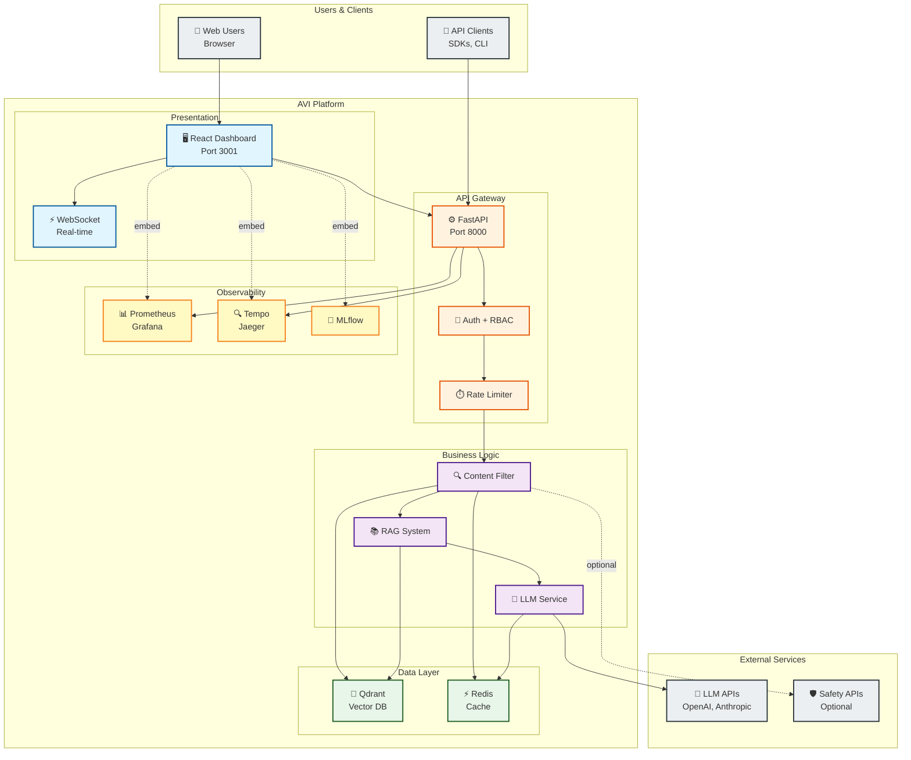
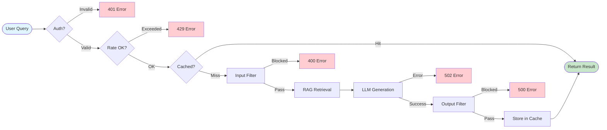
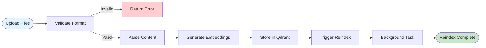
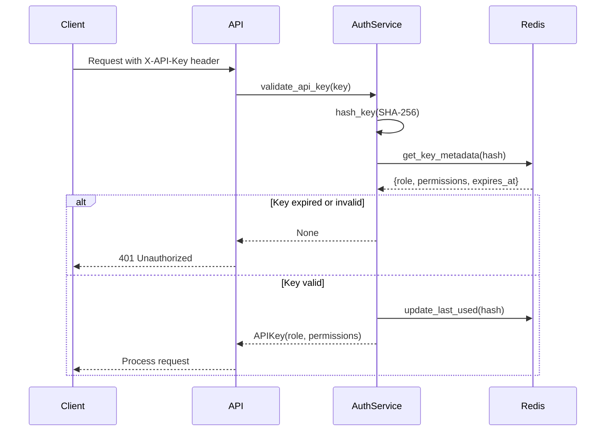

# AVI System Architecture

> Comprehensive architecture documentation for the AVI (AI Validation Interface) platform

**Version**: 2.0 (Modernized)
**Date**: 2025-11-13
**Status**: ✅ Production Ready

---

## 📋 Table of Contents

- [Executive Overview](#executive-overview)
- [System Architecture at a Glance](#system-architecture-at-a-glance)
- [Architecture Diagrams](#architecture-diagrams)
- [Key Architectural Decisions](#key-architectural-decisions)
- [Technology Stack](#technology-stack)
- [System Components](#system-components)
- [Data Flow](#data-flow)
- [Security Architecture](#security-architecture)
- [Deployment Architecture](#deployment-architecture)
- [Performance & Scalability](#performance--scalability)
- [Observability & Monitoring](#observability--monitoring)
- [Development Workflow](#development-workflow)
- [Migration from Legacy System](#migration-from-legacy-system)
- [Future Roadmap](#future-roadmap)

---

## 📊 Executive Overview

### What is AVI?

**AVI (AI Validation Interface)** is a production-grade platform for building safe and controllable LLM-powered applications. It provides:

- **Content Filtering**: Vector-based and LLM-based input/output safety filtering
- **RAG System**: Context retrieval with reranking for enhanced responses
- **Multi-LLM Support**: Integration with OpenAI, Anthropic, and custom providers
- **Observability**: Comprehensive metrics, tracing, and experiment tracking
- **Admin Dashboard**: Modern React-based UI for monitoring and administration

### System Capabilities

| Feature | Description | Status |
|---------|-------------|--------|
| **Content Filtering** | Granular input/output filtering with vector rules + optional Safety LLM | ✅ Production |
| **RAG Integration** | Semantic search + cross-encoder reranking | ✅ Production |
| **API Gateway** | FastAPI with auth, rate limiting, caching | ✅ Production |
| **Admin Dashboard** | React 18 + TypeScript SPA with embedded services | ✅ Production |
| **Observability** | Prometheus, Grafana, Tempo, Jaeger, MLflow | ✅ Production |
| **Experiments** | Jupyter notebooks with automated tracking | ✅ Production |
| **Deployment** | Docker Compose + Kubernetes | ✅ Production |

### Modernization Highlights

This architecture represents the **modernized AVI v2.0** with the following improvements:

1. **React Admin Dashboard** - Replaced Streamlit with modern SPA
2. **Modular Requirements** - Organized dependencies with `pyproject.toml` (PEP 621)
3. **Notebooks-Only Experiments** - Standardized on Jupyter with CLI integration
4. **WebSocket Support** - Real-time updates in UI
5. **Comprehensive Documentation** - 11 architecture diagrams + developer guides

---

## 🏗️ System Architecture at a Glance



---

## 📐 Architecture Diagrams

The architecture is documented through a series of specialized diagrams. Each diagram serves a specific purpose:

### 1. [High-Level Design (HLD)](./diagrams/01_HLD_ARCHITECTURE.md)

**When to use**: First-time introduction to the system, executive presentations, architecture reviews

**What it shows**:
- Overall system structure with all major components
- External services and integrations
- Data flow between subsystems
- Technology stack for each layer

**Key insights**:
- 9 major subsystems (Presentation, API Gateway, Business Logic, Data Access, Storage, Observability, Experiments)
- Modernized stack (React UI, modular requirements, notebooks)
- Service ports and communication protocols

---

### 2. [Detailed Sequence Diagram - Query Flow](./diagrams/02_SEQUENCE_QUERY_DETAILED.md)

**When to use**: Understanding request processing, debugging performance issues, implementing new features

**What it shows**:
- Step-by-step flow of a query through the system (50+ steps)
- Authentication & rate limiting
- Cache check (fast path)
- Input filtering (vector rules + optional Safety LLM)
- RAG retrieval with reranking
- LLM generation
- Output filtering
- Cache storage

**Key insights**:
- Total latency: 700-2500ms (without cache), 7-15ms (with cache)
- Cache hit provides 100x speedup
- Multiple failure points with specific error codes (401, 429, 400, 500, 502, 503)

**Related timing table**:
| Stage | Typical Time | Notes |
|-------|-------------|-------|
| Auth & Rate Limit | 5-10ms | Redis lookup |
| Cache Check | 2-5ms | Redis GET |
| Input Filtering | 50-150ms | Vector search |
| RAG Retrieval | 100-200ms | Vector + rerank |
| LLM Generation | 500-2000ms | External API |
| Output Filtering | 50-150ms | Vector search |

---

### 3. [Simplified Sequence Diagrams](./diagrams/06_SEQUENCE_SIMPLE.md)

**When to use**: Quick reference, onboarding new developers, explaining specific flows

**What it shows**:
- 6 simplified flows (8-15 steps each):
  1. **Query Processing** (8 steps)
  2. **Upload & Index** (10 steps)
  3. **Authentication** (10 steps)
  4. **Streaming Response** (12 steps)
  5. **Experiment Execution** (15 steps)
  6. **UI Real-time Update** (8 steps)

**Key insights**:
- Focused on essential steps only
- Clear success/failure paths
- Ideal for team communication

---

### 4. [Functional Blocks Diagram](./diagrams/08_FUNCTIONAL_BLOCKS.md)

**When to use**: Understanding system responsibilities, planning new features, refactoring

**What it shows**:
- 9 functional areas with detailed responsibilities:
  1. **User Interaction** - Web UI, API clients
  2. **API Layer** - Auth, rate limiting, routing
  3. **Query Processing** - Filtering, RAG, LLM
  4. **Data Management** - Rules, docs, links
  5. **Configuration** - Settings, API keys
  6. **Storage & Caching** - Qdrant, Redis
  7. **External Integrations** - LLM/Safety providers
  8. **Observability** - Metrics, tracing, logs
  9. **Research & Experiments** - Notebooks, benchmarks

**Key insights**:
- Clear separation of concerns
- Single responsibility principle
- Dependency graph showing coupling

---

### 5. [Deployment Architecture](./diagrams/09_DEPLOYMENT.md)

**When to use**: Production deployment, infrastructure planning, scaling decisions

**What it shows**:
- **Docker Compose** setup for local/dev environments
- **Kubernetes** manifests for production
- Resource requirements (CPU, RAM, storage)
- Container specifications for each service
- Networking and volume configurations

**Key insights**:
- Minimum requirements: 6 cores, 16GB RAM, 50GB storage
- Production requirements: 16 cores, 48GB RAM, 200GB SSD
- 10+ services orchestrated (API, Dashboard, Qdrant, Redis, Prometheus, Grafana, Tempo, Jaeger, MLflow)

**Example service matrix**:
| Service | Image | Port | CPU | RAM | Storage |
|---------|-------|------|-----|-----|---------|
| API | python:3.11-slim | 8000 | 2 cores | 4GB | - |
| Dashboard | node:18-alpine | 3001 | 1 core | 2GB | - |
| Qdrant | qdrant/qdrant:v1.7 | 6333 | 2 cores | 8GB | 50GB |
| Redis | redis:7-alpine | 6379 | 1 core | 2GB | 10GB |
| Prometheus | prom/prometheus | 9090 | 1 core | 2GB | 20GB |

---

### 6. [Component Diagram](./diagrams/10_COMPONENTS.md)

**When to use**: Code navigation, refactoring, dependency analysis

**What it shows**:
- Detailed code structure across 45+ Python files (~15,915 lines)
- Module dependencies and relationships
- Public interfaces and APIs
- Layer separation (API → Core → Services → Utils)

**Key insights**:
- **API Layer** (~3,100 lines): 7 files handling HTTP endpoints
- **Core Layer** (~2,200 lines): 5 files with business logic
- **Services Layer** (~5,150 lines): 12 files for data access
- **Utils Layer** (~1,115 lines): 7 files for common utilities
- Clean architecture with clear boundaries

**File structure**:
```
src/
├── api/           # HTTP endpoints, auth, routing (7 files)
├── core/          # Business logic (5 files)
├── services/      # Data access, clients (12 files)
└── utils/         # Common utilities (7 files)
```

---

### 7. [Data Model (ER Diagram)](./diagrams/11_DATA_MODEL.md)

**When to use**: Database design, data migration, understanding entity relationships

**What it shows**:
- 9 core entities with attributes and relationships:
  1. **FILTER_RULE** - Content filtering rules
  2. **DOCUMENT** - Knowledge base documents
  3. **DOCUMENT_LINK** - Rule-document associations
  4. **API_KEY** - Authentication credentials
  5. **USER** - User accounts (future)
  6. **REQUEST_LOG** - API request history
  7. **QUERY_CACHE** - Cached responses
  8. **EXPERIMENT** - Experiment metadata
  9. **EXPERIMENT_RUN** - Individual runs
  10. **METRIC** - Experiment metrics

**Key insights**:
- Multi-backend storage (Qdrant, Redis, FileSystem, MLflow)
- Security: API keys hashed with SHA-256
- Data growth estimates:
  - Rules: ~500-1,000 (stable)
  - Documents: ~10,000-50,000 (grows over time)
  - Logs: ~1M-10M/year (archived)
  - Cache: ~100K-1M entries (TTL-based cleanup)

**Storage mapping**:
- **Qdrant**: FILTER_RULE, DOCUMENT (vector embeddings)
- **Redis**: API_KEY (metadata), REQUEST_LOG (recent), QUERY_CACHE
- **FileSystem**: DOCUMENT_LINK, configuration files
- **MLflow**: EXPERIMENT, EXPERIMENT_RUN, METRIC

---

## 🎯 Key Architectural Decisions

### 1. **React SPA instead of Streamlit**

**Decision**: Build custom React 18 + TypeScript dashboard

**Rationale**:
- Streamlit limitations: full page reloads, limited customization, not suitable for production admin panels
- React provides: SPA navigation, fine-grained state control, better UX, professional look
- Enables embedded services (Grafana, MLflow, Jaeger) via iframe without navigation disruption

**Trade-offs**:
- ✅ Better UX, production-ready, scalable, customizable
- ❌ More complex frontend stack, longer initial development

---

### 2. **Modular Requirements with pyproject.toml**

**Decision**: Reorganize dependencies into modular structure with PEP 621 compliant `pyproject.toml`

**Rationale**:
- Previous: Scattered requirements files (root + requirements/ folder) with duplication
- New: Single source of truth with optional dependencies (`pip install -e ".[ml-gpu,monitoring]"`)
- Follows modern Python packaging standards (PEP 517, 518, 621)

**Structure**:
```
requirements/
├── base.txt          # Core dependencies
├── api.txt           # FastAPI extensions
├── ml-cpu.txt        # ML without GPU
├── ml-gpu.txt        # ML with CUDA
├── vector-db.txt     # Qdrant, ChromaDB
├── monitoring.txt    # Prometheus, OTEL, MLflow
├── dev.txt           # Development tools
├── test.txt          # Testing frameworks
└── research.txt      # Jupyter, datasets
```

**Trade-offs**:
- ✅ No duplication, clear dependencies, flexible installation, follows standards
- ❌ Migration effort for existing installations

---

### 3. **Notebooks-Only for Experiments**

**Decision**: Standardize all experiments on Jupyter notebooks, remove standalone scripts

**Rationale**:
- Previous: Mixed approach with `scripts/benchmark_test.py` and notebooks
- Notebooks provide: iterative development, inline visualization, reproducibility, narrative documentation
- Unified CLI: `avi experiment run <notebook>` for all experiments

**Integration**:
- **ExperimentTracker** class in `avi/experiments.py` for metadata management
- **MLflow** for experiment logging and artifact storage
- **CLI** for running notebooks non-interactively

**Trade-offs**:
- ✅ Better for research, visualization, reproducibility, documentation
- ❌ Slightly less convenient for automated CI/CD (mitigated by CLI)

---

### 4. **Plugin-Based Safety System**

**Decision**: Extensible plugin system for safety models instead of hardcoded integrations

**Rationale**:
- Need to support multiple safety providers (OpenAI Moderation, Llama Guard, custom models)
- Plugin architecture allows adding new providers without code changes
- Modes: `disabled`, `local`, `external`, `plugin`

**Implementation**:
```python
# src/services/safety_client.py
class SafetyClient:
    def __init__(self, mode: str):
        self.plugin = load_plugin(mode)

    async def check_safety(self, text: str) -> SafetyResult:
        return await self.plugin.check(text)
```

**Trade-offs**:
- ✅ Extensible, testable, vendor-agnostic
- ❌ Additional abstraction layer

---

### 5. **Granular Filtering Control**

**Decision**: Allow per-request control over filtering components

**Rationale**:
- Different use cases need different safety levels
- Research may want bypass mode, production may require strict filtering
- Flexibility without code changes

**API**:
```json
{
  "query": "What is AVI?",
  "input_filtering": {
    "enable_vector_rules": true,
    "enable_safety_llm": false,
    "enable_prompt_modification": true
  },
  "output_filtering": {
    "enable_vector_rules": true,
    "enable_safety_llm": false,
    "enable_output_cleaning": true
  }
}
```

**Trade-offs**:
- ✅ Flexible, use-case specific, no code changes
- ❌ More complex API, potential misuse if not understood

---

### 6. **Redis for Distributed State**

**Decision**: Use Redis for authentication, rate limiting, and caching

**Rationale**:
- FastAPI runs multiple workers (horizontal scaling)
- Need shared state across workers for consistent rate limiting and auth
- Redis provides sub-millisecond latency for lookups

**Use cases**:
- **Auth**: API key metadata cache (faster than DB lookup)
- **Rate Limiting**: Distributed counters with TTL
- **Query Cache**: Response caching (60-80% hit rate)
- **WebSocket**: Pub/sub for real-time updates

**Trade-offs**:
- ✅ Fast, distributed, battle-tested, simple
- ❌ Additional service dependency, memory requirements

---

### 7. **OpenTelemetry for Tracing**

**Decision**: Implement distributed tracing with OpenTelemetry + Tempo + Jaeger

**Rationale**:
- Complex request flow (Auth → Filter → RAG → LLM → Filter → Cache)
- Need end-to-end visibility for debugging performance issues
- Correlation IDs for log aggregation

**Stack**:
- **OpenTelemetry SDK**: Instrumentation in FastAPI
- **Tempo**: Trace storage (Grafana Labs)
- **Jaeger UI**: Visualization
- **Grafana**: Trace explorer integration

**Trade-offs**:
- ✅ Comprehensive visibility, standard protocol, great tooling
- ❌ Additional infrastructure, log volume, learning curve

---

## 🔧 Technology Stack

### Frontend (Presentation Layer)

| Technology | Version | Purpose |
|-----------|---------|---------|
| **React** | 18.x | UI framework |
| **TypeScript** | 5.x | Type safety |
| **Ant Design** | 5.x | Component library |
| **Zustand** | 4.x | State management |
| **React Query** | 5.x | API client with caching |
| **Recharts** | 2.x | Data visualization |
| **iframe-resizer** | 4.x | Embedded services |
| **Vite** | 5.x | Build tool |

### Backend (API + Business Logic)

| Technology | Version | Purpose |
|-----------|---------|---------|
| **FastAPI** | 0.104+ | Web framework |
| **Pydantic** | 2.x | Data validation |
| **SlowAPI** | 0.1.9+ | Rate limiting |
| **OpenTelemetry** | 1.21+ | Distributed tracing |
| **python-jose** | 3.3+ | JWT handling |
| **httpx** | 0.25+ | Async HTTP client |

### ML/AI Stack

| Technology | Version | Purpose |
|-----------|---------|---------|
| **sentence-transformers** | 2.2+ | Embeddings |
| **cross-encoder** | 0.1+ | Reranking |
| **openai** | 1.3+ | LLM API client |
| **anthropic** | 0.7+ | Claude API client |
| **transformers** | 4.35+ | Model inference |
| **torch** | 2.1+ | Deep learning (optional GPU) |

### Data Storage

| Technology | Version | Purpose |
|-----------|---------|---------|
| **Qdrant** | 1.7+ | Vector database |
| **Redis** | 7.x | Cache + state |
| **MLflow** | 2.9+ | Experiment tracking |

### Observability

| Technology | Version | Purpose |
|-----------|---------|---------|
| **Prometheus** | 2.48+ | Metrics collection |
| **Grafana** | 10.2+ | Dashboards |
| **Tempo** | 2.3+ | Trace storage |
| **Jaeger** | 1.51+ | Trace visualization |

### Development Tools

| Technology | Version | Purpose |
|-----------|---------|---------|
| **Jupyter** | 1.0+ | Notebooks |
| **pytest** | 7.4+ | Testing |
| **black** | 23.x | Code formatting |
| **ruff** | 0.1+ | Linting |
| **mypy** | 1.7+ | Type checking |

### Deployment

| Technology | Version | Purpose |
|-----------|---------|---------|
| **Docker** | 24.x+ | Containerization |
| **Docker Compose** | 2.23+ | Local orchestration |
| **Kubernetes** | 1.28+ | Production orchestration |

---

## 🧩 System Components

### API Gateway Components

**1. Authentication Service** (`src/api/auth.py`)
- API key validation (SHA-256 hashing)
- Role-based access control (RBAC)
- Permission checks
- Key rotation support

**2. Rate Limiter** (SlowAPI + Redis)
- Per-endpoint limits (e.g., 30/minute for queries)
- Distributed counter with TTL
- API key-based quotas
- 429 responses with retry-after headers

**3. Middleware Stack**
- CORS handling
- Request logging (structured JSON)
- Metrics collection (Prometheus)
- Distributed tracing (OpenTelemetry)
- Error handling

### Business Logic Components

**1. Content Filter** (`src/core/content_filter.py`)
- **Vector Rules**: Semantic similarity matching against rule embeddings
- **Safety LLM**: Optional external safety check (OpenAI Moderation, Llama Guard)
- **Prompt Modification**: Rewrite queries to avoid violations
- **Output Cleaning**: Remove system markers, sanitize responses

**2. RAG System** (`src/core/rag_system.py`)
- **Vector Search**: Retrieve top-K candidates from Qdrant
- **Reranker**: Cross-encoder scoring for relevance
- **Context Formatting**: Build LLM prompt with retrieved docs
- **Relevance Scoring**: Return scores for transparency

**3. LLM Service** (`src/core/llm_service.py`)
- **Multi-Provider Support**: OpenAI, Anthropic, custom endpoints
- **Streaming**: Server-sent events for real-time responses
- **Retry Logic**: Exponential backoff for transient failures
- **Token Counting**: Track usage and costs

### Data Access Components

**1. Vector DB Service** (`src/services/vector_db.py`)
- Qdrant client wrapper
- Collection management (create, delete, list)
- Search operations (rules, documents)
- Batch operations for efficiency

**2. Cache Service** (`src/services/cache_service.py`)
- Redis client wrapper
- Key generation (SHA-256 of query + options)
- TTL management (default 3600s)
- Invalidation strategies

**3. Links Manager** (`src/services/links_manager.py`)
- Rule-document associations
- Batch linking operations
- Approval workflow
- Validation logic

---

## 🔄 Data Flow

### Query Processing Flow (Detailed)



### Upload & Reindex Flow



---

## 🔐 Security Architecture

### Authentication Flow



### Security Best Practices

1. **API Keys**
   - Stored hashed (SHA-256) in Redis
   - Never logged in plaintext
   - Rotation support with overlapping validity
   - Rate limiting per key

2. **RBAC (Role-Based Access Control)**
   - Roles: `admin`, `user`, `readonly`
   - Permissions checked at endpoint level
   - Future: Fine-grained permissions per resource

3. **Input Validation**
   - Pydantic schemas for all API requests
   - Max length limits on text inputs
   - File type validation for uploads

4. **Output Sanitization**
   - Remove internal system markers
   - PII detection (optional)
   - HTML escaping in UI

5. **Network Security**
   - HTTPS in production (certificates via Let's Encrypt)
   - CORS configured for allowed origins
   - Docker network isolation

6. **Secrets Management**
   - Environment variables for secrets
   - `.env` files gitignored
   - Kubernetes secrets for production

---

## 🚀 Deployment Architecture

### Development Deployment

```bash
# Install dependencies
pip install -e ".[dev,ml-cpu,monitoring]"

# Start backend
uvicorn main:app --reload --port 8000

# Start frontend (in separate terminal)
cd dashboard
npm install
npm run dev  # Port 3001

# Start services (in separate terminal)
docker-compose up qdrant redis prometheus grafana
```

### Production Deployment (Docker Compose)

**Recommended for**: Small to medium deployments, single-node setups

```bash
# Build and start all services
docker-compose up --build -d

# Check status
docker-compose ps

# View logs
docker-compose logs -f api

# Scale API workers
docker-compose up --scale api=4 -d
```

**Services started**:
- `api` (FastAPI) - Port 8000
- `dashboard` (React) - Port 3001
- `qdrant` (Vector DB) - Port 6333
- `redis` (Cache) - Port 6379
- `prometheus` (Metrics) - Port 9090
- `grafana` (Dashboards) - Port 3000
- `tempo` (Tracing) - Port 3200
- `jaeger` (Trace UI) - Port 16686
- `mlflow` (Experiments) - Port 5000

### Production Deployment (Kubernetes)

**Recommended for**: Large deployments, multi-node clusters, high availability

See [Deployment Diagram](./diagrams/09_DEPLOYMENT.md) for full Kubernetes manifests.

**Key features**:
- **Horizontal Pod Autoscaling**: API scales based on CPU/memory
- **Persistent Volumes**: Qdrant and Redis data persistence
- **Ingress**: Single entry point with path-based routing
- **ConfigMaps & Secrets**: Configuration management
- **Health Checks**: Liveness and readiness probes

**Example scaling**:
```bash
# Scale API replicas
kubectl scale deployment avi-api --replicas=10

# Check HPA status
kubectl get hpa

# View logs
kubectl logs -f deployment/avi-api
```

---

## 📊 Performance & Scalability

### Performance Metrics

| Metric | Target | Typical | Notes |
|--------|--------|---------|-------|
| **Query latency (cached)** | <50ms | 7-15ms | Redis lookup |
| **Query latency (uncached)** | <1000ms | 700-2500ms | Full pipeline |
| **API throughput** | 100+ req/s | 50-200 req/s | Depends on RAG |
| **UI load time** | <3s | 1-2s | First paint |
| **Cache hit rate** | >50% | 60-80% | Typical workload |

### Bottlenecks & Optimizations

**1. External LLM API** (500-2000ms)
- **Bottleneck**: Slowest component by far
- **Mitigations**:
  - Aggressive caching (60-80% hit rate)
  - Streaming responses for better UX
  - Batch requests where possible

**2. Vector Search** (50-100ms)
- **Bottleneck**: Grows with database size
- **Mitigations**:
  - HNSW index in Qdrant (sub-linear scaling)
  - Limit search to top-K candidates
  - Reranker threshold for early exit

**3. Reranker** (50-100ms)
- **Bottleneck**: Cross-encoder is compute-intensive
- **Mitigations**:
  - Only rerank top-K candidates (not all)
  - Score threshold for early stopping
  - Consider GPU acceleration for production

**4. Safety LLM** (200-500ms, if enabled)
- **Bottleneck**: Additional external API call
- **Mitigations**:
  - Make optional (most users use vector rules only)
  - Cache safety checks for common inputs
  - Consider local model (Llama Guard)

### Scalability Patterns

**Horizontal Scaling** (Recommended):
- **API**: Multiple FastAPI workers behind load balancer
- **Qdrant**: Sharding for >100M vectors
- **Redis**: Cluster mode for >64GB data

**Vertical Scaling**:
- **Qdrant**: More RAM for larger vector indexes
- **API**: More CPU cores for embedding inference

**Caching Strategies**:
- **L1 (Memory)**: In-process cache for hot keys
- **L2 (Redis)**: Distributed cache across workers
- **L3 (CDN)**: Static assets for dashboard (future)

---

## 📈 Observability & Monitoring

### Metrics (Prometheus + Grafana)

**System Metrics**:
- `avi_http_request_duration_seconds` (histogram, p50/p95/p99)
- `avi_http_requests_total` (counter by endpoint, status)
- `avi_cache_hits_total` / `avi_cache_misses_total`
- `avi_safety_interventions_total` (counter by stage, category)

**Business Metrics**:
- `avi_query_processing_latency_seconds` (by component: filter, rag, llm)
- `avi_rerank_latency_seconds` (histogram)
- `avi_llm_tokens_total` (counter for cost tracking)

**Infrastructure Metrics**:
- `qdrant_collections_size` (vector count)
- `redis_memory_used_bytes`
- `redis_connected_clients`

### Tracing (Tempo + Jaeger)

**Instrumentation**:
- Automatic: FastAPI requests (OpenTelemetry middleware)
- Manual: Custom spans for business logic

**Example trace**:
```
POST /query [2,340ms]
  ├─ validate_api_key [8ms]
  ├─ check_rate_limit [3ms]
  ├─ check_cache [2ms] (miss)
  ├─ filter_input [120ms]
  │   ├─ embed_query [40ms]
  │   └─ search_rules [80ms]
  ├─ retrieve_context [180ms]
  │   ├─ search_documents [100ms]
  │   └─ rerank [80ms]
  ├─ generate_response [1,950ms]
  │   └─ openai_api_call [1,940ms]
  ├─ filter_output [65ms]
  └─ store_cache [2ms]
```

### Logging

**Format**: Structured JSON with correlation IDs

**Example log entry**:
```json
{
  "timestamp": "2025-11-13T10:30:00Z",
  "level": "INFO",
  "correlation_id": "req_abc123",
  "component": "content_filter",
  "message": "Input filter applied",
  "details": {
    "matched_rules": 0,
    "was_modified": false,
    "latency_ms": 120
  }
}
```

### Dashboards

**1. AVI Observability** (Main)
- Request rate (req/s)
- Latency (p50, p95, p99)
- Error rate (%)
- Cache hit rate (%)

**2. Safety Interventions**
- Interventions by category (toxicity, PII, prompt injection)
- Interventions by stage (input vs output)
- Blocked requests over time

**3. Reranker Performance**
- Reranker latency distribution
- Score distribution
- Candidates filtered

**4. Infrastructure**
- Qdrant collection sizes
- Redis memory usage
- Container CPU/memory

---

## 🔬 Development Workflow

### Setting Up Development Environment

```bash
# 1. Clone repository
git clone https://github.com/yourusername/AVI.git
cd AVI

# 2. Create virtual environment
python -m venv venv
source venv/bin/activate  # On Windows: venv\Scripts\activate

# 3. Install dependencies (development mode)
pip install -e ".[dev,ml-cpu,monitoring]"

# 4. Start services
docker-compose up -d qdrant redis prometheus grafana

# 5. Run backend
uvicorn main:app --reload --port 8000

# 6. Run frontend (in separate terminal)
cd dashboard
npm install
npm run dev

# 7. Access UI
# Dashboard: http://localhost:3001
# API Docs: http://localhost:8000/docs
# Grafana: http://localhost:3000
```

### Running Experiments

```bash
# List available notebooks
avi experiment list

# Run experiment
avi experiment run notebooks/toxicity_detection.ipynb

# View results
avi experiment results --experiment toxicity_detection

# Export to MLflow
avi experiment export --to mlflow
```

### Testing

```bash
# Run all tests
pytest

# Run specific test file
pytest tests/test_content_filter.py

# Run with coverage
pytest --cov=src --cov-report=html

# Run type checking
mypy src/

# Run linting
ruff check src/

# Run formatting check
black --check src/
```

### Git Workflow

```bash
# Create feature branch
git checkout -b feature/new-safety-rule

# Make changes, commit
git add .
git commit -m "feat(filter): add new safety rule category"

# Push to remote
git push origin feature/new-safety-rule

# Create PR via GitHub UI
```

---

## 🔄 Migration from Legacy System

### Key Changes in v2.0

| Component | v1.0 (Legacy) | v2.0 (Modernized) |
|-----------|---------------|-------------------|
| **UI** | Streamlit (`app.py`) | React 18 + TypeScript (`dashboard/`) |
| **Requirements** | Scattered files | Modular structure + `pyproject.toml` |
| **Experiments** | Mixed (scripts + notebooks) | Notebooks only (`notebooks/`) |
| **CLI** | Manual script execution | Unified CLI (`avi experiment`) |
| **Real-time Updates** | Polling | WebSocket |
| **Service Embedding** | External links | iframe with resizer |

### Migration Guide

**1. UI Migration** (User-facing change):
- Old: Access Streamlit at `http://localhost:8501`
- New: Access React dashboard at `http://localhost:3001`
- All functionality preserved, better UX

**2. Requirements Migration** (Developer-facing):
```bash
# Old installation
pip install -r requirements.txt
pip install -r requirements/dev.txt

# New installation (equivalent)
pip install -e ".[dev,ml-cpu,monitoring]"
```

**3. Experiment Migration**:
```bash
# Old: Run script
python scripts/benchmark_test.py --config config.yaml

# New: Use CLI with notebook
avi experiment run notebooks/benchmark.ipynb
```

**4. API** (No breaking changes):
- All endpoints preserved
- Same authentication mechanism
- Backward compatible

---

## 🎯 Future Roadmap

### Short-term (Next 3 months)

1. **User Management**
   - Replace API key-only auth with user accounts
   - OAuth2/OIDC integration (Google, GitHub)
   - User dashboard for API key management

2. **Advanced Filtering**
   - PII detection and masking
   - Bias detection
   - Factuality checks

3. **Performance Optimization**
   - GPU acceleration for reranker
   - Model quantization (int8)
   - Batch inference

### Medium-term (3-6 months)

1. **Multi-tenancy**
   - Organization/workspace concept
   - Per-tenant data isolation
   - Billing and usage tracking

2. **Plugin Marketplace**
   - Community-contributed safety plugins
   - Custom LLM integrations
   - Pre-trained filter rules

3. **Advanced Observability**
   - Cost tracking per query
   - SLA monitoring
   - Alerting system

### Long-term (6-12 months)

1. **On-Premise Deployment**
   - Air-gapped installation
   - Helm charts for Kubernetes
   - Enterprise support

2. **Model Fine-tuning**
   - Fine-tune safety models on your data
   - Custom embeddings
   - Domain-specific rerankers

3. **Agentic Workflows**
   - Multi-step reasoning with safety checks
   - Tool calling with approval workflows
   - Chain-of-thought filtering

---

## 📚 Related Documentation

### Core Documentation
- [README.md](../README.md) - Project overview and quick start
- [PRODUCTION_MVP_PLAN.md](../PRODUCTION_MVP_PLAN.md) - Production deployment plan
- [API.md](./API.md) - API reference
- [DEVELOPER_GUIDE.md](./DEVELOPER_GUIDE.md) - Development guide (if exists)

### Planning Documents
- [MASTER_PLAN_REDESIGN.md](./MASTER_PLAN_REDESIGN.md) - Complete redesign plan
- [REDESIGN_EXECUTIVE_SUMMARY.md](./REDESIGN_EXECUTIVE_SUMMARY.md) - Executive summary
- [REDESIGN_ROADMAP.md](./REDESIGN_ROADMAP.md) - Visual roadmap
- [REQUIREMENTS_REORGANIZATION.md](./REQUIREMENTS_REORGANIZATION.md) - Dependency reorganization

### Architecture Diagrams
- [01_HLD_ARCHITECTURE.md](./diagrams/01_HLD_ARCHITECTURE.md) - High-level design
- [02_SEQUENCE_QUERY_DETAILED.md](./diagrams/02_SEQUENCE_QUERY_DETAILED.md) - Query flow
- [06_SEQUENCE_SIMPLE.md](./diagrams/06_SEQUENCE_SIMPLE.md) - Simplified flows
- [08_FUNCTIONAL_BLOCKS.md](./diagrams/08_FUNCTIONAL_BLOCKS.md) - Functional blocks
- [09_DEPLOYMENT.md](./diagrams/09_DEPLOYMENT.md) - Deployment architecture
- [10_COMPONENTS.md](./diagrams/10_COMPONENTS.md) - Component structure
- [11_DATA_MODEL.md](./diagrams/11_DATA_MODEL.md) - Data model

---

## 🤝 Contributing

We welcome contributions! Please see [CONTRIBUTING.md](../CONTRIBUTING.md) for guidelines.

**Areas we'd love help with**:
- New safety plugins (bias, factuality, PII)
- UI/UX improvements
- Documentation and tutorials
- Performance optimizations
- Bug fixes

---

## 📄 License

[Insert license information]

---

## 📞 Support

- **GitHub Issues**: [https://github.com/yourusername/AVI/issues](https://github.com/yourusername/AVI/issues)
- **Documentation**: [https://avi-docs.example.com](https://avi-docs.example.com)
- **Slack Community**: [#avi-support](https://join.slack.com/t/avi-community)

---

**Document Version**: 2.0
**Last Updated**: 2025-11-13
**Authors**: AVI Development Team
**Status**: ✅ Production Ready

> This architecture documentation represents the modernized AVI v2.0 system with React UI, modular requirements, notebooks-only experiments, and comprehensive observability.
