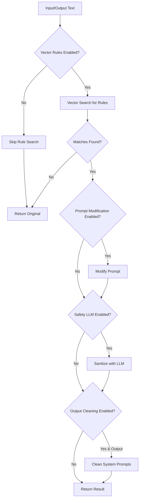
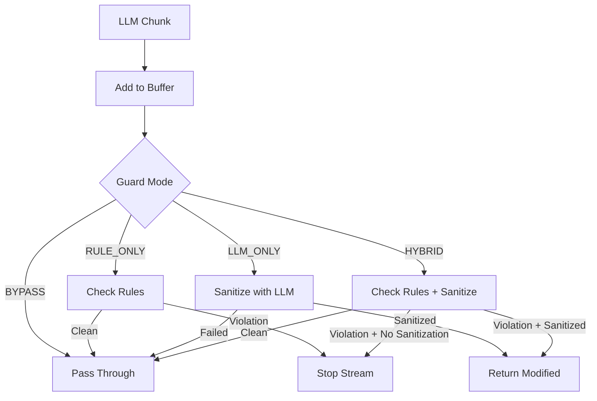

# Анализ производительности фильтра AVI

## Обзор

Этот документ содержит подробный анализ влияния системы фильтрации AVI на скорость генерации и качество ответов в различных режимах. Документ описывает роль `scoring_llm`, доступность различных компонентов и рекомендации по выбору режима для различных use cases.

**Дата создания:** 2025-11-13
**Версия:** 1.0
**Связанные задачи:** REFACTORING_PLAN.md - Задача 1.5

---

## 📊 Содержание

- [1. Архитектура фильтрации](#1-архитектура-фильтрации)
- [2. Режимы безопасности (Safety Modes)](#2-режимы-безопасности-safety-modes)
- [3. Режимы Streaming Guard](#3-режимы-streaming-guard)
- [4. Компоненты фильтрации](#4-компоненты-фильтрации)
- [5. Анализ производительности](#5-анализ-производительности)
- [6. Scoring LLM - роль и доступность](#6-scoring-llm---роль-и-доступность)
- [7. Сравнительная таблица режимов](#7-сравнительная-таблица-режимов)
- [8. Рекомендации по выбору режима](#8-рекомендации-по-выбору-режима)

---

## 1. Архитектура фильтрации

Система фильтрации AVI состоит из двух основных компонентов:

### 1.1 ContentFilterService (src/core/content_filter.py)

**Основная служба фильтрации**, обрабатывающая как входящие запросы (input), так и исходящие ответы (output).



### 1.2 StreamingGuard (src/core/streaming_guard.py)

**Служба модерации streaming ответов**, работающая с потоковыми chunk'ами от LLM.



---

## 2. Режимы безопасности (Safety Modes)

Режим безопасности определяет, **какой LLM используется для санитизации** контента.

### 2.1 Описание режимов

| Режим | Код | Описание | Файл конфигурации |
|-------|-----|----------|-------------------|
| **DISABLED** | `disabled` | Только vector search, без LLM санитизации | settings.SAFETY_MODE |
| **LOCAL** | `local` | Использует локальный safety микросервис | settings.SAFETY_SERVICE_URL |
| **EXTERNAL** | `external` / `llm` / `remote` | Использует внешний LLM API (OpenRouter) | settings.SAFETY_LLM_* |
| **HYBRID** | `hybrid` | Комбинирует local + external с fallback | Оба конфига выше |

### 2.2 Инициализация режимов

**Код:** `src/core/content_filter.py:89-155`

```python
def _initialize_safety_adapter(self, safety_llm: LLMAdapter | None) -> LLMAdapter | None:
    mode = self.requested_mode

    if mode is SafetyMode.DISABLED:
        return None  # Только vector search

    if mode is SafetyMode.EXTERNAL:
        # Требуется: SAFETY_LLM_API_KEY, SAFETY_LLM_MODEL
        return LLMAdapter(role="safety")

    if mode is SafetyMode.LOCAL:
        # Требуется: SAFETY_SERVICE_URL или SAFETY_LOCAL_API_URL
        return LLMAdapter(role="local_safety")

    if mode is SafetyMode.HYBRID:
        # Пытается инициализировать оба, fallback на один из них
        local_adapter = LLMAdapter(role="local_safety")
        external_adapter = LLMAdapter(role="safety")
        return LLMAdapter(role="hybrid",
                          primary_adapter=local_adapter,
                          fallback_adapter=external_adapter)
```

### 2.3 Деградация режимов

**HYBRID режим деградирует** при отсутствии одного из адаптеров:
- Local недоступен → деградация к EXTERNAL
- External недоступен → деградация к LOCAL
- Оба недоступны → деградация к DISABLED

### 2.4 Условия доступности

#### DISABLED
- ✅ **Всегда доступен** - не требует внешних зависимостей

#### LOCAL
- ✅ Требует запущенный safety микросервис
- ✅ Требует `SAFETY_SERVICE_URL` или `SAFETY_LOCAL_API_URL`
- ⚠️ Проверка здоровья: `SafetyServiceClient.check_health()`

#### EXTERNAL
- ✅ Требует `SAFETY_LLM_API_KEY` (не пустой)
- ✅ Требует `SAFETY_LLM_MODEL` (не пустой)
- ⚠️ В production: `AVI_TEST_MODE` должен быть выключен

#### HYBRID
- ✅ Требует **хотя бы один** из LOCAL или EXTERNAL
- ⚠️ Рекомендуется оба для полного fallback

---

## 3. Режимы Streaming Guard

Streaming Guard определяет **стратегию модерации потоковых ответов**.

### 3.1 Описание режимов

| Режим | Код | Описание | Поведение при нарушении |
|-------|-----|----------|------------------------|
| **BYPASS** | `bypass` | Пропускает все chunk'ы без проверки | Нет модерации |
| **RULE_ONLY** | `rule-only` | Только проверка правил через vector search | **Останавливает stream** |
| **LLM_ONLY** | `llm-only` | Только санитизация через safety LLM | Возвращает sanitized chunk |
| **HYBRID** | `hybrid` | Проверка правил + LLM санитизация | Sanitized chunk или stop |

**Настройка:** `settings.STREAM_GUARD_MODE` (default: `"hybrid"`)

### 3.2 Логика обработки chunk'ов

**Код:** `src/core/streaming_guard.py:112-198`

#### BYPASS
```python
if self.mode is StreamingGuardMode.BYPASS:
    return StreamingGuardDecision(allowed=True, content=chunk)
```
- **Latency overhead:** 0ms
- **Качество:** Нет защиты

#### RULE_ONLY
```python
filter_result = await self._check_rules(self._buffer)
if matches_detected:
    self._stopped = True
    return StreamingGuardDecision(allowed=False, stop_stream=True)
```
- **Latency overhead:** ~10-50ms (vector search)
- **Качество:** Высокая точность, но может прерывать безопасные ответы

#### LLM_ONLY
```python
sanitized_chunk = await self._sanitize_with_llm(chunk)
if sanitized_chunk is not None:
    return StreamingGuardDecision(allowed=True, content=sanitized_chunk)
```
- **Latency overhead:** ~100-500ms (зависит от LLM)
- **Качество:** Более мягкая фильтрация, продолжает stream

#### HYBRID
```python
# 1. Проверка правил
filter_result = await self._check_rules(self._buffer)
matches_detected = bool(filter_result and filter_result.matches)

# 2. Санитизация через LLM
sanitized_chunk = await self._sanitize_with_llm(chunk)

# 3. Решение
if matches_detected:
    if sanitized_chunk and sanitized_chunk.strip():
        # Возвращаем sanitized версию
        return StreamingGuardDecision(allowed=True, content=sanitized_chunk)
    else:
        # Останавливаем stream, если санитизация не удалась
        self._stopped = True
        return StreamingGuardDecision(allowed=False, stop_stream=True)
```
- **Latency overhead:** ~110-550ms (vector search + LLM)
- **Качество:** Лучший баланс безопасности и доступности

### 3.3 Буферизация

StreamingGuard поддерживает **скользящий буфер** для анализа контекста:
- **Размер буфера:** `buffer_limit` (default: 2000 символов)
- **Обновление:** `self._buffer = (self._buffer + chunk)[-buffer_limit:]`
- **Назначение:** Анализ последних 2000 символов для обнаружения нарушений в контексте

---

## 4. Компоненты фильтрации

ContentFilterService использует **4 основных компонента**, каждый из которых можно включить/выключить:

### 4.1 Vector Rules Search

**Параметр:** `enable_vector_rules` (default: `True`)
**Код:** `src/core/content_filter.py:223-251`

```python
if enable_vector_rules:
    matches_from_rules = await self.vector_db.find_matching_rules(
        text, n_results=settings.VECTOR_SEARCH_TOP_K
    )
    # Фильтрация по threshold
    for match in matches_from_rules:
        rule_threshold = await self.vector_db.get_rule_threshold(match.rule_text)
        if match.relevance_score >= rule_threshold:
            filtered_matches.append(match)
```

**Характеристики:**
- **Latency:** ~10-50ms (зависит от размера БД и TOP_K)
- **Точность:** Высокая (основана на векторном сходстве)
- **Настройки:**
  - `VECTOR_SEARCH_TOP_K`: 10 (количество кандидатов)
  - `FILTER_DEFAULT_THRESHOLD`: 0.60 (production-tuned)
  - `FILTER_FALLBACK_THRESHOLD`: 0.50

### 4.2 Prompt Modification

**Параметр:** `enable_prompt_modification` (default: `True`)
**Код:** `src/core/content_filter.py:260-274`

```python
if result.matches and enable_prompt_modification:
    result.was_modified = True
    context_info = context or ""
    safe_prompt = (
        f"Remember to adhere to safety guidelines and answer ethically. "
        f"User question: USER QUESTION: {text}\n"
        f"CONTEXT: {context_info}\n"
    )
    result.modified_text = safe_prompt
```

**Характеристики:**
- **Latency:** ~1ms (просто конкатенация строк)
- **Применяется:** Только для INPUT с matches
- **Эффект:** Добавляет safety инструкции к промпту

### 4.3 Safety LLM Sanitization

**Параметр:** `use_llm` (default: `False`)
**Код:** `src/core/content_filter.py:277-288`

```python
if result.matches and use_llm and self.safety_llm:
    sanitization_start = time.perf_counter()
    llm_response = await self._try_generate_safe_text(text, context)
    sanitization_latency_seconds = time.perf_counter() - sanitization_start
    if llm_response:
        result.modified_text = llm_response
        result.was_modified = True
```

**Характеристики:**
- **Latency:** ~100-500ms (зависит от LLM и размера текста)
- **Доступность:** Только при SafetyMode != DISABLED
- **System Prompt (EXTERNAL/LOCAL):**
  ```
  You are a content safety assistant.
  Your task is to check and, if necessary, rephrase the text
  to make it safe and ethical, while preserving the main meaning.
  ```

### 4.4 Output Cleaning

**Параметр:** `enable_output_cleaning` (default: `True`)
**Код:** `src/core/content_filter.py:291-302`

```python
if not is_input and enable_output_cleaning:
    cleaned_text = self._process_output_content(text)
    if cleaned_text != text:
        result.was_modified = True
        result.modified_text = cleaned_text
```

**Характеристики:**
- **Latency:** ~1-5ms (парсинг строк)
- **Применяется:** Только для OUTPUT
- **Функция:** Удаляет системные маркеры из LLM ответа
  - `USER QUESTION:`
  - `DONT ANSWER`
  - `SYSTEM:`
  - `USER:`
  - И другие инструкции

---

## 5. Анализ производительности

### 5.1 Компонентная декомпозиция latency

```
Total Latency = Detection Latency + Sanitization Latency (опционально)

Detection Latency =
    Vector Search Time (если enabled) +
    Prompt Modification Time (если enabled) +
    Output Cleaning Time (если enabled и OUTPUT)

Sanitization Latency =
    Safety LLM Time (если use_llm=True и matches найдены)
```

### 5.2 Измеряемые метрики

**Код:** `src/core/content_filter.py:306-318`

```python
content_filter_metrics.record(
    mode=self.active_mode,
    predicted_positive=bool(result.matches),
    detection_latency_seconds=detection_latency_seconds,
    sanitization_latency_seconds=sanitization_latency_seconds,
    actual_positive=ground_truth,
)

content_filter_metrics.record_component_usage(
    components_applied=components_applied,
    was_modified=result.was_modified,
    is_input=is_input,
)
```

**Метрики из задачи 1.4** (см. `docs/METRICS_ANALYSIS.md`):
- `avi_filter_latency_seconds{mode, stage}` - общая latency
- `avi_filter_detection_latency_seconds{mode, stage}` - только detection
- `avi_filter_sanitization_latency_seconds{mode, stage}` - только LLM
- `avi_filter_component_usage_total{component, stage}` - использование компонентов

### 5.3 Оценка overhead по режимам

#### Safety Mode = DISABLED

| Компонент | Включен | Latency |
|-----------|---------|---------|
| Vector Rules | ✅ | 10-50ms |
| Prompt Modification | ✅ | ~1ms |
| Safety LLM | ❌ | 0ms |
| Output Cleaning | ✅ | 1-5ms |
| **TOTAL (INPUT)** | | **11-51ms** |
| **TOTAL (OUTPUT)** | | **11-55ms** |

#### Safety Mode = LOCAL

| Компонент | Включен | Latency |
|-----------|---------|---------|
| Vector Rules | ✅ | 10-50ms |
| Prompt Modification | ✅ | ~1ms |
| Safety LLM (local service) | ✅ (если matches) | 50-200ms |
| Output Cleaning | ✅ | 1-5ms |
| **TOTAL (INPUT, no matches)** | | **11-51ms** |
| **TOTAL (INPUT, with matches)** | | **61-251ms** |
| **TOTAL (OUTPUT, with matches)** | | **61-255ms** |

#### Safety Mode = EXTERNAL/LLM

| Компонент | Включен | Latency |
|-----------|---------|---------|
| Vector Rules | ✅ | 10-50ms |
| Prompt Modification | ✅ | ~1ms |
| Safety LLM (external API) | ✅ (если matches) | 100-500ms |
| Output Cleaning | ✅ | 1-5ms |
| **TOTAL (INPUT, no matches)** | | **11-51ms** |
| **TOTAL (INPUT, with matches)** | | **111-551ms** |
| **TOTAL (OUTPUT, with matches)** | | **111-555ms** |

#### Safety Mode = HYBRID

| Компонент | Включен | Latency |
|-----------|---------|---------|
| Vector Rules | ✅ | 10-50ms |
| Prompt Modification | ✅ | ~1ms |
| Safety LLM (primary, local) | ✅ (если matches) | 50-200ms |
| Safety LLM (fallback, external) | ✅ (если primary fails) | +100-500ms |
| Output Cleaning | ✅ | 1-5ms |
| **TOTAL (INPUT, no matches)** | | **11-51ms** |
| **TOTAL (INPUT, matches + local)** | | **61-251ms** |
| **TOTAL (INPUT, matches + fallback)** | | **161-751ms** |

### 5.4 Streaming Guard overhead

| Mode | Overhead per chunk | Поведение |
|------|-------------------|-----------|
| BYPASS | 0ms | Пропускает все |
| RULE_ONLY | 10-50ms | Проверяет buffer, может остановить |
| LLM_ONLY | 100-500ms | Санитизирует каждый chunk |
| HYBRID | 110-550ms | Проверяет + санитизирует |

**Примечание:** В HYBRID режиме, если правила не сработали, LLM санитизация НЕ вызывается, что снижает overhead.

### 5.5 Влияние на общую скорость генерации

**Пример:** Генерация ответа длиной 500 токенов (~375 слов, ~2000 символов)

| Режим | Input Filter | Output Filter | LLM Generation | **TOTAL** | % Overhead |
|-------|--------------|---------------|----------------|-----------|------------|
| No Filter | 0ms | 0ms | 2000ms | 2000ms | 0% |
| DISABLED | 50ms | 55ms | 2000ms | 2105ms | 5.3% |
| LOCAL (no matches) | 50ms | 55ms | 2000ms | 2105ms | 5.3% |
| LOCAL (with matches) | 250ms | 255ms | 2000ms | 2505ms | 25.3% |
| EXTERNAL (with matches) | 550ms | 555ms | 2000ms | 3105ms | 55.3% |
| HYBRID (local success) | 250ms | 255ms | 2000ms | 2505ms | 25.3% |

### 5.6 Детальный анализ Streaming производительности

#### 5.6.1 Streaming vs Non-Streaming сравнение

**Сценарий:** Генерация ответа 500 токенов (~2000 символов)

##### Non-Streaming (блокирующий режим)

```
Timeline:
[Input Filter]──[LLM Generation (full)]──[Output Filter]──[Response]
    50ms              2000ms                  55ms          = 2105ms

User Experience:
- Ожидание: 2105ms
- Получает: Весь ответ сразу
- TTFR (Time To First Response): 2105ms
```

| Режим | Input | Generation | Output | Total | User Wait |
|-------|-------|------------|--------|-------|-----------|
| DISABLED | 50ms | 2000ms | 55ms | 2105ms | 2105ms |
| LOCAL (matches) | 250ms | 2000ms | 255ms | 2505ms | 2505ms |
| HYBRID (matches) | 250ms | 2000ms | 255ms | 2505ms | 2505ms |

##### Streaming (потоковый режим)

```
Timeline:
[Input Filter]──[Chunk 1]──[Guard]──[Emit]
    50ms          40ms       50ms     5ms    ← TTFB = 145ms
                  [Chunk 2]──[Guard]──[Emit]
                    40ms       50ms     5ms
                  [Chunk 3]──[Guard]──[Emit]
                    ...        ...      ...
                  [Chunk N]──[Guard]──[Emit]──[Output Filter]
                    40ms       50ms     5ms       55ms

User Experience:
- TTFB (Time To First Byte): 145ms
- Получает: Инкрементальный текст
- Perceived latency: значительно ниже
```

#### 5.6.2 Подробные расчеты для Streaming

**Допущения:**
- Ответ: 500 токенов = 2000 символов
- LLM скорость: 25 токенов/сек
- Chunk size: 50 токенов = ~10 chunks
- Генерация 1 chunk: 2000ms / 10 = 200ms (в среднем)
- Network latency: 5ms per emit

##### Streaming Guard BYPASS (минимальный overhead)

```
TTFB = Input Filter + First Chunk + Network
     = 50ms + 200ms + 5ms = 255ms

Per-chunk latency:
Chunk generation: 200ms
Guard processing: 0ms (bypass)
Network emit: 5ms
Total per chunk: 205ms

Total time:
Input: 50ms
10 chunks × 205ms: 2050ms
Total: 2100ms

Overhead vs non-streaming: -5ms (параллелизация)
```

##### Streaming Guard RULE_ONLY

```
TTFB = Input Filter + First Chunk + Guard + Network
     = 50ms + 200ms + 30ms + 5ms = 285ms

Per-chunk latency:
Chunk generation: 200ms (parallel with previous processing)
Guard processing: 30ms (vector search на buffer)
Network emit: 5ms
Total per chunk: 235ms

Total time:
Input: 50ms
First chunk: 200ms + 30ms + 5ms = 235ms
9 remaining chunks × 235ms: 2115ms
Total: 2400ms

Overhead vs non-streaming: +295ms
Overhead vs BYPASS streaming: +300ms
```

**Примечание:** Vector search выполняется на **буфере** (последние 2000 символов), не на отдельном chunk'е.

##### Streaming Guard LLM_ONLY

```
TTFB = Input Filter + First Chunk + LLM Sanitize + Network
     = 50ms + 200ms + 300ms + 5ms = 555ms

Per-chunk latency:
Chunk generation: 200ms
LLM sanitization: 300ms (external API call)
Network emit: 5ms
Total per chunk: 505ms

Total time:
Input: 50ms
10 chunks × 505ms: 5050ms
Total: 5100ms

Overhead vs non-streaming: +2995ms (очень высокий!)
Overhead vs BYPASS streaming: +3000ms
```

**Критическая проблема:** LLM_ONLY на каждый chunk добавляет 300ms, что **крайне дорого** для streaming.

##### Streaming Guard HYBRID (рекомендуемый)

```
TTFB = Input Filter + First Chunk + Guard + Network
     = 50ms + 200ms + 30ms + 5ms = 285ms

Per-chunk latency (если правила НЕ сработали):
Chunk generation: 200ms
Rule check: 30ms
LLM sanitization: 0ms (не вызывается)
Network emit: 5ms
Total: 235ms

Per-chunk latency (если правила СРАБОТАЛИ):
Chunk generation: 200ms
Rule check: 30ms
LLM sanitization: 300ms
Network emit: 5ms
Total: 535ms

Scenarios:
1. Clean stream (no violations): 2400ms total
2. 1 violation at chunk 5:
   - Chunks 1-4: 4 × 235ms = 940ms
   - Chunk 5 (violation): 535ms
   - Decision: sanitize (continue) or stop
   - If continue, chunks 6-10: 5 × 235ms = 1175ms
   - Total: 50ms + 940ms + 535ms + 1175ms = 2700ms

Overhead vs non-streaming (clean): +295ms
Overhead vs non-streaming (1 violation): +595ms
```

#### 5.6.3 TTFB (Time To First Byte) сравнение

**TTFB критичен для perceived performance** - пользователь видит начало ответа быстрее.

| Режим | Non-Streaming TTFR | Streaming TTFB | Улучшение | User Impact |
|-------|-------------------|----------------|-----------|-------------|
| No Filter | 2000ms | 200ms | **-1800ms** ⚡ | Огромное |
| Input DISABLED + Guard BYPASS | 2050ms | 255ms | **-1795ms** ⚡ | Огромное |
| Input DISABLED + Guard RULE_ONLY | 2105ms | 285ms | **-1820ms** ⚡ | Огромное |
| Input LOCAL (matches) + Guard HYBRID | 2505ms | 485ms | **-2020ms** ⚡ | Огромное |
| Input EXTERNAL (matches) + Guard HYBRID | 3105ms | 785ms | **-2320ms** ⚡ | Огромное |

**Вывод:** Streaming **драматически улучшает** perceived latency, даже с высоким Guard overhead.

#### 5.6.4 Throughput метрики

**Chunks per second:**

| Guard Mode | Generation (chunks/s) | Processing (chunks/s) | Bottleneck |
|------------|----------------------|-----------------------|------------|
| BYPASS | 5.0 | ∞ (no processing) | LLM generation |
| RULE_ONLY | 5.0 | 4.3 (235ms/chunk) | Guard processing |
| LLM_ONLY | 5.0 | 2.0 (505ms/chunk) | Guard LLM |
| HYBRID (clean) | 5.0 | 4.3 (235ms/chunk) | Guard processing |
| HYBRID (violations) | 5.0 | 1.9 (535ms/chunk) | Guard LLM |

**Tokens per second (end-to-end):**

| Guard Mode | Scenario | Tokens/s | vs Baseline |
|------------|----------|----------|-------------|
| No Guard | - | 25.0 | 100% |
| BYPASS | - | 24.4 | 97.6% |
| RULE_ONLY | clean | 20.8 | 83.2% |
| LLM_ONLY | all sanitized | 9.8 | 39.2% ⚠️ |
| HYBRID | clean | 20.8 | 83.2% |
| HYBRID | 20% violations | 18.5 | 74.0% |

**Критическое наблюдение:** LLM_ONLY режим **снижает throughput в 2.5 раза**!

#### 5.6.5 Влияние chunk size

**Эксперимент:** 500 токенов с разным chunk size

| Chunk Size | Chunks Count | TTFB (RULE_ONLY) | Total Time | Trade-off |
|------------|--------------|------------------|------------|-----------|
| 10 токенов | 50 | 50ms + 80ms + 30ms = 160ms | 50×235ms + 50ms = 11800ms | Низкий TTFB, высокий overhead |
| 25 токенов | 20 | 50ms + 200ms + 30ms = 280ms | 20×235ms + 50ms = 4750ms | Баланс |
| 50 токенов | 10 | 50ms + 400ms + 30ms = 480ms | 10×235ms + 50ms = 2400ms | **Оптимальный** |
| 100 токенов | 5 | 50ms + 800ms + 30ms = 880ms | 5×235ms + 50ms = 1225ms | Низкий overhead, высокий TTFB |

**Рекомендация:** Chunk size **50-100 токенов** обеспечивает лучший баланс TTFB и overhead.

#### 5.6.6 Worst-case сценарии

##### Scenario 1: Violation в первом chunk'е (RULE_ONLY)

```
Input: 50ms
Chunk 1: 200ms
Guard detects violation: 30ms
Stream STOPPED: immediate
Total: 280ms

User sees: Частичный ответ (~10 слов), затем error/stop
Impact: Плохой UX, но быстрая защита
```

##### Scenario 2: Violation в середине (HYBRID)

```
Input: 50ms
Chunks 1-5 (clean): 5 × 235ms = 1175ms
Chunk 6 (violation): 200ms + 30ms (detect) + 300ms (sanitize) = 530ms
Guard returns sanitized chunk
Chunks 7-10: 4 × 235ms = 940ms
Total: 2695ms

User sees: Постепенный ответ, один chunk слегка задерживается
Impact: Приемлемый UX, сохраняется streaming
```

##### Scenario 3: LLM_ONLY с медленным safety LLM

```
Input: 50ms
Each chunk: 200ms (gen) + 500ms (slow LLM) = 700ms
10 chunks: 7000ms
Total: 7050ms

User sees: Очень медленный streaming, каждый chunk задерживается
Impact: Неприемлемо медленно ⚠️
```

#### 5.6.7 Сравнительная таблица: Streaming vs Non-Streaming

| Метрика | Non-Streaming | Streaming (BYPASS) | Streaming (HYBRID) | Преимущество |
|---------|--------------|-------------------|-------------------|--------------|
| **TTFB/TTFR** | 2105ms | 255ms | 285ms | **-1820ms** ⚡ |
| **Total Time** | 2105ms | 2100ms | 2400ms (clean) | -5ms to +295ms |
| **Perceived Latency** | Высокая | Очень низкая | Низкая | Streaming ⭐⭐⭐ |
| **Memory Usage** | Высокий (весь ответ) | Низкий (chunked) | Низкий (chunked) | Streaming ⭐⭐⭐ |
| **User Engagement** | Ожидание | Немедленное чтение | Немедленное чтение | Streaming ⭐⭐⭐ |
| **Safety Granularity** | Проверка в конце | Проверка per-chunk | Проверка per-chunk | Streaming ⭐⭐⭐ |
| **Error Handling** | Весь ответ потерян | Частичный ответ сохранен | Частичный + sanitization | Streaming ⭐⭐ |
| **Throughput** | 1 req at 2.1s | 1 req at 2.1s | 1 req at 2.4s | Примерно равно |
| **Overhead** | 105ms | 100ms | 300-600ms | Non-streaming ⭐ |

#### 5.6.8 Рекомендации для Streaming

##### Когда использовать Streaming

✅ **ОБЯЗАТЕЛЬНО использовать:**
- Интерактивные чаты (user engagement критичен)
- Длинные ответы (>200 токенов)
- Real-time приложения
- Когда perceived latency важнее throughput

✅ **Рекомендуется использовать:**
- Production chatbots
- Customer support systems
- Content generation tools

❌ **Избегать Streaming:**
- Batch processing (throughput критичен)
- API-to-API интеграции (нет пользователя)
- Короткие ответы (<50 токенов)
- Когда требуется atomic response

##### Выбор Streaming Guard Mode

| Use Case | Guard Mode | Обоснование |
|----------|-----------|-------------|
| Development | BYPASS | Нет overhead, быстрая итерация |
| Low-risk chat | RULE_ONLY | Низкий overhead (235ms/chunk), может прервать |
| Medium-risk | HYBRID | Баланс защиты и UX |
| High-risk | HYBRID | Лучшая защита с сохранением streaming |
| Ultra-sensitive | RULE_ONLY | Строго останавливает при нарушении |

**Избегать:** LLM_ONLY для streaming (слишком медленно)

##### Оптимизация Streaming Performance

1. **Chunk Size:**
   ```python
   # Оптимальный размер
   chunk_size = 50-100 токенов

   # Слишком маленький (высокий overhead)
   chunk_size = 10 токенов  # ❌

   # Слишком большой (высокий TTFB)
   chunk_size = 200 токенов  # ❌
   ```

2. **Buffer Limit:**
   ```python
   # StreamingGuard buffer
   buffer_limit = 2000  # Default (хорошо для контекста)
   buffer_limit = 1000  # Для более быстрой проверки
   buffer_limit = 500   # Minimal (может пропустить контекстные нарушения)
   ```

3. **Conditional LLM Sanitization:**
   ```python
   # В HYBRID режиме LLM вызывается только при matches
   # Для чистых chunk'ов: 235ms
   # Для violation chunk'ов: 535ms
   # Среднее (5% violations): 235ms × 0.95 + 535ms × 0.05 = 250ms
   ```

4. **Early Stopping:**
   ```python
   # RULE_ONLY: останавливает сразу при нарушении
   # HYBRID: пытается sanitize, затем останавливает
   # Compromise: HYBRID с max_violations_per_response
   ```

#### 5.6.9 Метрики для мониторинга Streaming

**Ключевые метрики** (должны быть в Prometheus):

1. `avi_streaming_ttfb_seconds{mode}` - Time To First Byte
2. `avi_streaming_chunks_per_second{mode}` - Throughput
3. `avi_streaming_guard_latency_per_chunk{mode}` - Guard overhead
4. `avi_streaming_violations_detected_total{mode}` - Частота нарушений
5. `avi_streaming_stopped_total{mode, reason}` - Количество прерванных streams
6. `avi_streaming_sanitized_chunks_total{mode}` - Количество sanitized chunks

**Alerting:**
- TTFB > 500ms (слишком медленно для streaming)
- Guard latency > 100ms (bottleneck)
- Stop rate > 5% (слишком много false positives)
- Sanitization rate > 20% (возможно, проблема с LLM)

---

## 6. Scoring LLM - роль и доступность

### 6.1 Конфигурация

**Настройки:** `config/settings.py:154-173`

```python
SCORING_LLM_API_KEY: str = ""
SCORING_LLM_API_BASE: str = ""
SCORING_LLM_MODEL: str = ""
SCORING_LLM_TEMPERATURE: float = 0.0  # Детерминистичный
SCORING_LLM_MAX_TOKENS: int = 10      # Очень мало - только для скоринга
```

**Инициализация:** `src/services/config_manager.py:403-410`

```python
if settings.SCORING_LLM_MODEL:
    self._configs["llm"]["scoring"] = LLMConfig(
        model=settings.SCORING_LLM_MODEL,
        api_key=settings.SCORING_LLM_API_KEY or "",
        api_base=settings.SCORING_LLM_API_BASE or "",
        temperature=settings.SCORING_LLM_TEMPERATURE,
        max_tokens=settings.SCORING_LLM_MAX_TOKENS,
    )
```

### 6.2 Использование в системе

**Поиск по кодбейзе:** Scoring LLM настроен в конфигурации, НО:

❌ **НЕ используется в `ContentFilterService`**
❌ **НЕ используется в `StreamingGuard`**
❌ **НЕ используется в `RAGSystem`**
❌ **НЕ используется в API endpoints**

### 6.3 Назначение

Судя по настройкам:
- **Temperature: 0.0** - детерминистичный вывод
- **Max Tokens: 10** - очень короткий ответ (вероятно, цифровой score)
- **Имя:** "scoring" - предполагает оценку качества

**Вероятное назначение:**
1. **Оценка качества ответов LLM** - scoring relevance, safety, helpfulness
2. **Эксперименты и A/B тестирование** - оценка различных конфигураций
3. **Ground truth annotation** - автоматическая разметка для метрик
4. **Future feature** - зарезервировано для будущего функционала

### 6.4 Рекомендации по использованию

**Возможные применения:**

1. **Relevance Scoring для RAG:**
   ```python
   # Оценка релевантности документов для запроса
   prompt = f"Rate relevance (0-10): Query: {query}\nDocument: {doc}"
   score = await scoring_llm.generate_response(prompt)
   ```

2. **Safety Scoring:**
   ```python
   # Оценка безопасности ответа (0-10)
   prompt = f"Rate safety (0-10): {response}"
   safety_score = await scoring_llm.generate_response(prompt)
   ```

3. **Ground Truth для Metrics:**
   ```python
   # Автоматическая аннотация для confusion matrix
   prompt = f"Is this toxic (yes/no): {text}"
   ground_truth = await scoring_llm.generate_response(prompt)
   ```

### 6.5 Условия доступности

Scoring LLM доступен, если:
- ✅ `SCORING_LLM_API_KEY` не пустой
- ✅ `SCORING_LLM_MODEL` не пустой
- ✅ `SCORING_LLM_API_BASE` настроен (опционально)
- ⚠️ В production: `AVI_TEST_MODE` должен быть выключен

**Проверка:**
```python
from config.settings import settings

def is_scoring_llm_available() -> bool:
    return bool(settings.SCORING_LLM_API_KEY and settings.SCORING_LLM_MODEL)
```

**Предупреждение:** `config/settings.py:365-367`
```python
if not self.SCORING_LLM_API_KEY:
    logger.warning(
        "SCORING_LLM_API_KEY is not set. SCORE functionality will be unavailable."
    )
```

---

## 7. Сравнительная таблица режимов

### 7.1 Safety Modes для INPUT фильтрации

| Режим | Latency (no matches) | Latency (with matches) | Качество защиты | Доступность | Use Case |
|-------|---------------------|------------------------|----------------|-------------|----------|
| **DISABLED** | 11-51ms | 11-51ms | ⭐⭐⭐ (только правила) | ✅ Всегда | Development, низкий риск |
| **LOCAL** | 11-51ms | 61-251ms | ⭐⭐⭐⭐ (правила + local LLM) | ⚠️ Требует сервис | Средний риск, низкая latency |
| **EXTERNAL** | 11-51ms | 111-551ms | ⭐⭐⭐⭐⭐ (правила + мощный LLM) | ✅ Требует API key | Высокий риск, качество важнее |
| **HYBRID** | 11-51ms | 61-751ms | ⭐⭐⭐⭐⭐ (fallback защита) | ✅ Лучшая | Production, критично |

### 7.2 Safety Modes для OUTPUT фильтрации

| Режим | Latency (no matches) | Latency (with matches) | Качество защиты | Модификация ответа |
|-------|---------------------|------------------------|----------------|-------------------|
| **DISABLED** | 11-55ms | 11-55ms | ⭐⭐⭐ | Только cleaning |
| **LOCAL** | 11-55ms | 61-255ms | ⭐⭐⭐⭐ | Cleaning + sanitization |
| **EXTERNAL** | 11-55ms | 111-555ms | ⭐⭐⭐⭐⭐ | Cleaning + sanitization |
| **HYBRID** | 11-55ms | 61-755ms | ⭐⭐⭐⭐⭐ | Cleaning + sanitization |

### 7.3 Streaming Guard Modes

| Режим | Latency/chunk | Качество | Прерывание stream | Рекомендация |
|-------|---------------|----------|------------------|--------------|
| **BYPASS** | 0ms | ⭐ (нет защиты) | Никогда | Testing only |
| **RULE_ONLY** | 10-50ms | ⭐⭐⭐⭐ | При нарушении | Низкая latency, строгие правила |
| **LLM_ONLY** | 100-500ms | ⭐⭐⭐⭐ | Редко | Мягкая фильтрация |
| **HYBRID** | 110-550ms | ⭐⭐⭐⭐⭐ | При необходимости | **Production default** |

### 7.4 Сравнение по критериям

#### Latency (INPUT, с matches)
```
DISABLED      |████████                              | 11-51ms
LOCAL         |████████████████████████              | 61-251ms
EXTERNAL      |████████████████████████████████████  | 111-551ms
HYBRID (best) |████████████████████████              | 61-251ms
HYBRID (worst)|████████████████████████████████████████████ | 161-751ms
```

#### Качество защиты
```
DISABLED      |██████                                | 3/5
LOCAL         |████████                              | 4/5
EXTERNAL      |██████████                            | 5/5
HYBRID        |██████████                            | 5/5
```

#### Доступность (uptime)
```
DISABLED      |██████████                            | 100%
LOCAL         |████████                              | зависит от сервиса
EXTERNAL      |█████████                             | зависит от API
HYBRID        |█████████                             | max(local, external)
```

---

## 8. Рекомендации по выбору режима

### 8.1 По типу приложения

#### 1. Development / Testing
```yaml
Safety Mode: DISABLED или LOCAL
Stream Guard: BYPASS или RULE_ONLY
Reason: Минимальная latency, быстрая итерация
Risk: Низкий (не production)
```

#### 2. Low-Risk Application (информационный бот)
```yaml
Safety Mode: LOCAL
Stream Guard: RULE_ONLY
Reason: Баланс скорости и защиты
Risk: Средний (низкие последствия при ошибке)
```

#### 3. Medium-Risk Application (customer support)
```yaml
Safety Mode: HYBRID (local primary)
Stream Guard: HYBRID
Reason: Хорошая защита с fallback
Risk: Средний-Высокий
```

#### 4. High-Risk Application (медицина, финансы, дети)
```yaml
Safety Mode: EXTERNAL или HYBRID (external primary)
Stream Guard: HYBRID
Reason: Максимальная защита, качество важнее скорости
Risk: Критический
```

### 8.2 По требованиям к latency

#### Ultra-Low Latency (<50ms overhead)
```yaml
Safety Mode: DISABLED
Stream Guard: BYPASS или RULE_ONLY
Components:
  - enable_vector_rules: true
  - enable_prompt_modification: false  # Экономим 1ms
  - use_llm: false
  - enable_output_cleaning: true
```

#### Low Latency (<200ms overhead)
```yaml
Safety Mode: LOCAL
Stream Guard: RULE_ONLY
Components:
  - enable_vector_rules: true
  - enable_prompt_modification: true
  - use_llm: true (только при matches)
  - enable_output_cleaning: true
```

#### Balanced Latency (<300ms overhead)
```yaml
Safety Mode: HYBRID (local primary)
Stream Guard: HYBRID
Components: все включены
```

#### Quality-First (latency не критична)
```yaml
Safety Mode: EXTERNAL или HYBRID
Stream Guard: HYBRID
Components: все включены
Vector Search:
  - VECTOR_SEARCH_TOP_K: 20  # Больше кандидатов
  - FILTER_DEFAULT_THRESHOLD: 0.50  # Ниже порог
```

### 8.3 По stage развертывания

#### Local Development
```yaml
ENVIRONMENT: development
SAFETY_MODE: disabled
STREAM_GUARD_MODE: bypass
AVI_TEST_MODE: 1  # Mock LLMs
```

#### Staging
```yaml
ENVIRONMENT: staging
SAFETY_MODE: local или hybrid
STREAM_GUARD_MODE: rule-only или hybrid
# Реальные LLMs, но менее критично
```

#### Production
```yaml
ENVIRONMENT: production
SAFETY_MODE: hybrid
STREAM_GUARD_MODE: hybrid
AVI_TEST_MODE: 0  # НИКОГДА не включать в production
REQUIRE_API_KEY: true
RATE_LIMIT_ENABLED: true
```

### 8.4 Специальные случаи

#### Streaming Chat (низкая latency важна)
```yaml
Safety Mode: LOCAL или DISABLED
Stream Guard: RULE_ONLY  # Останавливает при нарушении
Reason: HYBRID добавляет 100-500ms на каждый chunk
```

#### Batch Processing (качество важнее скорости)
```yaml
Safety Mode: EXTERNAL
Stream Guard: не используется (не streaming)
Components: все включены
use_llm: true  # Всегда санитизировать через LLM
```

#### Multilingual (несколько языков)
```yaml
Safety Mode: EXTERNAL
Reason: Внешние LLM лучше обрабатывают multilingual
Stream Guard: HYBRID
FILTER_DEFAULT_THRESHOLD: 0.55  # Немного выше для снижения FP
```

---

## 9. Дополнительные оптимизации

### 9.1 Настройка thresholds

**Production-tuned значения** (уже настроены в `settings.py`):
```python
FILTER_DEFAULT_THRESHOLD: 0.60  # Баланс precision/recall
FILTER_FALLBACK_THRESHOLD: 0.50  # Fallback для правил без threshold
```

**Рекомендации по изменению:**
- **Снизить** (0.50-0.55): Больше matches, больше false positives, выше защита
- **Повысить** (0.65-0.75): Меньше matches, меньше false positives, ниже защита

### 9.2 Оптимизация Vector Search

```python
# Снизить TOP_K для ускорения
VECTOR_SEARCH_TOP_K: 5  # Вместо 10 (default)

# Увеличить для лучшего качества
VECTOR_SEARCH_TOP_K: 20  # Больше кандидатов
```

**Trade-off:**
- TOP_K=5: ~10-30ms latency, может пропустить релевантные правила
- TOP_K=10: ~10-50ms latency (default, balanced)
- TOP_K=20: ~20-80ms latency, лучшее покрытие

### 9.3 Отключение компонентов

**Для минимальной latency:**
```python
result = await filter_service.check_content(
    text,
    use_llm=False,  # Отключить LLM санитизацию
    enable_prompt_modification=False,  # Отключить модификацию
    enable_output_cleaning=True,  # Оставить cleaning (важно)
)
```

**Для минимальной защиты (только cleaning):**
```python
result = await filter_service.check_content(
    text,
    enable_vector_rules=False,  # Отключить rule search
    enable_prompt_modification=False,
    enable_output_cleaning=True,  # Только cleaning
)
```

### 9.4 Кеширование

**LLM санитизация** может быть закеширована:
- Кеш ключ: `hash(text + context + safety_mode)`
- TTL: `CACHE_TTL` (default: 3600s)
- Backend: `CACHE_BACKEND` (memory или redis)

**Vector search** уже использует оптимизированные индексы (HNSW в Chroma/Qdrant).

---

## 10. Выводы

### 10.1 Ключевые находки

1. **Vector Rules** - самый быстрый и эффективный компонент (10-50ms)
2. **Safety LLM** - самый медленный (100-500ms), но обеспечивает лучшее качество
3. **HYBRID режим** - лучший баланс для production (fallback + оптимизация)
4. **Streaming Guard HYBRID** - добавляет значительный overhead, но необходим для безопасности
5. **Scoring LLM** - настроен, но НЕ используется в основном коде (для будущих feature)

### 10.2 Best Practices

✅ **DO:**
- Использовать HYBRID режим в production
- Настроить fallback для критических приложений
- Мониторить `detection_latency` и `sanitization_latency` отдельно
- Использовать RULE_ONLY для streaming при низкой latency требования
- Настраивать thresholds под конкретное приложение

❌ **DON'T:**
- Включать AVI_TEST_MODE в production
- Использовать EXTERNAL режим без fallback
- Отключать все компоненты (минимум vector_rules)
- Использовать BYPASS в production
- Игнорировать метрики latency

### 10.3 Рекомендуемая конфигурация для Production

```yaml
# config/settings.py или .env
ENVIRONMENT=production
SAFETY_MODE=hybrid
STREAM_GUARD_MODE=hybrid

# LLM конфигурация
SAFETY_LLM_API_KEY=<external_api_key>
SAFETY_LLM_MODEL=gpt-4o-mini  # Быстрый и качественный
SAFETY_SERVICE_URL=http://localhost:8001  # Local safety сервис

# Thresholds (production-tuned)
FILTER_DEFAULT_THRESHOLD=0.60
FILTER_FALLBACK_THRESHOLD=0.50
VECTOR_SEARCH_TOP_K=10

# Performance
CACHE_BACKEND=redis
CACHE_TTL=3600

# Security
REQUIRE_API_KEY=true
RATE_LIMIT_ENABLED=true
AVI_TEST_MODE=0
```

### 10.4 Метрики для мониторинга

Обязательно мониторить (см. `docs/METRICS_ANALYSIS.md`):
1. `avi_filter_latency_seconds{mode, stage}` - общая latency
2. `avi_filter_detection_latency_seconds{mode, stage}` - detection overhead
3. `avi_filter_sanitization_latency_seconds{mode, stage}` - LLM overhead
4. `avi_streaming_guard_chunks_processed_total{mode}` - streaming throughput
5. `avi_safety_intervention_total{stage, mode}` - частота модификаций

**Alerting thresholds:**
- `p95(filter_latency) > 200ms` для LOCAL
- `p95(filter_latency) > 600ms` для EXTERNAL
- `safety_intervention_rate > 30%` (слишком много false positives)

---

## 11. Связанная документация

- [METRICS_ANALYSIS.md](./METRICS_ANALYSIS.md) - Подробный анализ метрик
- [VECTOR_VS_LINKED_DOCUMENTS.md](./VECTOR_VS_LINKED_DOCUMENTS.md) - Архитектура документов
- [INDEXING_PROCESS.md](./INDEXING_PROCESS.md) - Процесс индексации
- [REFACTORING_PLAN.md](../REFACTORING_PLAN.md) - План рефакторинга

---

**Автор:** Claude Code
**Дата:** 2025-11-13
**Версия:** 1.0
**Задача:** REFACTORING_PLAN.md - Задача 1.5
