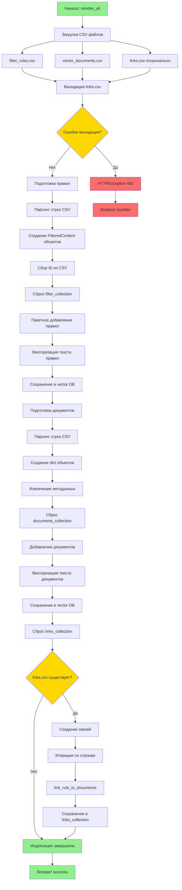

# Процесс индексации AVI

## Обзор

Система индексации AVI отвечает за загрузку и векторизацию данных из CSV файлов в векторную базу данных. Процесс индексации создает три основные коллекции:

1. **filter_collection** - правила фильтрации контента
2. **main_collection** - документы для контекстного поиска
3. **rule_document_links** - связи между правилами и документами

## Архитектура компонентов

### Основные компоненты

#### 1. IndexingService (`src/services/indexing_service.py`)
Центральный сервис для управления процессом индексации.

**Ключевые методы:**
- `reindex_all()` - полная переиндексация всех данных
- `validate_rules_csv()` - валидация CSV файла с правилами
- `validate_documents_csv()` - валидация CSV файла с документами
- `validate_links_csv()` - валидация CSV файла со связями

#### 2. VectorDBService (`src/services/vector_db.py`)
Абстракция для работы с векторными базами данных (Chroma/Qdrant).

**Основные операции:**
- `add_filter_rules_batch()` - пакетное добавление правил
- `add_documents()` - добавление документов
- `link_rule_to_documents()` - создание связей
- `reset_*_collection()` - сброс коллекций

#### 3. LinksManager (`src/services/links_manager.py`)
Управление связями между правилами и документами.

**Функции:**
- Создание/удаление связей
- Пакетные операции со связями
- Управление статусом одобрения связей

## Процесс индексации

### Последовательность операций



### Детальное описание шагов

#### Шаг 1: Загрузка CSV файлов
```python
rules_path = settings.RAW_DATA_DIR / "filter_rules.csv"
docs_path = settings.RAW_DATA_DIR / "vector_documents.csv"
links_path = settings.RAW_DATA_DIR / "links.csv"
```

**Файлы:**
- `filter_rules.csv` - обязательный
- `vector_documents.csv` - обязательный
- `links.csv` - опциональный

#### Шаг 2: Валидация данных

**Валидация links.csv:**
- Проверка наличия обязательных колонок: `rule_id`, `document_id`
- Проверка на дубликаты пар rule_id/document_id
- Возврат списка ошибок

**Валидация rules.csv:**
- Обязательные колонки: `id`, `text`, `risk_level`
- Проверка на дубликаты ID

**Валидация documents.csv:**
- Обязательные колонки: `id`, `text`
- Проверка на дубликаты ID

#### Шаг 3: Индексация правил

```python
# Подготовка правил
for _, row in rules_df.iterrows():
    rule = FilteredContent(
        text=row["text"],
        category=row.get("category", "other"),
        risk_level=row["risk_level"],
        threshold=row.get("threshold", 0.75),
    )
    rules_to_add.append(rule)
    rule_ids_to_add.append(str(row["id"]))

# Сброс коллекции
self.vector_db.reset_filter_collection()

# Пакетное добавление с сохранением ID
self.vector_db.add_filter_rules_batch(rules_to_add, ids=rule_ids_to_add)
```

**Важно:** ID из CSV файла сохраняются для корректной работы связей.

#### Шаг 4: Индексация документов

```python
documents = []
for idx, row in docs_df.iterrows():
    doc = {
        "text": row["text"],
        "metadata": {
            "document_id": row.get("id", f"doc_{idx}"),
            "category": row.get("category"),
            "source": row.get("source"),
        },
    }
    documents.append(doc)

self.vector_db.reset_documents_collection()
self.vector_db.add_documents(documents)
```

#### Шаг 5: Создание связей

```python
self.vector_db.reset_links_collection()
if not links_df.empty:
    for _, row in links_df.iterrows():
        await self.vector_db.link_rule_to_documents(
            rule_id=str(row["rule_id"]),
            document_ids=[str(row["document_id"])],
            is_approved=row.get("is_approved", True),
        )
```

## Векторизация данных

### Провайдеры векторных БД

#### Chroma (по умолчанию)
- **Модель эмбеддингов:** `sentence-transformers/all-MiniLM-L6-v2`
- **Размерность вектора:** 384
- **Метрика расстояния:** Косинусное расстояние
- **Хранилище:** Локальная файловая система

**Особенности:**
- Автоматическая векторизация через встроенную функцию
- Персистентное хранилище в `VECTOR_DB_PATH`
- Быстрый старт для разработки

#### Qdrant
- **Модель эмбеддингов:** `sentence-transformers/all-MiniLM-L6-v2`
- **Размерность вектора:** Настраивается через `INDEX_DIMENSION` (по умолчанию 384)
- **Метрика расстояния:** Косинусное сходство
- **Поиск:** Гибридный (векторный + лексический)

**Особенности:**
- Поддержка локального и удаленного режимов
- Гибридный поиск с весами (60% векторный, 40% лексический)
- Пулинг соединений для оптимизации
- Оптимизаторы с `default_segment_number=2`

### Процесс векторизации

```python
# Пример для Qdrant
embeddings = self._embedding_model.encode(texts)
# Преобразование в список векторов
vectors = [list(map(float, vector)) for vector in embeddings.tolist()]
```

**Батчинг:**
- Правила: добавляются все сразу пакетом
- Документы: батчи по 100 элементов (по умолчанию)

## Обработка ошибок и Rollback

### Стратегия обработки ошибок

#### 1. Валидационные ошибки
```python
if errors:
    logger.error(f"Links CSV validation errors: {errors}")
    raise HTTPException(status_code=400, detail=f"Links CSV errors: {errors}")
```

**Поведение:** Процесс прерывается до начала изменений в БД.

#### 2. Ошибки при индексации
```python
try:
    # ... процесс индексации
except HTTPException:
    raise  # Пробрасываем HTTP ошибки как есть
except Exception as e:
    logger.error(f"Error during reindexing: {e!s}")
    raise HTTPException(status_code=500, detail=str(e))
```

### Механизм Rollback

**Текущая реализация:**
- Использует стратегию "полного сброса" перед индексацией
- `reset_*_collection()` удаляет старые данные перед добавлением новых

**Проблемы:**
⚠️ Нет транзакционности между коллекциями
⚠️ При ошибке на середине процесса данные могут быть частично удалены

**Последовательность сброса:**
1. Сброс filter_collection
2. Добавление правил
3. Сброс documents_collection
4. Добавление документов
5. Сброс links_collection
6. Добавление связей

**Точки отказа:**
- Если ошибка происходит на шаге 3, правила уже в новом состоянии
- Если ошибка на шаге 5, правила и документы обновлены, но связи удалены

## Структура данных

### Схема filter_rules.csv

| Колонка | Тип | Обязательная | Описание |
|---------|-----|--------------|----------|
| id | string | Да | Уникальный идентификатор правила |
| text | string | Да | Текст правила для векторного поиска |
| category | string | Нет | Категория правила (по умолчанию "other") |
| risk_level | integer | Да | Уровень риска (обычно 1-5) |
| threshold | float | Нет | Порог релевантности (по умолчанию 0.75) |

### Схема vector_documents.csv

| Колонка | Тип | Обязательная | Описание |
|---------|-----|--------------|----------|
| id | string | Да | Уникальный идентификатор документа |
| text | string | Да | Текст документа для векторного поиска |
| category | string | Нет | Категория документа |
| source | string | Нет | Источник документа |

### Схема links.csv

| Колонка | Тип | Обязательная | Описание |
|---------|-----|--------------|----------|
| rule_id | string | Да | ID правила |
| document_id | string | Да | ID документа |
| is_approved | boolean | Нет | Статус одобрения (по умолчанию true) |

## API для индексации

### POST /api/v1/reindex

Запуск полной переиндексации в фоновом режиме.

**Требования:**
- Режим индексации должен быть включен (`indexing_mode=true`)

**Ответы:**
- **200 OK** - индексация запущена
  ```json
  {
    "status": "started",
    "message": "Reindexing started in the background"
  }
  ```
- **409 Conflict** - индексация отключена
- **500 Internal Server Error** - ошибка при запуске

**Реализация:**
```python
async def perform_reindex():
    await indexing_service.reindex_all()

background_tasks.add_task(perform_reindex)
```

## Bottlenecks и точки для оптимизации

### 1. Синхронная обработка больших файлов

**Проблема:**
```python
for _, row in rules_df.iterrows():
    # Обработка каждой строки последовательно
```

**Impact:** Медленная обработка больших CSV файлов (>10000 строк)

**Решение:**
- Использовать векторизованные операции pandas
- Параллельная обработка батчей
- Асинхронная загрузка данных

### 2. Отсутствие прогресс-индикатора

**Проблема:** Невозможно отследить ход выполнения длительной индексации.

**Impact:** Плохой UX, невозможность диагностики зависаний

**Решение:**
- Добавить эмиссию событий прогресса
- Использовать WebSocket/SSE для real-time обновлений
- Хранить состояние индексации в Redis/БД

### 3. Нет инкрементальной индексации

**Проблема:** Каждая индексация - полный сброс и перезагрузка всех данных.

**Impact:**
- Время простоя системы
- Потребление ресурсов
- Невозможность работы во время индексации

**Решение:**
- Реализовать инкрементальную индексацию (только изменения)
- Добавить версионирование данных
- Использовать стратегию blue-green deployment

### 4. Отсутствие транзакционности

**Проблема:** При ошибке в середине процесса данные остаются в несогласованном состоянии.

**Impact:** Потеря данных, необходимость ручного восстановления

**Решение:**
- Реализовать механизм snapshot перед индексацией
- Добавить автоматический rollback при ошибках
- Использовать временные коллекции с атомарной заменой

### 5. Фиксированный размер батчей

**Проблема:** Размер батча (100) не адаптируется к размеру данных и доступным ресурсам.

**Impact:** Неоптимальное использование памяти и сети

**Решение:**
- Динамический размер батча на основе доступной памяти
- Конфигурируемые параметры батчинга
- Адаптивный батчинг на основе метрик производительности

### 6. Векторизация документов в main_collection

**Проблема:** Все документы векторизуются и хранятся как векторные эмбеддинги.

**Impact:**
- Большой расход памяти и дискового пространства
- Медленная индексация больших документов
- Избыточная векторизация для документов, используемых только через связи

**Решение:**
- Использовать linked_documents вместо полной векторизации
- Хранить документы как plain text с метаданными
- Векторизовать только при необходимости (lazy loading)

### 7. Последовательное создание связей

**Проблема:**
```python
for _, row in links_df.iterrows():
    await self.vector_db.link_rule_to_documents(...)
```

**Impact:** Медленное создание большого количества связей

**Решение:**
- Пакетное создание связей
- Параллельная обработка независимых связей
- Использование bulk upsert операций БД

### 8. Отсутствие кэширования эмбеддингов

**Проблема:** При каждой переиндексации одни и те же тексты векторизуются заново.

**Impact:** Избыточные вычисления, медленная повторная индексация

**Решение:**
- Кэширование эмбеддингов по хешу текста
- Переиспользование векторов для неизмененных документов
- Persistent кэш эмбеддингов

## Метрики производительности

### Текущие метрики (отсутствуют)

⚠️ Система не собирает метрики процесса индексации

### Рекомендуемые метрики

1. **Время индексации:**
   - Общее время
   - Время по этапам (правила, документы, связи)
   - Время векторизации

2. **Объем данных:**
   - Количество проиндексированных правил
   - Количество проиндексированных документов
   - Количество созданных связей

3. **Использование ресурсов:**
   - Пиковое потребление памяти
   - Использование CPU
   - Размер векторной БД на диске

4. **Ошибки:**
   - Количество валидационных ошибок
   - Количество ошибок индексации
   - Тип и частота ошибок

## Рекомендации по использованию

### Для небольших датасетов (<1000 записей)
- Использовать Chroma с настройками по умолчанию
- Индексация занимает несколько секунд
- Не требует оптимизации

### Для средних датасетов (1000-10000 записей)
- Можно использовать Chroma или Qdrant
- Рассмотреть увеличение batch_size до 500
- Добавить мониторинг времени индексации

### Для больших датасетов (>10000 записей)
- Рекомендуется Qdrant с remote режимом
- Реализовать параллельную обработку
- Использовать инкрементальную индексацию
- Добавить прогресс-индикатор
- Настроить оптимизаторы Qdrant

## Известные проблемы

1. **CSVProcessor не используется:** Класс создается в `routes.py`, но нигде не применяется (legacy код) ✅ ИСПРАВЛЕНО

2. **Нет версионирования данных:** Невозможно откатиться к предыдущей версии индексации

3. **Hardcoded значения:** Threshold по умолчанию (0.75) и другие параметры зашиты в код

4. **Отсутствие документации схемы CSV:** Нет формальной схемы или примеров файлов

## Дальнейшие улучшения

### Приоритет: Высокий
1. Реализовать статус индексации (API endpoint + WebSocket)
2. Добавить механизм snapshot/rollback
3. Реализовать инкрементальную индексацию

### Приоритет: Средний
4. Параллельная обработка больших файлов
5. Адаптивный батчинг
6. Метрики производительности

### Приоритет: Низкий
7. Кэширование эмбеддингов
8. Миграция на linked_documents (см. задачу 1.3)
9. Валидация схем через Pydantic

## Связанные задачи

- **Задача 1.3:** Исследование vector_documents vs linked_documents
- **Задача 2.1:** Реализация статуса индексации
- **Задача 2.3:** Бенчмаркинг индексации

---

**Версия документа:** 1.0
**Дата создания:** 2025-11-13
**Автор:** Claude Code (задача 1.2)
