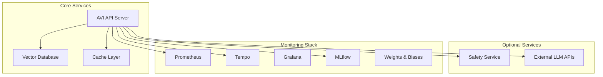

# Системные требования AVI

## Обзор

Этот документ определяет минимальные и рекомендуемые системные требования для развертывания системы AVI в различных конфигурациях. Документ разбит на секции по компонентам и конфигурациям для удобства планирования инфраструктуры.

**Дата создания:** 2025-11-14
**Версия:** 1.0
**Связанные задачи:** REFACTORING_PLAN.md - Задача 4.2

---

## 📊 Содержание

- [1. Общая архитектура](#1-общая-архитектура)
- [2. Требования по компонентам](#2-требования-по-компонентам)
- [3. Требования по конфигурациям](#3-требования-по-конфигурациям)
- [4. Требования по масштабу развертывания](#4-требования-по-масштабу-развертывания)
- [5. Требования по сети](#5-требования-по-сети)
- [6. Дисковое пространство](#6-дисковое-пространство)
- [7. Рекомендации по оборудованию](#7-рекомендации-по-оборудованию)

---

## 1. Общая архитектура

AVI система состоит из следующих компонентов:



### 1.1 Минимальная конфигурация (Minimal)
- **1 компонент:** AVI API Server (с встроенной in-memory Chroma)
- **Подходит для:** Development, локальное тестирование

### 1.2 Стандартная конфигурация (Recommended)
- **4-6 компонентов:** API + Vector DB + Redis + Safety Service + Monitoring
- **Подходит для:** Production, distributed setup

### 1.3 Полная конфигурация (High-Security/Research)
- **8+ компонентов:** Все вышеперечисленные + Qdrant + MLflow + W&B
- **Подходит для:** High-risk production, ML research

---

## 2. Требования по компонентам

### 2.1 AVI API Server

Основной сервер приложения, содержащий всю бизнес-логику.

#### Минимальные требования

| Параметр | Значение | Примечания |
|----------|----------|------------|
| **CPU** | 1 ядро (2.0+ GHz) | Single-threaded performance важна |
| **RAM** | 2 GB | Без кеширования, minimal mode |
| **Disk** | 5 GB | Код + dependencies + minimal data |
| **Disk Type** | HDD | Допустимо, но SSD предпочтительнее |
| **OS** | Linux, macOS, Windows | Python 3.11+ |

**Memory Breakdown (Minimal):**
- Python runtime: ~200 MB
- FastAPI + dependencies: ~150 MB
- Vector embeddings model: ~100-300 MB
- Working memory: ~200-500 MB
- **Total:** ~650 MB - 1.2 GB

#### Рекомендуемые требования

| Параметр | Значение | Примечания |
|----------|----------|------------|
| **CPU** | 4 ядра (2.5+ GHz) | Для parallel processing |
| **RAM** | 8 GB | С кешем, reranking, concurrent requests |
| **Disk** | 20 GB | Logs, cache, data |
| **Disk Type** | SSD | Значительно ускоряет vector search |
| **OS** | Linux (Ubuntu 20.04+) | Production environment |

**Memory Breakdown (Recommended):**
- Python runtime: ~300 MB
- FastAPI + dependencies: ~200 MB
- Vector embeddings model: ~300-500 MB
- Reranking model: ~200-400 MB (если enabled)
- Cache (in-memory): ~500 MB - 2 GB
- Working memory: ~500-1000 MB
- **Total:** ~2 GB - 4.4 GB

#### CPU Характеристики

**Single Query Latency:**
- Vector search: 10-50ms per query
- Reranking: 20-100ms per document (зависит от модели)
- LLM safety checks: 100-500ms per call

**Throughput (4 cores, 8GB RAM):**
- Minimal config: 50-100 req/min
- Recommended config: 20-40 req/min (с safety checks)
- High-security config: 10-20 req/min

#### Масштабирование

**Горизонтальное:**
- Stateless API → легко масштабируется
- Redis для shared cache
- Load balancer перед API instances

**Вертикальное:**
- +2 GB RAM → +10-20 req/min throughput
- +2 CPU cores → +15-30% throughput
- SSD вместо HDD → +20-40% vector search speed

---

### 2.2 Vector Database

#### 2.2.1 ChromaDB (In-Memory)

**Use cases:** Development, small datasets (<100k documents), single instance

| Требование | Minimal | Recommended | Large Scale |
|------------|---------|-------------|-------------|
| **CPU** | Встроено в API | Встроено в API | Встроено в API |
| **RAM** | +500 MB | +1 GB | +2-4 GB |
| **Disk** | 2 GB | 5 GB | 10-20 GB |
| **Disk Type** | HDD OK | SSD preferred | SSD required |

**Memory Formula (ChromaDB):**
```
RAM = base_overhead + (num_vectors * vector_dim * 4 bytes) + index_overhead
    = 100 MB + (N * 384 * 4) + (N * 0.2 MB)
```

**Примеры:**
- 1k vectors: ~100 MB + 1.5 MB + 0.2 MB = ~102 MB
- 10k vectors: ~100 MB + 15 MB + 2 MB = ~117 MB
- 100k vectors: ~100 MB + 150 MB + 20 MB = ~270 MB
- 1M vectors: ~100 MB + 1.5 GB + 200 MB = ~1.8 GB

**Disk Space (ChromaDB):**
- Metadata: ~100 bytes per vector
- Index: ~200 bytes per vector
- Total: ~300 bytes per vector + overhead

```
Disk = (num_vectors * 300 bytes) * 1.5 (overhead)
```

**Performance Characteristics:**
- Search latency: 10-50ms for <100k vectors
- Search latency: 50-200ms for 100k-1M vectors
- Indexing speed: 1000-5000 vectors/sec

#### 2.2.2 ChromaDB (Persistent)

**Use cases:** Production single instance, medium datasets

| Требование | Small | Medium | Large |
|------------|-------|--------|-------|
| **CPU** | 1 ядро | 2 ядра | 4 ядра |
| **RAM** | 1 GB | 2 GB | 4 GB |
| **Disk** | 5 GB | 10 GB | 50 GB |
| **Disk Type** | SSD preferred | SSD required | NVMe SSD |

**Рекомендации:**
- Persistent storage на отдельном volume
- Regular backups (snapshot-based)
- Mount с noatime для performance

#### 2.2.3 Qdrant

**Use cases:** Production distributed, large datasets, high availability

##### Standalone Qdrant

| Требование | Small | Medium | Large |
|------------|-------|--------|-------|
| **CPU** | 2 ядра | 4 ядра | 8+ ядер |
| **RAM** | 2 GB | 4 GB | 8-16 GB |
| **Disk** | 10 GB | 50 GB | 200+ GB |
| **Disk Type** | SSD required | NVMe SSD | NVMe SSD with RAID |
| **Network** | 100 Mbps | 1 Gbps | 10 Gbps |

##### Qdrant Cloud

| План | Vectors | Storage | RAM | Latency | Price Est. |
|------|---------|---------|-----|---------|------------|
| Free | 1M | 1 GB | Shared | ~50ms | $0/month |
| Starter | 10M | 10 GB | 2 GB | ~30ms | $25/month |
| Professional | 100M | 100 GB | 8 GB | ~20ms | $200/month |
| Enterprise | Unlimited | Custom | Custom | <10ms | Custom |

**Performance Characteristics (Qdrant):**
- Search latency: 5-20ms for <10M vectors
- Search latency: 20-50ms for 10M-100M vectors
- Indexing speed: 10k-50k vectors/sec (зависит от batch size)
- HNSW index build: 1-2 hours for 10M vectors

**Memory Formula (Qdrant HNSW):**
```
RAM = base_overhead + vectors_payload + HNSW_index
    = 200 MB + (N * 400 bytes) + (N * M * 4 bytes * ef_construct/64)

где M = количество связей в HNSW (default: 16)
    ef_construct = параметр построения индекса (default: 100)
```

**Примеры (Qdrant):**
- 100k vectors: ~200 MB + 40 MB + 100 MB = ~340 MB
- 1M vectors: ~200 MB + 400 MB + 1 GB = ~1.6 GB
- 10M vectors: ~200 MB + 4 GB + 10 GB = ~14.2 GB

---

### 2.3 Redis Cache

**Use cases:** Distributed caching, rate limiting, shared state

#### Standalone Redis

| Требование | Development | Production | High-Traffic |
|------------|-------------|------------|--------------|
| **CPU** | 1 ядро | 2 ядра | 4 ядра |
| **RAM** | 512 MB | 2 GB | 4-8 GB |
| **Disk** | 1 GB | 5 GB | 20 GB |
| **Disk Type** | HDD OK | SSD preferred | SSD required |
| **Persistence** | Optional | AOF enabled | AOF + RDB snapshots |

**Memory Sizing (Redis):**
```
RAM = overhead + cached_items_size + fragmentation

Overhead: ~50 MB
Fragmentation: ~20-30% of data size

Cache item size estimate:
- Query cache: 1-10 KB per item
- Embedding cache: 1-2 KB per item
- Rate limit data: <1 KB per user
```

**Examples:**
- 10k cached queries: ~50 MB + 100 MB + 30 MB = ~180 MB
- 100k cached queries: ~50 MB + 1 GB + 300 MB = ~1.35 GB
- 1M cached queries: ~50 MB + 10 GB + 3 GB = ~13 GB

**Configuration Recommendations:**
```ini
# redis.conf for production
maxmemory 2gb
maxmemory-policy allkeys-lru
appendonly yes
appendfsync everysec
save 900 1
save 300 10
save 60 10000
```

#### Redis Cloud

| План | RAM | Connections | Latency | Price Est. |
|------|-----|-------------|---------|------------|
| Free | 30 MB | 30 | ~1ms | $0/month |
| Cache | 1 GB | 1000 | <1ms | $7/month |
| Standard | 5 GB | 5000 | <1ms | $35/month |
| Pro | 25 GB | 25000 | <1ms | $175/month |

---

### 2.4 Safety Service (Local)

**Use cases:** Low-latency safety checks, local deployment

| Требование | Minimal | Recommended |
|------------|---------|-------------|
| **CPU** | 1 ядро | 2 ядра |
| **RAM** | 512 MB | 1 GB |
| **Disk** | 1 GB | 2 GB |
| **Disk Type** | Any | SSD preferred |
| **Network** | 100 Mbps | 1 Gbps |

**Performance:**
- Latency: 5-20ms per request
- Throughput: 100-500 req/sec (regex-based)
- Scales well horizontally

---

### 2.5 External LLM APIs

**Use cases:** Main generation, safety checks, scoring

#### API Latency Targets

| Provider | Model | Avg Latency | P95 Latency | Cost (1M tokens) |
|----------|-------|-------------|-------------|------------------|
| OpenRouter | Claude 3.5 Sonnet | 800-1500ms | 2000ms | $3/$15 |
| OpenRouter | Claude 3 Haiku | 300-600ms | 1000ms | $0.25/$1.25 |
| OpenRouter | GPT-4 Turbo | 1000-2000ms | 3000ms | $10/$30 |
| Anthropic Direct | Claude 3.5 Sonnet | 600-1200ms | 1800ms | $3/$15 |
| Anthropic Direct | Claude 3 Haiku | 200-500ms | 800ms | $0.25/$1.25 |
| OpenAI Direct | GPT-4 Turbo | 800-1500ms | 2500ms | $10/$30 |

**Bandwidth Requirements:**
- Input: ~1-5 KB per request
- Output (streaming): ~10-50 KB per response
- Output (non-streaming): ~10-50 KB per response

**Network:**
- Minimal: 1 Mbps (low traffic)
- Recommended: 10 Mbps (medium traffic)
- High-traffic: 100 Mbps (high throughput)

**Rate Limits (typical):**
- OpenRouter Free: 10 req/min
- OpenRouter Pay-as-go: 100 req/min
- Anthropic Tier 1: 50 req/min, 40k tokens/min
- Anthropic Tier 2: 1000 req/min, 80k tokens/min
- OpenAI Tier 1: 500 req/min, 30k tokens/min

---

### 2.6 Monitoring Stack

#### 2.6.1 Prometheus

| Требование | Development | Production |
|------------|-------------|------------|
| **CPU** | 0.5 ядра | 1 ядро |
| **RAM** | 512 MB | 2 GB |
| **Disk** | 5 GB | 20-50 GB |
| **Retention** | 7 days | 30 days |

**Disk Formula:**
```
Disk = num_metrics * num_samples * 2 bytes * retention_days
```

Example (100 metrics, 1 sample/sec, 30 days):
```
100 * 86400 * 30 * 2 = ~518 MB per metric set
```

#### 2.6.2 Tempo (Tracing)

| Требование | Development | Production |
|------------|-------------|------------|
| **CPU** | 0.5 ядра | 2 ядра |
| **RAM** | 512 MB | 2 GB |
| **Disk** | 5 GB | 50-100 GB |
| **Retention** | 7 days | 14 days |

#### 2.6.3 Grafana

| Требование | Development | Production |
|------------|-------------|------------|
| **CPU** | 0.5 ядра | 1 ядро |
| **RAM** | 256 MB | 512 MB |
| **Disk** | 1 GB | 5 GB |

#### 2.6.4 MLflow

| Требование | Development | Production |
|------------|-------------|------------|
| **CPU** | 1 ядро | 2 ядра |
| **RAM** | 1 GB | 4 GB |
| **Disk** | 10 GB | 50-100 GB |
| **Database** | SQLite | PostgreSQL |

**Artifact Storage:**
- Runs: ~10-100 MB per experiment
- Models: ~100 MB - 1 GB per model version
- Logs: ~1-10 MB per run

#### 2.6.5 Weights & Biases

**Cloud service - no self-hosting needed**

| Plan | Storage | Runs | Users | Price |
|------|---------|------|-------|-------|
| Free | 100 GB | Unlimited | 1 | $0/month |
| Team | 1 TB | Unlimited | 5 | $50/user/month |
| Enterprise | Custom | Unlimited | Unlimited | Custom |

---

## 3. Требования по конфигурациям

Для каждой конфигурации из задачи 4.1:

### 3.1 Minimal Configuration

**Profile:** Development, local testing

#### Минимальные требования

| Компонент | CPU | RAM | Disk | Services |
|-----------|-----|-----|------|----------|
| **AVI API** | 1 ядро | 2 GB | 5 GB | - |
| **Total** | **1 ядро** | **2 GB** | **5 GB** | **0 external** |

**Характеристики:**
- Latency overhead: 10-50ms
- Throughput: 50-100 req/min
- Memory footprint: 500 MB - 1 GB
- No external dependencies

#### Рекомендуемые требования

| Компонент | CPU | RAM | Disk | Services |
|-----------|-----|-----|------|----------|
| **AVI API** | 2 ядра | 4 GB | 10 GB | - |
| **Total** | **2 ядра** | **4 GB** | **10 GB** | **0 external** |

**Machine examples:**
- ✅ MacBook Air M1 (8GB)
- ✅ AWS t3.medium (2 vCPU, 4 GB)
- ✅ DigitalOcean Basic Droplet ($24/month)
- ✅ Local development laptop

---

### 3.2 Lightweight Configuration

**Profile:** Low-risk production, internal tools

#### Минимальные требования

| Компонент | CPU | RAM | Disk | Notes |
|-----------|-----|-----|------|-------|
| **AVI API** | 2 ядра | 3 GB | 10 GB | With local safety |
| **Safety Service** | 1 ядро | 512 MB | 1 GB | Optional |
| **Total** | **2 ядра** | **4 GB** | **15 GB** | **1 optional service** |

**Характеристики:**
- Latency overhead: 10-50ms
- Throughput: 30-60 req/min
- Memory footprint: 1-2 GB

#### Рекомендуемые требования

| Компонент | CPU | RAM | Disk | Notes |
|-----------|-----|-----|------|-------|
| **AVI API** | 2 ядра | 4 GB | 15 GB | - |
| **Safety Service** | 1 ядро | 1 GB | 2 GB | Optional |
| **Total** | **3 ядра** | **5 GB** | **20 GB** | **1 service** |

**Machine examples:**
- ✅ AWS t3.large (2 vCPU, 8 GB) - single instance
- ✅ DigitalOcean Droplet ($48/month)
- ✅ Hetzner CX31 (2 vCPU, 8 GB, €8/month)

---

### 3.3 Recommended Configuration ⭐

**Profile:** Standard production deployment

#### Минимальные требования

| Компонент | CPU | RAM | Disk | Notes |
|-----------|-----|-----|------|-------|
| **AVI API** | 2 ядра | 4 GB | 10 GB | - |
| **Redis** | 1 ядро | 1 GB | 5 GB | - |
| **Chroma/Qdrant** | 1 ядро | 2 GB | 10 GB | - |
| **Prometheus** | 0.5 ядра | 512 MB | 10 GB | Optional |
| **Tempo** | 0.5 ядра | 512 MB | 20 GB | Optional |
| **Total** | **4 ядра** | **8 GB** | **50 GB** | **2-4 services** |

**Характеристики:**
- Latency overhead: 110-550ms
- Throughput: 20-40 req/min
- Memory footprint: 2-4 GB (API only)

#### Рекомендуемые требования

| Компонент | CPU | RAM | Disk | Notes |
|-----------|-----|-----|------|-------|
| **AVI API** | 4 ядра | 8 GB | 20 GB | - |
| **Redis** | 2 ядра | 2 GB | 10 GB | With persistence |
| **Qdrant** | 2 ядра | 4 GB | 50 GB | SSD required |
| **Prometheus** | 1 ядро | 2 GB | 20 GB | 30 days retention |
| **Tempo** | 1 ядро | 2 GB | 50 GB | 14 days retention |
| **Grafana** | 1 ядро | 512 MB | 5 GB | - |
| **Total** | **11 ядер** | **18.5 GB** | **155 GB** | **6 services** |

**Deployment options:**

**Option A: Single powerful server**
- Machine: 12 cores, 32 GB RAM, 200 GB SSD
- Examples:
  - AWS c6i.2xlarge (8 vCPU, 16 GB, ~$250/month)
  - Hetzner AX41 (12 cores, 64 GB, €50/month)
  - DigitalOcean Premium ($160/month)

**Option B: Distributed (recommended)**
- API server: 4 cores, 8 GB
- Services server: 8 cores, 16 GB (Redis + Qdrant + Monitoring)
- Total cost: ~$200-300/month (cloud)

**Option C: Cloud-native**
- API: ECS/EKS/Cloud Run (auto-scaling)
- Redis: ElastiCache / Redis Cloud
- Qdrant: Qdrant Cloud
- Monitoring: CloudWatch / Datadog
- Total cost: ~$300-500/month (with auto-scaling)

---

### 3.4 High-Security Configuration

**Profile:** High-risk production (finance, healthcare)

#### Минимальные требования

| Компонент | CPU | RAM | Disk | Notes |
|-----------|-----|-----|------|-------|
| **AVI API** | 4 ядра | 8 GB | 20 GB | - |
| **Redis** | 2 ядра | 2 GB | 10 GB | With AOF |
| **Qdrant** | 4 ядра | 8 GB | 100 GB | Replicated |
| **MLflow** | 2 ядра | 4 GB | 50 GB | Audit trail |
| **Prometheus** | 1 ядро | 2 GB | 50 GB | Long retention |
| **Tempo** | 2 ядра | 2 GB | 100 GB | Long retention |
| **Total** | **15 ядер** | **26 GB** | **330 GB** | **6 services** |

**Характеристики:**
- Latency overhead: 150-700ms
- Throughput: 10-20 req/min
- Memory footprint: 3-6 GB (API only)

#### Рекомендуемые требования

| Компонент | CPU | RAM | Disk | Notes |
|-----------|-----|-----|------|-------|
| **AVI API** | 8 ядер | 16 GB | 50 GB | Redundancy |
| **Redis** | 2 ядра | 4 GB | 20 GB | Replicated |
| **Qdrant Cluster** | 12 ядер | 24 GB | 200 GB | 3-node cluster |
| **PostgreSQL** | 4 ядра | 8 GB | 100 GB | For MLflow |
| **MLflow** | 2 ядра | 4 GB | 100 GB | With PG backend |
| **Prometheus** | 2 ядра | 4 GB | 100 GB | 90 days retention |
| **Tempo** | 2 ядра | 4 GB | 200 GB | 30 days retention |
| **Grafana** | 1 ядро | 1 GB | 10 GB | - |
| **Total** | **33 ядра** | **65 GB** | **780 GB** | **8 services** |

**Deployment recommendations:**
- Multi-AZ deployment for HA
- Load balancing across API instances
- Database replication (Redis, PostgreSQL, Qdrant)
- Automated backups with encryption
- Network isolation (VPC, security groups)
- TLS everywhere

**Machine examples:**
- AWS: c6i.4xlarge for API + r6i.xlarge for services (~$800/month)
- Bare metal: Dedicated servers with HA (~$400-600/month)
- Kubernetes cluster: 3-5 nodes (~$600-1000/month)

---

### 3.5 High-Performance Configuration

**Profile:** High-traffic APIs, maximum speed

#### Минимальные требования

| Компонент | CPU | RAM | Disk | Notes |
|-----------|-----|-----|------|-------|
| **AVI API** | 4 ядра | 8 GB | 20 GB | Minimal filtering |
| **Redis** | 2 ядра | 4 GB | 10 GB | Large cache |
| **Chroma** | 2 ядра | 4 GB | 20 GB | Fast SSD |
| **Total** | **8 ядер** | **16 GB** | **50 GB** | **2 services** |

**Характеристики:**
- Latency overhead: 10-30ms
- Throughput: 100-200 req/min
- Memory footprint: 2-3 GB (API only)

#### Рекомендуемые требования

| Компонент | CPU | RAM | Disk | Notes |
|-----------|-----|-----|------|-------|
| **AVI API (x3)** | 12 ядер | 24 GB | 60 GB | Load balanced |
| **Redis Cluster** | 6 ядер | 12 GB | 30 GB | 3-node cluster |
| **Chroma** | 4 ядра | 8 GB | 50 GB | NVMe SSD |
| **Load Balancer** | 2 ядра | 2 GB | 10 GB | HAProxy/Nginx |
| **Total** | **24 ядра** | **46 GB** | **150 GB** | **7 instances** |

**Performance targets:**
- P50 latency: <50ms
- P95 latency: <200ms
- P99 latency: <500ms
- Throughput: 500-1000 req/min

**Optimization recommendations:**
- NVMe SSDs for all storage
- CPU with AVX2/AVX512 for vector ops
- 10 Gbps network between services
- Connection pooling
- HTTP/2 or gRPC between services

---

### 3.6 Balanced Configuration

**Profile:** Medium production, single instance

#### Минимальные требования

| Компонент | CPU | RAM | Disk |
|-----------|-----|-----|------|
| **AVI API** | 2 ядра | 4 GB | 15 GB |
| **Safety Service** | 1 ядро | 1 GB | 2 GB |
| **Total** | **3 ядра** | **5 GB** | **20 GB** |

#### Рекомендуемые требования

| Компонент | CPU | RAM | Disk |
|-----------|-----|-----|------|
| **AVI API** | 4 ядра | 8 GB | 30 GB |
| **Safety Service** | 2 ядра | 2 GB | 5 GB |
| **Total** | **6 ядер** | **10 GB** | **35 GB** |

**Machine examples:**
- AWS c6i.xlarge (4 vCPU, 8 GB)
- Hetzner CPX31 (4 vCPU, 8 GB, €15/month)
- DigitalOcean Droplet ($96/month)

---

### 3.7 Research Configuration

**Profile:** ML research, experiments, A/B testing

#### Минимальные требования

| Компонент | CPU | RAM | Disk |
|-----------|-----|-----|------|
| **AVI API** | 4 ядра | 8 GB | 30 GB |
| **Redis** | 2 ядра | 2 GB | 10 GB |
| **Qdrant** | 4 ядра | 8 GB | 100 GB |
| **MLflow** | 2 ядра | 4 GB | 50 GB |
| **Prometheus** | 1 ядро | 2 GB | 20 GB |
| **Total** | **13 ядер** | **24 GB** | **210 GB** |

#### Рекомендуемые требования

| Компонент | CPU | RAM | Disk |
|-----------|-----|-----|------|
| **AVI API** | 8 ядер | 16 GB | 50 GB |
| **Redis** | 2 ядра | 4 GB | 20 GB |
| **Qdrant** | 4 ядра | 8 GB | 200 GB |
| **PostgreSQL** | 4 ядра | 8 GB | 100 GB |
| **MLflow** | 2 ядра | 4 GB | 100 GB |
| **W&B** | Cloud service | - | - |
| **Prometheus** | 2 ядра | 4 GB | 50 GB |
| **Grafana** | 1 ядро | 1 GB | 10 GB |
| **Total** | **23 ядра** | **45 GB** | **530 GB** |

**Special requirements:**
- GPU optional (for local model experiments)
- Large storage for experiment artifacts
- W&B Team plan (~$250/month)

---

### 3.8 Cloud-Native Configuration

**Profile:** Cloud deployment with auto-scaling

**Managed services used:**
- Compute: ECS/EKS/Cloud Run (auto-scaling)
- Cache: ElastiCache / Redis Cloud
- Vector DB: Qdrant Cloud
- Storage: S3/GCS
- Monitoring: CloudWatch/Stackdriver

#### Base configuration (min replicas)

| Component | Min | Max | CPU/instance | RAM/instance |
|-----------|-----|-----|--------------|--------------|
| **API** | 2 | 10 | 2 ядра | 4 GB |
| **Redis** | 1 | 3 | Managed | 2 GB |
| **Qdrant** | 1 | 3 | Managed | 4 GB |

**Scaling policies:**
- Scale up: CPU > 70% or latency > 500ms
- Scale down: CPU < 30% and latency < 200ms
- Cool-down: 5 minutes

**Cost estimates (AWS):**
- Base (2 API instances): ~$200/month
- Medium load (5 instances): ~$400/month
- High load (10 instances): ~$700/month

---

### 3.9 Debugging Configuration

**Profile:** Development, troubleshooting

Same as **Minimal** + verbose logging:

| Additional Requirement | Value |
|------------------------|-------|
| **Disk (logs)** | +10 GB |
| **OTEL overhead** | +200 MB RAM |

---

### 3.10 Demo Configuration

**Profile:** Presentations, demos

Same as **Lightweight** with:
- No rate limiting
- Short cache TTL (300s)
- Example data preloaded

---

### 3.11 Testing Configuration

**Profile:** CI/CD, automated testing

#### Минимальные требования

| Компонент | CPU | RAM | Disk |
|-----------|-----|-----|------|
| **AVI API** | 1 ядро | 2 GB | 5 GB |
| **Total** | **1 ядро** | **2 GB** | **5 GB** |

**CI/CD runners:**
- GitHub Actions: 2-core runners (free for public repos)
- GitLab CI: 1-core shared runners (free tier)
- Self-hosted: 2-core VM per runner

---

## 4. Требования по масштабу развертывания

### 4.1 Development (Local)

**Use case:** Локальная разработка

| Requirement | Value |
|-------------|-------|
| **Config** | minimal или debugging |
| **CPU** | 2 ядра |
| **RAM** | 4 GB |
| **Disk** | 10 GB |
| **Network** | Local only |
| **Cost** | $0 (your laptop) |

**Target metrics:**
- Requests: <10 req/min
- Response time: <1s acceptable
- Uptime: Not critical

---

### 4.2 Small Production (до 100 req/min)

**Use case:** Internal tools, low-traffic apps

| Requirement | Value |
|-------------|-------|
| **Config** | lightweight или balanced |
| **Servers** | 1 (single instance) |
| **CPU** | 4 ядра |
| **RAM** | 8 GB |
| **Disk** | 50 GB SSD |
| **Network** | 100 Mbps |
| **Backup** | Daily snapshots |

**Recommended setup:**
- VPS: Hetzner CPX31, DO Droplet, AWS t3.large
- OS: Ubuntu 22.04 LTS
- Docker Compose deployment
- Let's Encrypt TLS
- Simple monitoring (Prometheus + Grafana)

**Monthly cost:** $40-100

---

### 4.3 Medium Production (100-1000 req/min)

**Use case:** Standard production app

| Requirement | Value |
|-------------|-------|
| **Config** | recommended |
| **Servers** | 2-3 (distributed) |
| **CPU** | 8-12 ядер total |
| **RAM** | 16-24 GB total |
| **Disk** | 200 GB SSD |
| **Network** | 1 Gbps |
| **Backup** | Hourly snapshots, daily archives |
| **HA** | Active-passive or load balanced |

**Recommended setup:**

**Option A: Separate servers**
- API server: 4 cores, 8 GB
- Services server: 4 cores, 8 GB (Redis, Qdrant, monitoring)
- Load balancer: Cloud provider LB

**Option B: Kubernetes**
- 3-node cluster (4 cores, 8 GB each)
- API: 2-3 replicas
- Services: StatefulSets with persistent volumes

**Monthly cost:** $200-400

---

### 4.4 Large Production (1000+ req/min)

**Use case:** High-traffic production

| Requirement | Value |
|-------------|-------|
| **Config** | cloud-native или high-performance |
| **Servers** | 5-10+ (auto-scaling) |
| **CPU** | 32+ ядер total |
| **RAM** | 64+ GB total |
| **Disk** | 500 GB - 1 TB SSD |
| **Network** | 10 Gbps |
| **Backup** | Continuous replication |
| **HA** | Multi-AZ, active-active |
| **CDN** | CloudFlare / AWS CloudFront |

**Recommended setup:**

**Kubernetes cluster:**
- 5-10 nodes (8 cores, 16 GB each)
- API: 5-10 replicas with HPA
- Redis: 3-node cluster
- Qdrant: 3-node cluster
- RDS PostgreSQL for metadata

**Managed services:**
- ECS/EKS or GKE
- ElastiCache Redis
- Qdrant Cloud Pro
- CloudWatch / Datadog

**Monthly cost:** $1000-3000+

---

## 5. Требования по сети

### 5.1 Bandwidth Requirements

| Deployment Scale | Inbound | Outbound | Notes |
|------------------|---------|----------|-------|
| **Development** | 1 Mbps | 1 Mbps | Negligible |
| **Small (<100 req/min)** | 10 Mbps | 10 Mbps | API requests |
| **Medium (100-1k req/min)** | 100 Mbps | 100 Mbps | + streaming |
| **Large (1k+ req/min)** | 1 Gbps | 1 Gbps | + monitoring |

**Calculation example (Medium scale):**
- 500 req/min
- Avg request: 5 KB
- Avg response: 20 KB (streaming)
- **Inbound:** 500 * 5 KB / 60s = 41.7 KB/s = 0.33 Mbps
- **Outbound:** 500 * 20 KB / 60s = 166.7 KB/s = 1.3 Mbps
- **Peak (3x avg):** ~4 Mbps total

**Additional overhead:**
- Monitoring/metrics: +10-20%
- LLM API calls: +20-50%
- Backup/replication: varies

### 5.2 Latency Requirements

**Internal (same datacenter):**
- API ↔ Redis: <1ms
- API ↔ Vector DB: <5ms
- API ↔ Safety Service: <10ms

**External:**
- User ↔ API: <100ms (regional), <300ms (global)
- API ↔ LLM Provider: <2000ms (acceptable)

### 5.3 Ports

**Required open ports:**

| Service | Port | Protocol | Public? |
|---------|------|----------|---------|
| AVI API | 8000 | HTTP/HTTPS | Yes |
| Qdrant | 6333, 6334 | HTTP/gRPC | Internal only |
| Redis | 6379 | TCP | Internal only |
| Prometheus | 9090 | HTTP | Internal only |
| Grafana | 3000 | HTTP | Admin only |
| MLflow | 5000 | HTTP | Internal only |
| Tempo | 3200, 4317, 4318 | HTTP/gRPC | Internal only |

---

## 6. Дисковое пространство

### 6.1 Base Installation

| Component | Size |
|-----------|------|
| OS (Ubuntu 22.04) | 2 GB |
| Docker | 1 GB |
| AVI application | 1 GB |
| Python dependencies | 1 GB |
| **Base total** | **5 GB** |

### 6.2 Vector Database Storage

**ChromaDB:**
- ~300 bytes per vector
- Formula: `vectors * 300 * 1.5`

**Qdrant:**
- ~400 bytes per vector (with HNSW)
- Formula: `vectors * 400 * 1.5`

**Examples:**
- 100k vectors: ~60 MB (Chroma), ~80 MB (Qdrant)
- 1M vectors: ~600 MB (Chroma), ~800 MB (Qdrant)
- 10M vectors: ~6 GB (Chroma), ~8 GB (Qdrant)

### 6.3 Cache Storage

**Redis (if persistent):**
- Depends on cache size setting
- Typical: 1-5 GB

**In-memory cache:**
- No disk usage

### 6.4 Logs

**Without rotation:**
- API logs: ~100-500 MB/day
- Service logs: ~50-200 MB/day

**With rotation (recommended):**
- Keep 7 days: ~5-10 GB
- Keep 30 days: ~20-40 GB

**Log levels:**
- DEBUG: 2-5 GB/day
- INFO: 500 MB - 1 GB/day
- WARNING: 100-500 MB/day
- ERROR: 10-100 MB/day

### 6.5 Monitoring Data

**Prometheus:**
- Formula: `metrics * samples * 2 bytes`
- Typical: 5-20 GB for 30 days
- With high cardinality: 20-50 GB

**Tempo traces:**
- ~1-10 KB per trace
- 10k req/day = 10-100 MB/day
- 14 days retention = 140 MB - 1.4 GB

**MLflow:**
- Runs: ~10 MB per run
- Models: ~100 MB per model
- 100 experiments: ~5-10 GB

### 6.6 Backup Storage

**Recommended:**
- Daily full backup
- 7-day retention
- Size: 2-3x production data size

**Example (Recommended config):**
- Production data: 50 GB
- Single backup: 50 GB
- 7 backups: 350 GB
- **Backup storage needed:** 350 GB

**Compression:**
- Gzip: 50-70% reduction
- With compression: ~150-200 GB for 7 days

---

## 7. Рекомендации по оборудованию

### 7.1 CPU Recommendations

**Processor types:**

| Use Case | Recommendation | Examples |
|----------|----------------|----------|
| **Development** | Any modern CPU | Intel i5, AMD Ryzen 5, M1 |
| **Production** | Server-grade | Intel Xeon, AMD EPYC, AWS Graviton |
| **High-performance** | High clock speed | Intel Xeon Gold, AMD EPYC 7003 |
| **ML workloads** | AVX-512 support | Intel Xeon Ice Lake+ |

**Key features:**
- ✅ AVX2 support (for vector operations)
- ✅ Multiple cores (4+ for production)
- ✅ High single-thread performance (for LLM inference)

**Cloud instances:**
- AWS: c6i, c7i (compute optimized)
- GCP: c3, c3d (compute optimized)
- Azure: F-series (compute optimized)

### 7.2 Memory Recommendations

**RAM type:**
- DDR4-2666 minimum
- DDR4-3200 recommended
- ECC recommended for production

**Sizing by workload:**

| Workload | RAM | Swap |
|----------|-----|------|
| **Development** | 4 GB | 2 GB |
| **Small prod** | 8 GB | 4 GB |
| **Medium prod** | 16 GB | 8 GB |
| **Large prod** | 32+ GB | 16 GB |

**Memory breakdown rule:**
- 30% OS + overhead
- 40% application
- 20% cache
- 10% buffer

### 7.3 Storage Recommendations

**Disk types:**

| Type | Use Case | Speed | Cost |
|------|----------|-------|------|
| **HDD** | Development only | Slow | Low |
| **SATA SSD** | Small production | Medium | Medium |
| **NVMe SSD** | Production | Fast | High |
| **NVMe RAID** | High-performance | Very fast | Very high |

**IOPS requirements:**

| Deployment | Random Read IOPS | Random Write IOPS |
|------------|------------------|-------------------|
| **Development** | 1k | 500 |
| **Small prod** | 5k | 2k |
| **Medium prod** | 10k | 5k |
| **Large prod** | 20k+ | 10k+ |

**Cloud storage:**
- AWS: gp3 (general purpose), io2 (high performance)
- GCP: pd-ssd (standard), pd-extreme (high performance)
- Azure: Premium SSD v2

**File systems:**
- ext4 (general purpose)
- xfs (large files)
- btrfs (if snapshots needed)

**Mount options:**
```bash
# /etc/fstab
/dev/sda1 /data ext4 defaults,noatime,nodiratime 0 2
```

### 7.4 Network Recommendations

**NICs:**
- 1 Gbps minimum for production
- 10 Gbps for high-traffic
- Bonding/LAG for redundancy

**Network topology:**
- Private network for internal services
- Public network for API endpoints
- Firewall between tiers

**Cloud networking:**
- VPC with private subnets
- Security groups / Network ACLs
- NAT gateway for outbound
- Load balancer for inbound

---

## 8. Sizing Calculator

Use this formula to estimate requirements:

```
CPU cores = base + (expected_req_per_min / throughput_per_core)
RAM = base + cache_size + (concurrent_requests * request_memory)
Disk = base + vector_db_size + logs + monitoring + backup

где:
- base_cpu = 2 (minimal) or 4 (recommended)
- throughput_per_core = 10-30 req/min (depends on config)
- base_ram = 2-4 GB
- request_memory = 10-50 MB
- cache_size = 500 MB - 5 GB
```

### Example calculation (500 req/min, recommended config):

```
CPU:
  base = 4 cores
  additional = 500 / 20 = 25 cores
  safety_llm = 2 cores
  total = 4 + 25 + 2 = 31 cores → use 32 cores (8 API instances * 4 cores)

RAM:
  base = 4 GB per instance
  cache = 2 GB per instance
  concurrent = 10 * 50 MB = 500 MB
  total per instance = 4 + 2 + 0.5 = 6.5 GB → use 8 GB
  total cluster = 8 * 8 GB = 64 GB

Disk:
  base = 5 GB per instance
  vector_db = 10 GB (shared)
  logs = 20 GB (shared)
  monitoring = 50 GB (shared)
  backup = 100 GB (shared)
  total = (8 * 5) + 10 + 20 + 50 + 100 = 220 GB
```

---

## 9. Сводная таблица

| Configuration | CPU | RAM | Disk | Services | Monthly Cost* |
|---------------|-----|-----|------|----------|---------------|
| **Minimal** | 2 | 4 GB | 10 GB | 1 | $0-20 |
| **Lightweight** | 3 | 5 GB | 20 GB | 2 | $30-50 |
| **Recommended** ⭐ | 11 | 19 GB | 155 GB | 6 | $200-300 |
| **High-Security** | 33 | 65 GB | 780 GB | 8 | $600-1000 |
| **High-Performance** | 24 | 46 GB | 150 GB | 7 | $400-700 |
| **Balanced** | 6 | 10 GB | 35 GB | 2 | $80-120 |
| **Research** | 23 | 45 GB | 530 GB | 7+ | $400-600 |
| **Cloud-Native** | Auto | Auto | Auto | Managed | $200-1000+ |

*Cloud provider costs (AWS/GCP/Azure), excluding LLM API costs

---

## 10. Related Documentation

- **Configuration Matrix:** `docs/CONFIGURATION_MATRIX.md`
- **Deployment Guide:** `docs/DEPLOYMENT_GUIDE.md`
- **Configuration Files:** `data/configs/README.md`
- **Performance Analysis:** `docs/FILTER_PERFORMANCE_ANALYSIS.md`

---

**Version:** 1.0
**Last Updated:** 2025-11-14
**Maintainers:** AVI Team
