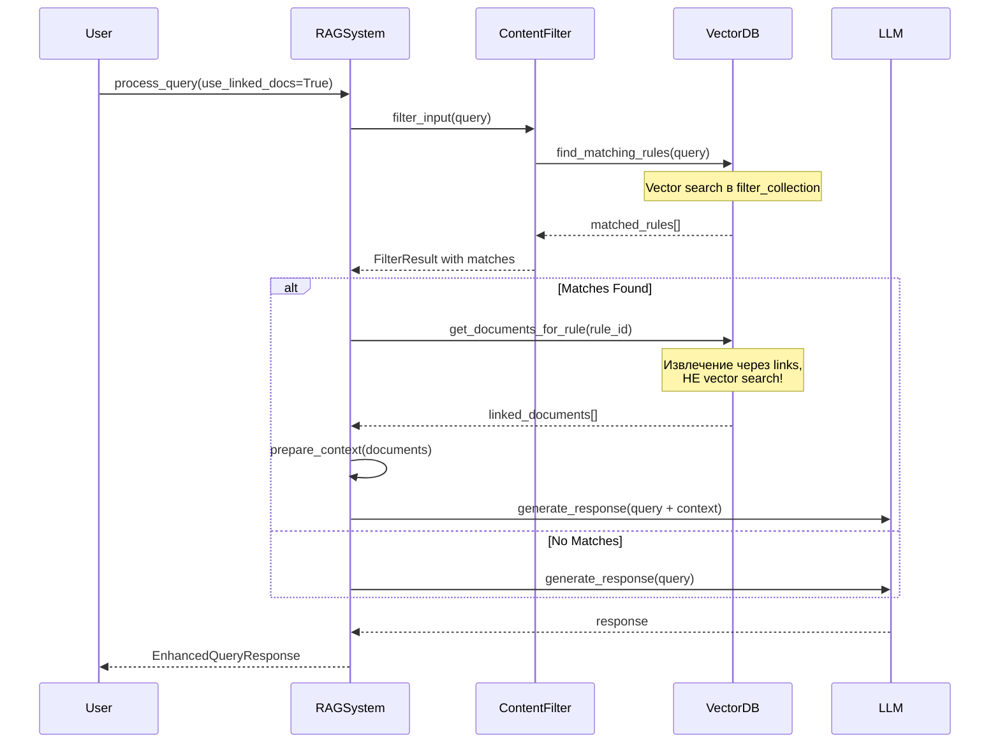
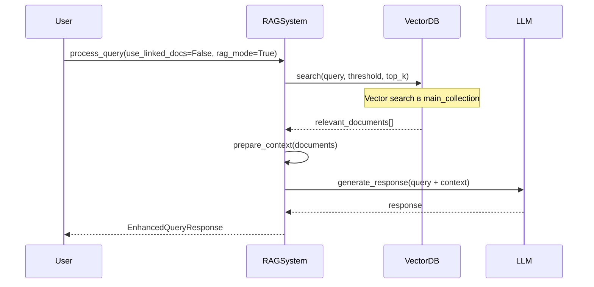

# Анализ: Vector Documents vs Linked Documents

**Дата:** 2025-11-13
**Задача:** 1.3 - Исследование vector_documents vs linked_documents
**Статус:** ✅ Завершено

---

## Executive Summary

**Ключевой вывод:** Система AVI уже реализована по принципу **linked documents** и работает корректно. Документы векторизуются при индексации, но в основном режиме работы (`use_linked_docs=True`) они извлекаются через связи с правилами, а не через прямой vector search по контенту.

**Рекомендация:** Миграция НЕ требуется. Текущая архитектура оптимальна и обеспечивает гибкость для разных сценариев использования.

---

## 1. Текущая Архитектура

### 1.1 Структура Vector Database

Система использует три отдельные коллекции в векторной базе данных:

```
┌─────────────────────────────────────────┐
│         Vector Database (Chroma/Qdrant) │
├─────────────────────────────────────────┤
│                                          │
│  ┌────────────────────────────────┐     │
│  │   filter_collection            │     │
│  │   (Rules with embeddings)      │     │
│  │                                 │     │
│  │   - rule_id                     │     │
│  │   - text (vectorized)           │     │
│  │   - category                    │     │
│  │   - risk_level                  │     │
│  │   - threshold                   │     │
│  └────────────────────────────────┘     │
│                                          │
│  ┌────────────────────────────────┐     │
│  │   main_collection              │     │
│  │   (Documents with embeddings)  │     │
│  │                                 │     │
│  │   - document_id                 │     │
│  │   - text (vectorized)           │     │
│  │   - metadata (category, source) │     │
│  └────────────────────────────────┘     │
│                                          │
│  ┌────────────────────────────────┐     │
│  │   rule_document_links          │     │
│  │   (Metadata only, no vectors)  │     │
│  │                                 │     │
│  │   - link_id (rule_id_doc_id)   │     │
│  │   - rule_id                     │     │
│  │   - document_id                 │     │
│  │   - is_approved                 │     │
│  │   - relevance_score (optional)  │     │
│  └────────────────────────────────┘     │
│                                          │
└─────────────────────────────────────────┘
```

### 1.2 Процесс Индексации

**Файл:** `src/services/indexing_service.py`

```python
async def reindex_all(self):
    # 1. Загрузка правил фильтрации
    rules_df = pd.read_csv("data/raw/filter_rules.csv")
    # Правила векторизуются и сохраняются в filter_collection

    # 2. Загрузка документов
    docs_df = pd.read_csv("data/raw/vector_documents.csv")
    # Документы векторизуются и сохраняются в main_collection

    # 3. Загрузка связей
    links_df = pd.read_csv("data/raw/links.csv")
    # Связи сохраняются в rule_document_links (БЕЗ векторизации)
```

**Важно:** Документы векторизуются, но это не означает, что они используются через vector search!

---

## 2. Режимы Работы Системы

### 2.1 Режим Linked Documents (use_linked_docs=True)

**Файл:** `src/core/rag_system.py:139-148`

Это основной режим работы системы:



**Процесс:**

1. **Input Filtering:** Запрос сравнивается с правилами через vector search
   ```python
   matches = await find_matching_rules(query, n_results=10)
   ```

2. **Document Retrieval:** Для каждого совпавшего правила извлекаются связанные документы
   ```python
   for match in matches:
       linked_docs = await get_documents_for_rule(match.rule_id)
   ```

3. **Context Building:** Документы используются как контекст для LLM
   ```python
   context_docs = await _get_context_from_matches(matches)
   ```

**Ключевой момент:** Документы извлекаются по связям (links), а НЕ через vector search по их содержимому!

### 2.2 Режим Direct Vector Search (use_linked_docs=False)

В этом режиме система делает прямой vector search по документам:



**Процесс:**

1. Запрос векторизуется
2. Выполняется vector search в `main_collection`
3. Возвращаются документы с наивысшей similarity

Этот режим используется реже и подходит для случаев, когда нужно найти документы по семантической близости к запросу, независимо от правил.

---

## 3. Сравнение Подходов

### 3.1 Linked Documents (текущий основной режим)

**Преимущества:**
- ✅ Точность: документы привязаны к конкретным правилам экспертами
- ✅ Контроль: можно управлять связями (approve/reject)
- ✅ Прозрачность: понятно, почему документ был включен в контекст
- ✅ Безопасность: только одобренные связи используются
- ✅ Гибкость: один документ может быть связан с несколькими правилами

**Недостатки:**
- ⚠️ Требуется ручное создание связей
- ⚠️ Документы, не связанные с правилами, не будут найдены
- ⚠️ Зависимость от качества правил

**Use Cases:**
- Compliance и regulatory требования (правила из законодательства + документы с пояснениями)
- Корпоративные политики (правила поведения + примеры и инструкции)
- Этические гайдлайны (правила этики + case studies)

### 3.2 Vector Search (альтернативный режим)

**Преимущества:**
- ✅ Автоматичность: не требуется ручное создание связей
- ✅ Гибкость: находит семантически похожие документы
- ✅ Покрытие: может найти релевантные документы, даже если нет правил

**Недостатки:**
- ⚠️ Меньше контроля: зависит от качества embeddings
- ⚠️ Возможны ложные срабатывания (irrelevant documents)
- ⚠️ Меньше прозрачности: почему именно этот документ?

**Use Cases:**
- Knowledge base search
- FAQ системы
- Общая информационная поддержка

---

## 4. Векторизация Документов: Нужна ли?

### 4.1 Текущая Ситуация

Документы векторизуются при индексации, даже если используются только через links.

**Код в `vector_db.py:883-901` (Qdrant):**
```python
def add_documents(self, documents: list[dict], batch_size: int = 100):
    for batch in documents:
        vectors = self._embed([doc.get("text", "") for doc in batch])
        # Документы сохраняются с векторами
        points.append(PointStruct(
            id=doc_id,
            vector={"dense": vectors[idx]},  # ← Векторизация происходит
            payload=payload,
        ))
```

### 4.2 Анализ Необходимости

| Сценарий | Нужна векторизация? | Почему |
|----------|---------------------|---------|
| **use_linked_docs=True** | ❌ Технически нет | Документы извлекаются по ID через links |
| **use_linked_docs=False** | ✅ Да | Требуется для vector search |
| **Гибридный режим** | ✅ Да | Возможность переключения между режимами |
| **Будущие фичи** | ✅ Вероятно | Hybrid search, reranking, clustering |

### 4.3 Рекомендация

**ОСТАВИТЬ векторизацию документов как есть** по следующим причинам:

1. **Гибкость архитектуры:** Система поддерживает оба режима работы
2. **Незначительный overhead:** Векторизация происходит только при индексации
3. **Хранение в памяти:** Vectors сжимаются эффективно (384-dimensional floats ≈ 1.5KB/doc)
4. **Будущие возможности:**
   - Reranking по vector similarity после извлечения по links
   - Hybrid search (комбинация links + vector search)
   - Document clustering и similarity analysis
   - Deduplication по semantic similarity

**Потенциальная оптимизация (низкий приоритет):**
- Добавить флаг `VECTORIZE_DOCUMENTS` в settings
- При `use_linked_docs=True` only хранить документы без векторов
- Экономия: ~1.5KB × количество документов

---

## 5. Схема Данных

### 5.1 filter_rules.csv

```csv
id,text,category,risk_level,threshold
rule_001,"Do not provide medical advice",compliance,5,0.80
rule_002,"Avoid sharing personal information",privacy,4,0.75
rule_003,"Do not generate harmful content",safety,5,0.85
```

**Поля:**
- `id`: Уникальный идентификатор правила
- `text`: Текст правила (векторизуется)
- `category`: Категория (toxicity, pii, prompt_injection, etc.)
- `risk_level`: Уровень риска (1-5)
- `threshold`: Порог срабатывания (0-1)

### 5.2 vector_documents.csv

```csv
id,text,category,source
doc_001,"Medical advice should only be provided by licensed professionals...",compliance,policy_handbook
doc_002,"Personal information includes name, address, SSN, email...",privacy,data_protection_guide
doc_003,"Harmful content includes violence, hate speech...",safety,content_guidelines
```

**Поля:**
- `id`: Уникальный идентификатор документа
- `text`: Содержимое документа (векторизуется)
- `category`: Категория документа
- `source`: Источник документа

### 5.3 links.csv

```csv
rule_id,document_id,is_approved
rule_001,doc_001,true
rule_002,doc_002,true
rule_003,doc_003,true
rule_001,doc_004,false
```

**Поля:**
- `rule_id`: ID правила
- `document_id`: ID документа
- `is_approved`: Одобрена ли связь (только approved используются)

---

## 6. Пример Работы Системы

### Сценарий: Пользователь спрашивает о медицинском совете

```
User Query: "Can you tell me how to treat my migraine?"
```

#### Шаг 1: Input Filtering

```python
# Vector search в filter_collection
matches = await find_matching_rules("Can you tell me how to treat my migraine?")

# Результат:
# [{
#   rule_id: "rule_001",
#   rule_text: "Do not provide medical advice",
#   category: "compliance",
#   risk_level: 5,
#   relevance_score: 0.87
# }]
```

#### Шаг 2: Retrieval Linked Documents

```python
# Извлечение по links, НЕ vector search!
linked_docs = await get_documents_for_rule("rule_001")

# Результат:
# [{
#   document_id: "doc_001",
#   text: "Medical advice should only be provided by licensed professionals...",
#   metadata: {category: "compliance", source: "policy_handbook"},
#   relevance_score: 0.87  # наследуется от правила
# }]
```

#### Шаг 3: Context Preparation

```python
context = prepare_context(linked_docs)

# Context передается в LLM:
# "Remember to adhere to safety guidelines...
#  User question: Can you tell me how to treat my migraine?
#
#  CONTEXT: Medical advice should only be provided by licensed professionals...
#  Source: policy_handbook"
```

#### Шаг 4: LLM Response

```
LLM: "I cannot provide medical advice. Migraines should be diagnosed and
     treated by a licensed healthcare professional. I recommend scheduling
     an appointment with your doctor to discuss your symptoms and treatment
     options."
```

---

## 7. Архитектурные Решения

### 7.1 Текущая Архитектура (Рекомендуется Сохранить)

```
┌─────────────────────────────────────────────────────────────┐
│                      RAG System                              │
├─────────────────────────────────────────────────────────────┤
│                                                               │
│  User Query                                                   │
│       │                                                       │
│       ▼                                                       │
│  ┌─────────────────┐                                         │
│  │ Input Filtering │  (vector search в rules)                │
│  └────────┬────────┘                                         │
│           │                                                   │
│           ▼                                                   │
│      Matched Rules                                            │
│           │                                                   │
│           ▼                                                   │
│  ┌─────────────────────┐                                     │
│  │ Get Linked Docs     │  (извлечение по links)              │
│  └────────┬────────────┘                                     │
│           │                                                   │
│           ▼                                                   │
│  ┌─────────────────────┐                                     │
│  │ Prepare Context     │                                     │
│  └────────┬────────────┘                                     │
│           │                                                   │
│           ▼                                                   │
│  ┌─────────────────────┐                                     │
│  │ LLM Generation      │                                     │
│  └────────┬────────────┘                                     │
│           │                                                   │
│           ▼                                                   │
│  ┌─────────────────────┐                                     │
│  │ Output Filtering    │                                     │
│  └────────┬────────────┘                                     │
│           │                                                   │
│           ▼                                                   │
│      Final Response                                           │
│                                                               │
└─────────────────────────────────────────────────────────────┘
```

**Преимущества:**
- ✅ Гибкость: поддерживает оба режима (linked и vector search)
- ✅ Контроль: экспертные связи между правилами и документами
- ✅ Производительность: эффективный поиск через indexed links
- ✅ Масштабируемость: легко добавлять новые правила и документы

### 7.2 Альтернатива: Убрать Векторизацию Документов (НЕ РЕКОМЕНДУЕТСЯ)

**Изменения:**
1. Хранить документы только как metadata в links коллекции
2. Убрать main_collection
3. При индексации не векторизовать документы

**Проблемы:**
- ❌ Потеря гибкости: невозможен direct vector search
- ❌ Нет возможности для будущих feature (reranking, hybrid search)
- ❌ Экономия минимальна (1.5KB/doc)
- ❌ Усложнение архитектуры для minimal gain

---

## 8. Выводы и Рекомендации

### 8.1 Ключевые Выводы

1. **Система УЖЕ реализована по принципу linked documents**
   - Документы извлекаются через связи с правилами
   - Vector search по документам используется только в альтернативном режиме

2. **Векторизация документов оправдана**
   - Обеспечивает гибкость архитектуры
   - Минимальный overhead
   - Открывает возможности для будущих улучшений

3. **Текущая архитектура оптимальна**
   - Баланс между контролем и автоматизацией
   - Поддержка разных use cases
   - Хорошая масштабируемость

### 8.2 Рекомендации

#### ✅ СОХРАНИТЬ текущую архитектуру

**Обоснование:**
- Система работает корректно
- Архитектура гибкая и масштабируемая
- Миграция не требуется
- Риски изменений превышают потенциальную выгоду

#### 📝 УЛУЧШИТЬ документацию

**Действия:**
1. Документировать разницу между режимами (use_linked_docs=True/False)
2. Создать guidelines для создания связей rules→documents
3. Добавить примеры использования в разных сценариях
4. Описать best practices для индексации

#### 🔧 ВОЗМОЖНЫЕ ОПТИМИЗАЦИИ (низкий приоритет)

1. **Lazy loading документов:**
   - Загружать полный текст документа только при необходимости
   - Хранить краткое описание в links

2. **Document versioning:**
   - Поддержка версий документов
   - Tracking изменений в связях

3. **Hybrid retrieval:**
   - Комбинировать linked documents + vector search
   - Reranking по vector similarity

4. **Link relevance scoring:**
   - Хранить relevance_score для каждой связи
   - Использовать при ранжировании документов

---

## 9. План Действий

### ✅ Задача 1.3 - ВЫПОЛНЕНА

**Что сделано:**
- ✅ Проанализирована текущая структура хранения документов
- ✅ Определена разница между vector_documents и linked_documents
- ✅ Установлено, что система работает по принципу linked documents
- ✅ Оценен impact на существующие данные (миграция не требуется)
- ✅ Создана документация текущего состояния

**Deliverables:**
- ✅ Документ с анализом текущего состояния (этот файл)
- ✅ Архитектурное решение: сохранить текущую реализацию
- ✅ План миграции: миграция НЕ требуется
- ✅ Обновленная схема данных

### Следующие шаги

Никаких изменений в коде не требуется. Переходим к следующей задаче в плане рефакторинга.

---

## 10. Приложения

### A. Файлы для Reference

- `src/services/vector_db.py` - реализация vector DB (Chroma/Qdrant)
- `src/services/links_manager.py` - управление связями
- `src/services/indexing_service.py` - процесс индексации
- `src/core/rag_system.py` - RAG система, использование linked docs
- `src/core/content_filter.py` - фильтрация с использованием правил

### B. Конфигурация

```python
# config/settings.py
RAW_DATA_DIR: Path = Path("./data/raw")

# Файлы данных:
# - data/raw/filter_rules.csv
# - data/raw/vector_documents.csv
# - data/raw/links.csv
```

### C. API Endpoints

```python
# Получение документов для правила
GET /api/v1/rules/{rule_id}/documents?only_approved=true

# Получение правил для документа
GET /api/v1/documents/{document_id}/rules?only_approved=true

# Создание связи
POST /api/v1/links
{
  "rule_id": "rule_001",
  "document_id": "doc_001",
  "is_approved": true
}

# Удаление связи
DELETE /api/v1/links/{rule_id}/{document_id}

# Обновление статуса связи
PATCH /api/v1/links/{rule_id}/{document_id}
{
  "is_approved": false
}
```

---

**Версия:** 1.0
**Автор:** Claude (Sonnet 4.5)
**Дата:** 2025-11-13
