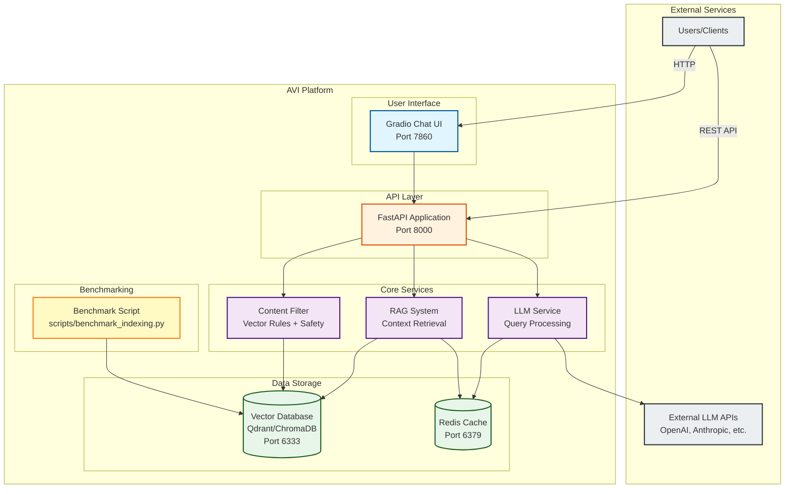
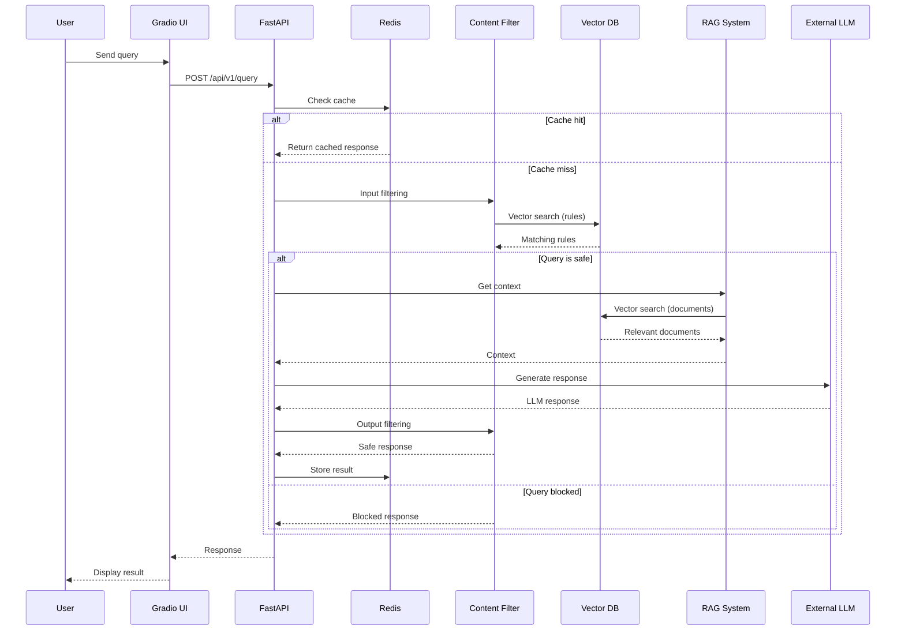

# HLD Architecture - AVI System

> High-Level Design of the AVI (Agreement Validation Interface) System

**Version**: 1.0 (Release Candidate)
**Date**: 2025-11-19
**Status**: Production Ready

---

## System Architecture



---

## Query Processing Flow



---

## Components

### User Interface

**Gradio Chat UI**
- **Port**: 7860
- **Features**:
  - Real-time chat interface
  - RAG toggle (on/off)
  - Safety filters toggle
  - Rule and document management

### API Layer

**FastAPI Application**
- **Port**: 8000
- **Documentation**: `/docs` (Swagger UI)
- **Key Endpoints**:
  - `POST /api/v1/query` - Process queries
  - `POST /api/v1/chat/stream` - Streaming chat
  - `POST /api/v1/upload/csv` - Upload data
  - `POST /api/v1/reindex` - Reindex database
  - `GET /api/v1/health` - Health check

### Core Services

**Content Filter**
- Vector-based rule matching
- Input/output filtering
- Safety LLM integration (optional)

**RAG System**
- Context retrieval from vector DB
- Document reranking
- Relevance scoring

**LLM Service**
- OpenAI-compatible API support
- Streaming responses
- Mock mode for testing

### Data Storage

**Vector Database (Qdrant/ChromaDB)**
- Collections: `filter_rules`, `vector_documents`, `links`
- Port: 6333 (Qdrant)

**Redis Cache**
- Query result caching
- Port: 6379

### Benchmarking

**Benchmark Script**
- `scripts/benchmark_indexing.py`
- Tests both ChromaDB and Qdrant
- Measures indexing time and memory
- Outputs results to `data/benchmarks/`

---

## Data Flow

1. **User Query** -> Gradio UI or direct API call
2. **Cache Check** -> Return if cached
3. **Input Filter** -> Block unsafe queries
4. **RAG Retrieval** -> Get relevant context
5. **LLM Generation** -> Generate response
6. **Output Filter** -> Sanitize response
7. **Cache Store** -> Save for future
8. **Return** -> Safe, grounded answer

---

## Deployment

### Docker Compose (Recommended)

```bash
docker compose up --build
```

Services:
- `api` - FastAPI backend (8000)
- `qdrant` - Vector database (6333)
- `redis` - Cache (6379)

### Local Development

```bash
pip install -r requirements.txt
uvicorn main:app --reload
python gradio_ui.py
```

---

**Version**: 1.0 (Release Candidate)
**Date**: 2025-11-19
**Status**: Production Ready
