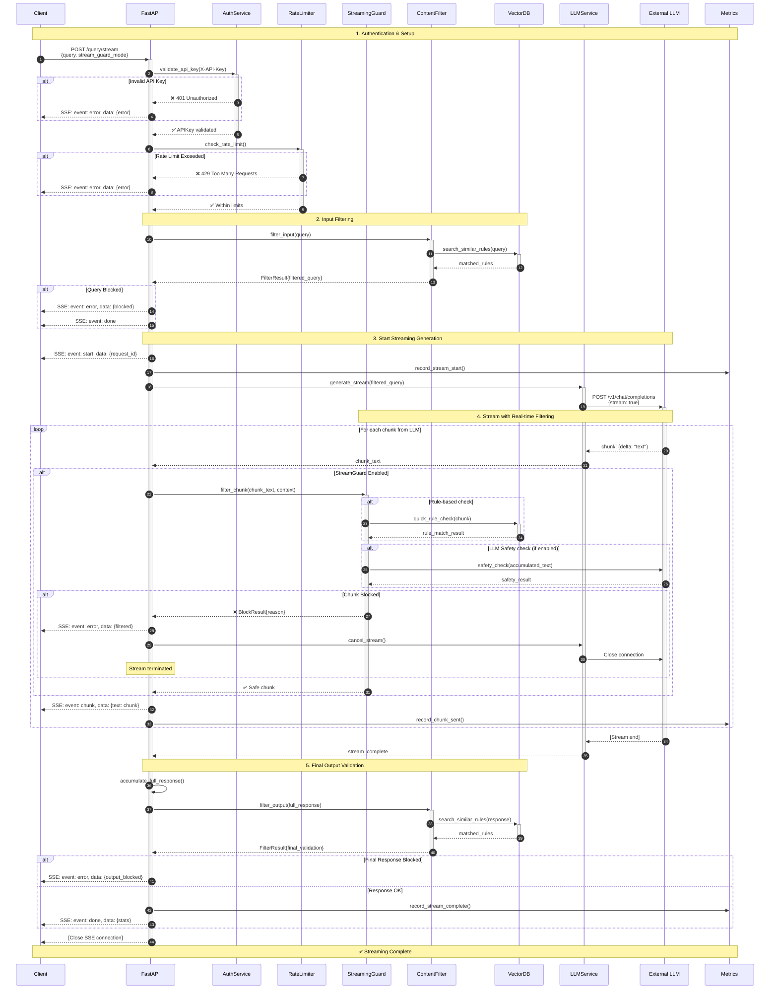

# Detailed Sequence Diagram - Streaming Query Flow

> Детальная sequence диаграмма обработки streaming запроса с real-time фильтрацией

**Поток**: POST /query/stream (Server-Sent Events)
**Версия**: 1.0
**Дата**: 2025-11-15

---

## 🔄 Полный поток streaming обработки



---

## 📊 Streaming Guard Modes

| Mode | Description | Latency | Accuracy |
|------|-------------|---------|----------|
| **BYPASS** | No filtering during streaming | 0ms | N/A |
| **RULE_ONLY** | Fast vector rule checks only | 10-30ms/chunk | 70% |
| **LLM_ONLY** | Safety LLM checks on accumulated text | 100-300ms/check | 95% |
| **HYBRID** | Rules first, LLM fallback | 10-300ms | 90% |

---

## 🔀 Stream Flow Variants

### Fast Path (BYPASS mode)
```
Client → Auth → LLM Stream → Client
Chunks flow: Real-time, no filtering
```

### Safe Path (HYBRID mode)
```
Client → Auth → Input Filter → LLM Stream → Streaming Guard (chunk-by-chunk) → Client
May terminate stream if violation detected
```

---

## ⚠️ Error Handling

### Stream Termination Scenarios

**1. Input Filter Violation (before streaming)**
```json
{
  "event": "error",
  "data": {
    "error": "Query blocked by content filter",
    "categories": ["prompt_injection"]
  }
}
```

**2. Mid-Stream Violation**
```json
{
  "event": "chunk",
  "data": {"text": "The answer is "}
}
{
  "event": "error",
  "data": {
    "error": "Stream terminated",
    "reason": "Unsafe content detected",
    "chunk_number": 5
  }
}
```

**3. Final Output Blocked**
```json
{
  "event": "error",
  "data": {
    "error": "Complete response blocked after validation",
    "categories": ["pii", "toxicity"]
  }
}
```

---

## 🎯 Configuration

```bash
# Streaming Guard Mode
STREAM_GUARD_MODE=hybrid  # bypass | rule_only | llm_only | hybrid

# Chunk Processing
STREAM_CHUNK_SIZE=50  # characters per chunk
STREAM_BUFFER_SIZE=200  # context window for LLM checks

# Timeouts
STREAM_TIMEOUT=30  # seconds
STREAM_IDLE_TIMEOUT=5  # seconds between chunks
```

---

## 📈 Performance Characteristics

| Metric | Value | Notes |
|--------|-------|-------|
| First chunk latency | 500-1000ms | Input filter + LLM start |
| Chunk interval | 50-200ms | Depends on LLM speed |
| Guard overhead (RULE_ONLY) | 10-30ms/chunk | Fast vector check |
| Guard overhead (LLM_ONLY) | 100-300ms/check | Every 5 chunks |
| Total stream time | 2-10s | For 500 token response |

---

**Версия**: 1.0
**Дата**: 2025-11-15
**Статус**: ✅ Production
**Связанные диаграммы**: [Query Detailed](./02_SEQUENCE_QUERY_DETAILED.md), [HLD](./01_HLD_ARCHITECTURE.md)
