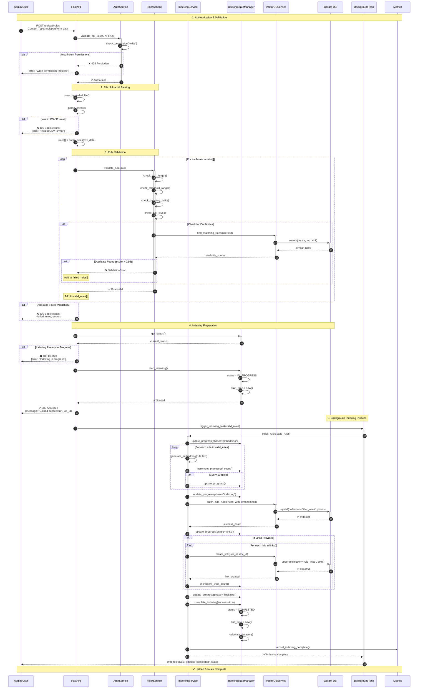
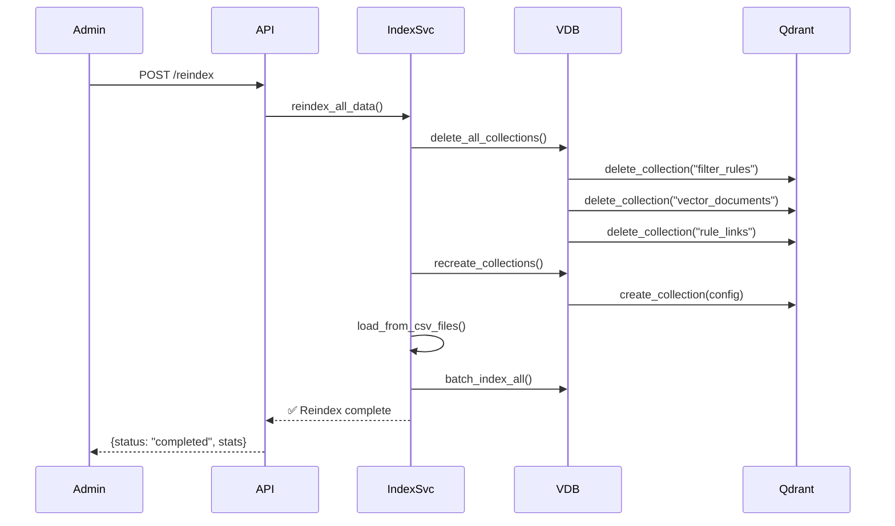

# Detailed Sequence Diagram - Upload & Reindex Flow

> Детальная sequence диаграмма процесса загрузки и индексирования данных

**Поток**: POST /upload/rules, POST /reindex
**Версия**: 1.0
**Дата**: 2025-11-15

---

## 🔄 Полный поток загрузки и индексирования



---

## 📊 Indexing Phases

| Phase | Description | Progress Range | Typical Time |
|-------|-------------|----------------|--------------|
| **idle** | No indexing running | 0% | - |
| **embedding** | Generating vector embeddings | 0-40% | 30-60s |
| **indexing** | Storing in Qdrant | 40-70% | 20-40s |
| **links** | Creating rule-document links | 70-95% | 10-30s |
| **finalizing** | Cleanup and verification | 95-100% | 5-10s |
| **completed** | All done | 100% | - |

---

## 🔀 Alternative Flows

### Reindex Existing Data



---

## ⚠️ Error Scenarios

### 1. Validation Errors

```json
{
  "error": "Validation failed",
  "message": "3 rules failed validation",
  "failed_rules": [
    {
      "row": 5,
      "rule_text": "test...",
      "error": "Threshold must be between 0.0 and 1.0"
    }
  ],
  "valid_count": 47,
  "failed_count": 3
}
```

### 2. Concurrent Indexing

```json
{
  "error": "Indexing already in progress",
  "current_progress": 45,
  "phase": "embedding",
  "started_at": "2025-11-15T10:30:00Z"
}
```

### 3. Indexing Failure

```json
{
  "error": "Indexing failed",
  "phase": "indexing",
  "processed": 120,
  "total": 200,
  "last_error": "Qdrant connection timeout"
}
```

---

## 🎯 Validation Rules

### Rule Validation Checks

```python
# Text validation
- Length: 3-1000 characters
- Not empty or whitespace only

# Threshold validation
- Range: 0.0 to 1.0
- Must be specified

# Category validation
- Must be in ALLOWED_CATEGORIES:
  ["Toxicity", "PII", "PromptInjection", "Bias",
   "Hallucination", "Violence", "Hate", "Sexual", "Custom"]

# Risk level validation (optional)
- Must be in: ["low", "medium", "high", "critical"]

# Duplicate check
- Similarity score with existing rules < 0.95
```

---

## 📈 Performance Metrics

| Dataset Size | Embedding Time | Indexing Time | Total Time |
|--------------|----------------|---------------|------------|
| 100 rules | 15s | 5s | 25s |
| 1,000 rules | 1m 30s | 20s | 2m |
| 10,000 rules | 15m | 3m | 20m |
| 100,000 rules | 2h 30m | 30m | 3h 15m |

*Assuming CPU-based embeddings, single worker*

---

## 🔧 Configuration

```bash
# Indexing Settings
INDEXING_ENABLED=true
INDEXING_BATCH_SIZE=100
INDEXING_MAX_WORKERS=4

# Vector DB
VECTOR_DB_PROVIDER=qdrant
QDRANT_URL=http://localhost:6333
QDRANT_COLLECTION_RULES=filter_rules
QDRANT_COLLECTION_DOCS=vector_documents
QDRANT_COLLECTION_LINKS=rule_links

# Validation
VALIDATE_DUPLICATES=true
DUPLICATE_THRESHOLD=0.95
```

---

## 📊 State Tracking (SSE/WebSocket)

Admins can subscribe to real-time indexing updates:

**GET /api/v1/indexing/status/stream** (SSE)

```javascript
const eventSource = new EventSource('/api/v1/indexing/status/stream');

eventSource.addEventListener('progress', (e) => {
  const data = JSON.parse(e.data);
  console.log(`Phase: ${data.phase}, Progress: ${data.progress}%`);
});

eventSource.addEventListener('complete', (e) => {
  console.log('Indexing complete!');
  eventSource.close();
});
```

---

**Версия**: 1.0
**Дата**: 2025-11-15
**Статус**: ✅ Production
**Связанные документы**: [INDEXING_PROCESS.md](../INDEXING_PROCESS.md), [INDEXING_STATUS.md](../INDEXING_STATUS.md)
