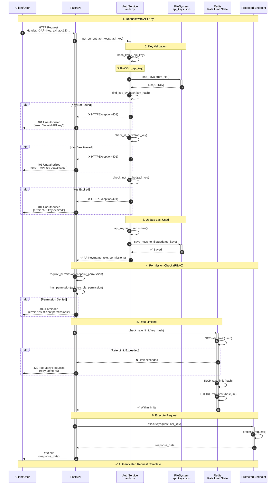
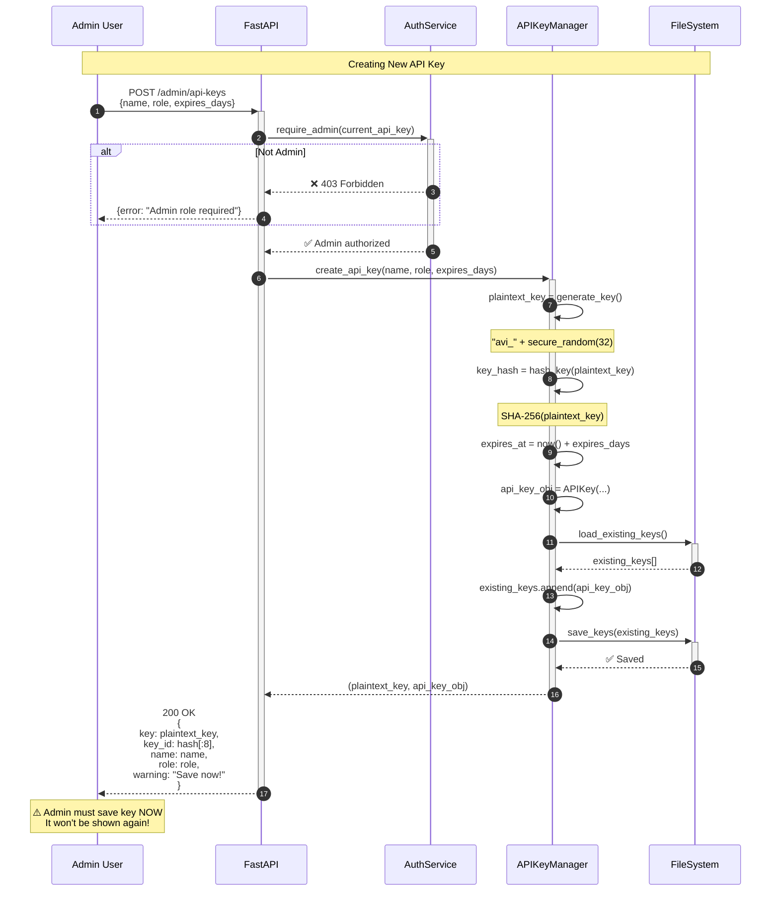
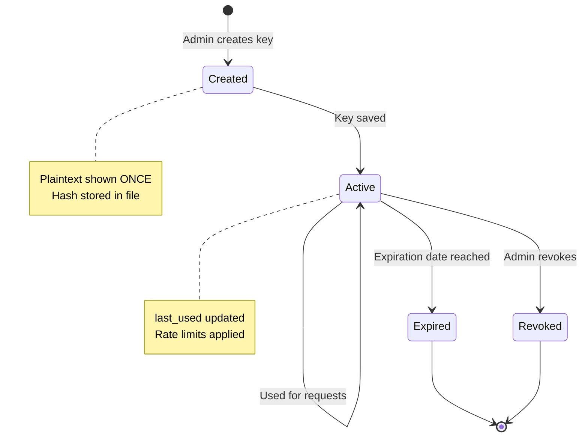

# Detailed Sequence Diagram - Authentication Flow

> Детальная sequence диаграмма процесса аутентификации через API Keys

**Поток**: API Key Authentication & RBAC
**Версия**: 1.0
**Дата**: 2025-11-15

---

## 🔄 Authentication Flow - API Request



---

## 🔄 Admin Flow - API Key Management



---

## 🔒 RBAC Permission Matrix

| Role | Permissions | Access Level |
|------|-------------|--------------|
| **admin** | `read`, `write`, `delete`, `admin` | Full access to all endpoints |
| **user** | `read`, `write` | Query, upload, settings (no admin) |
| **readonly** | `read` | View data, stats, logs only |

### Endpoint Permissions

| Endpoint | Required Permission | Allowed Roles |
|----------|---------------------|---------------|
| `GET /stats` | `read` | All |
| `GET /rules` | `read` | All |
| `POST /query` | `write` | user, admin |
| `POST /upload/rules` | `write` | user, admin |
| `POST /reindex` | `admin` | admin only |
| `DELETE /cache` | `admin` | admin only |
| `POST /admin/api-keys` | `admin` | admin only |
| `GET /admin/api-keys` | `admin` | admin only |

---

## ⚠️ Security Features

### 1. Key Storage
- **Never stored in plaintext**
- Only SHA-256 hash stored in `data/security/api_keys.json`
- Plaintext key shown ONCE at creation

### 2. Key Format
```
avi_{base64_url_safe_32_bytes}
Example: avi_kQ7x9Zm8PnL3vR2wT5yH4sJ6gF1dA0cB
```

### 3. Rate Limiting
- **Per API key** (not per IP)
- Configurable limits per endpoint type
- Stored in Redis for distributed systems

### 4. Expiration
- Optional expiration date
- Auto-reject expired keys
- Admins can set custom expiry

### 5. Revocation
- Soft delete (set `is_active = false`)
- Immediate effect
- Audit trail maintained

---

## 📊 Error Responses

### 401 Unauthorized

**Invalid Key:**
```json
{
  "detail": "Invalid or expired API key",
  "headers": {"WWW-Authenticate": "Bearer"}
}
```

**Expired Key:**
```json
{
  "detail": "API key expired on 2025-10-15",
  "expired_at": "2025-10-15T10:30:00Z"
}
```

**Deactivated Key:**
```json
{
  "detail": "API key has been revoked",
  "revoked_at": "2025-11-10T14:20:00Z"
}
```

### 403 Forbidden

**Insufficient Permissions:**
```json
{
  "detail": "Insufficient permissions. Required: admin",
  "current_role": "user",
  "required_permission": "admin"
}
```

### 429 Too Many Requests

**Rate Limit Exceeded:**
```json
{
  "detail": "Rate limit exceeded. Limit: 30/minute",
  "limit": "30/minute",
  "retry_after": 45,
  "reset_at": "2025-11-15T10:31:00Z"
}
```

---

## 🔧 Configuration

```bash
# API Key Storage
API_KEYS_FILE=data/security/api_keys.json

# Rate Limiting
RATE_LIMIT_ENABLED=true
RATE_LIMIT_QUERY=30/minute
RATE_LIMIT_UPLOAD=10/minute
RATE_LIMIT_ADMIN=50/minute
RATE_LIMIT_DEFAULT=100/minute

# Redis (for distributed rate limiting)
REDIS_URL=redis://localhost:6379/1

# Security
API_KEY_MIN_LENGTH=10
API_KEY_MAX_AGE_DAYS=365  # Default expiration
```

---

## 📈 Performance

| Operation | Latency | Notes |
|-----------|---------|-------|
| Key validation | 1-3ms | File read + hash comparison |
| Permission check | <1ms | In-memory lookup |
| Rate limit check | 1-2ms | Redis GET + INCR |
| Total auth overhead | 3-6ms | Per request |

---

## 🔄 Key Lifecycle



---

## 🛡️ Best Practices

### For Developers

1. **Always use HTTPS** in production
2. **Never log API keys** (even hashed)
3. **Rotate keys periodically** (recommended: 90 days)
4. **Use role-based keys** (not one admin key for everything)
5. **Set expiration dates** for temporary access

### For Admins

1. **Create service-specific keys** (one per service/user)
2. **Use descriptive names** (e.g., "production-api", "staging-client")
3. **Monitor key usage** (check `last_used` regularly)
4. **Revoke unused keys** promptly
5. **Audit admin key creation** (log all key management operations)

---

## 📊 Monitoring

Track these metrics:

- `auth_attempts_total{result="success|failure"}`
- `auth_latency_seconds`
- `rate_limit_exceeded_total{endpoint}`
- `api_key_usage_count{key_id, endpoint}`
- `api_key_created_total{role}`
- `api_key_revoked_total{reason}`

---

**Версия**: 1.0
**Дата**: 2025-11-15
**Статус**: ✅ Production
**Связанные документы**: [AUTHENTICATION.md](../AUTHENTICATION.md), [API.md](../API.md)
