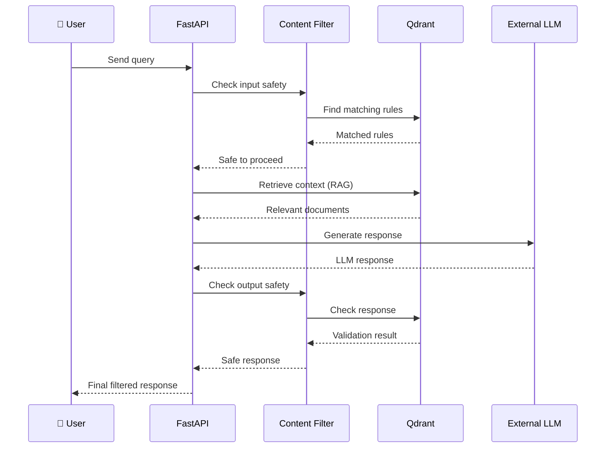
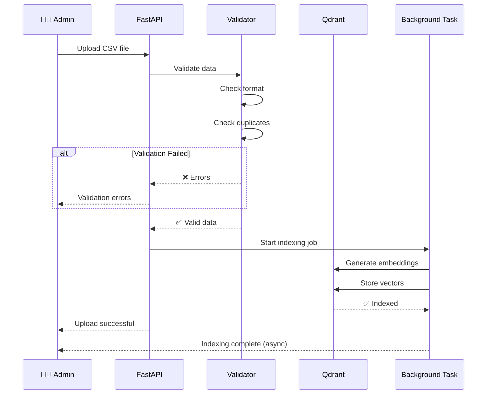
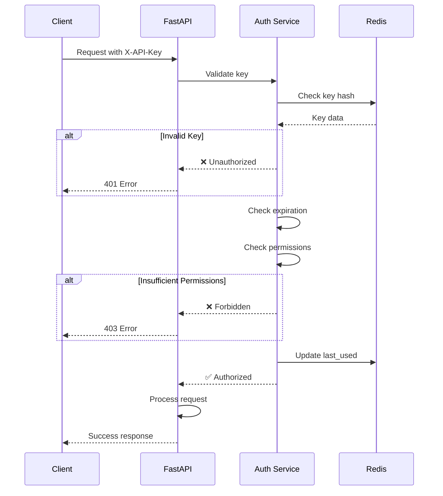
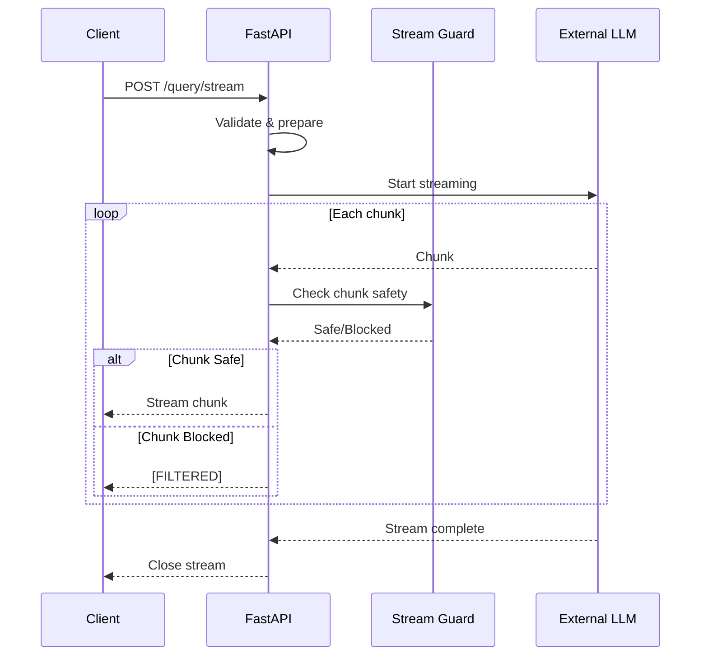
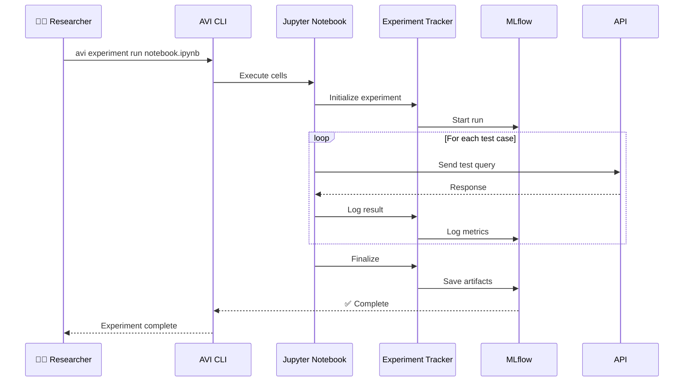
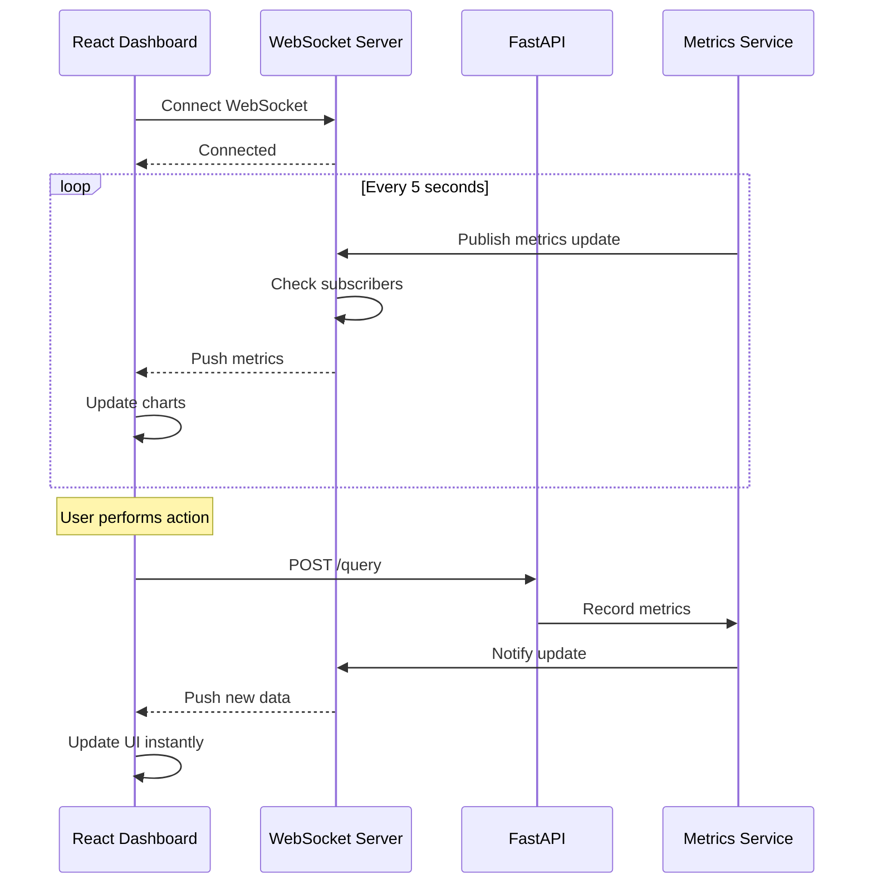

# Simple Sequence Diagrams - AVI System

> Упрощенные sequence диаграммы для быстрого понимания основных потоков

**Версия**: 2.0
**Дата**: 2025-11-13
**Аудитория**: Новые разработчики, stakeholders

---

## 1. Query Processing (Simplified)

Основной поток обработки запроса пользователя.



**Время**: ~700-2500ms (зависит от LLM)

---

## 2. Upload & Index (Simplified)

Загрузка и индексирование новых правил или документов.



**Время**: ~1-5 минут (зависит от размера)

---

## 3. Authentication Flow (Simplified)

Аутентификация запроса через API Key.



**Время**: ~5-15ms

---

## 4. Streaming Response (Simplified)

Потоковая генерация ответа с фильтрацией чанков.



**Время**: 1-5 секунд (зависит от длины ответа)

---

## 5. Experiment Execution (Simplified)

Запуск эксперимента через Jupyter Notebook.



**Время**: 5-30 минут (зависит от размера эксперимента)

---

## 6. UI Real-time Update (Simplified)

Real-time обновления в React Dashboard через WebSocket.



**Latency**: < 100ms для updates

---

## 📊 Сравнение сложности потоков

| Поток | Компоненты | Шаги | Типичное время |
|-------|-----------|------|----------------|
| Query (Simple) | 4 | 8 | 700-2500ms |
| Query (Full) | 12 | 50+ | 700-2500ms |
| Upload | 5 | 15 | 1-5 минут |
| Auth | 3 | 10 | 5-15ms |
| Streaming | 4 | Variable | 1-5 секунд |
| Experiment | 5 | 100+ | 5-30 минут |
| Real-time Update | 4 | 5 | < 100ms |

---

## 🎯 Ключевые паттерны

### 1. Request-Response (Синхронный)
```
Client → API → Processing → Response → Client
```
Примеры: Query, Upload, Auth

### 2. Background Processing (Асинхронный)
```
Client → API → Trigger Background Job
Background Job → Long Processing → Completion Notification
```
Примеры: Upload & Index, Reindex

### 3. Streaming (Server-Sent Events)
```
Client → API → Open Stream
Loop: LLM Chunk → Filter → Send to Client
Stream Complete
```
Примеры: Streaming Query

### 4. Real-time (WebSocket)
```
Client ↔ WebSocket Server
Server pushes updates when available
```
Примеры: Live metrics, System notifications

---

## ⚡ Быстрые пути (Fast Paths)

### Cache Hit (Query)
```
Client → API → Auth → Cache → Client
Time: ~15ms (100x faster!)
```

### Bypass Filtering (если доверенный клиент)
```
Client → API → Auth → LLM → Client
Time: ~500-2000ms (no filtering overhead)
```

### Pre-computed Results (для популярных запросов)
```
Client → API → Auth → Database → Client
Time: ~10-50ms
```

---

## 🔍 Когда использовать какую диаграмму

| Диаграмма | Используйте для |
|-----------|-----------------|
| **Simple Query** | Объяснение основного потока новичкам |
| **Detailed Query** | Debugging, оптимизация, полное понимание |
| **Upload** | Понимание процесса индексирования |
| **Auth** | Настройка безопасности |
| **Streaming** | Реализация real-time features |
| **Experiment** | Настройка исследовательской инфраструктуры |
| **Real-time Update** | Разработка WebSocket features |

---

## 📚 Связанные документы

- [Detailed Sequence - Query Flow](./02_SEQUENCE_QUERY_DETAILED.md)
- [HLD Architecture](./01_HLD_ARCHITECTURE.md)
- [Functional Blocks](./08_FUNCTIONAL_BLOCKS.md)
- [API Documentation](../API.md)

---

**Версия**: 2.0
**Дата**: 2025-11-13
**Статус**: ✅ Complete
**Цель**: Быстрое понимание основных потоков для новых разработчиков
