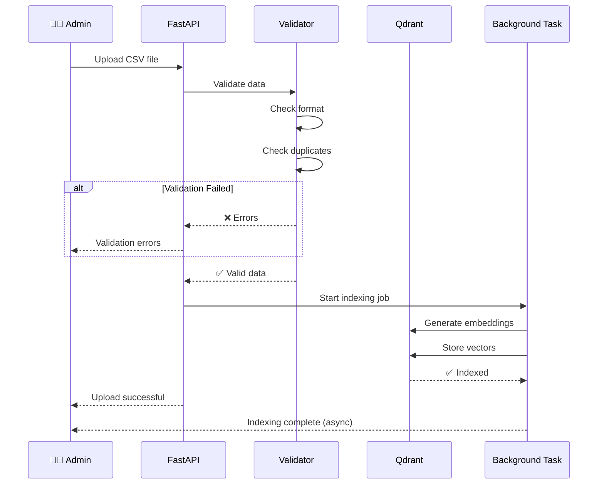
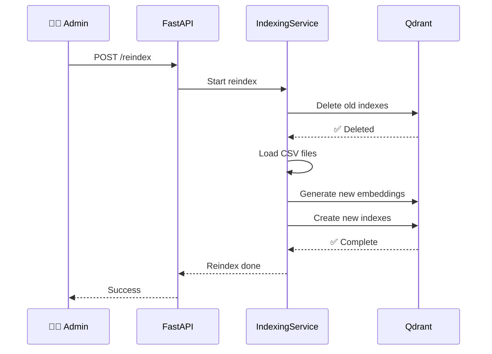

# Simple Sequence Diagram - Upload Flow

> Упрощенная sequence диаграмма для быстрого понимания процесса загрузки данных

**Поток**: Upload & Index
**Версия**: 1.0
**Дата**: 2025-11-15
**Аудитория**: Новые разработчики, stakeholders

---

## 📤 Upload & Index (Simplified)

Процесс загрузки и индексирования новых правил или документов.



**Время**: ~1-5 минут (зависит от размера)

---

## 🔄 Reindex Existing Data (Simplified)

Полная переиндексация всех данных.



**Время**: ~5-20 минут (зависит от объема)

---

## 📊 Key Points

### Validation Checks
- ✅ CSV format correctness
- ✅ Required fields present
- ✅ Value ranges (threshold 0-1)
- ✅ Duplicate detection
- ✅ Category validation

### Indexing Phases
1. **Embedding** - Generate vector embeddings (30-60s)
2. **Indexing** - Store in Qdrant (20-40s)
3. **Links** - Create relationships (10-30s)

### Real-time Progress
Admins can track progress via:
- **SSE**: `/api/v1/indexing/status/stream`
- **Polling**: `/api/v1/indexing/status`

---

## ⚠️ Common Errors

**Validation Failed:**
```
Some rules failed validation. Check:
- Text length (3-1000 chars)
- Threshold range (0.0-1.0)
- Valid category
```

**Indexing In Progress:**
```
Cannot start new indexing while
another is running. Wait or cancel.
```

**Permission Denied:**
```
Upload requires 'write' permission.
Admin key needed for reindex.
```

---

**Версия**: 1.0
**Дата**: 2025-11-15
**Статус**: ✅ Production
**Связанные диаграммы**: [Upload Detailed](./04_SEQUENCE_UPLOAD_DETAILED.md), [HLD](./01_HLD_ARCHITECTURE.md)
