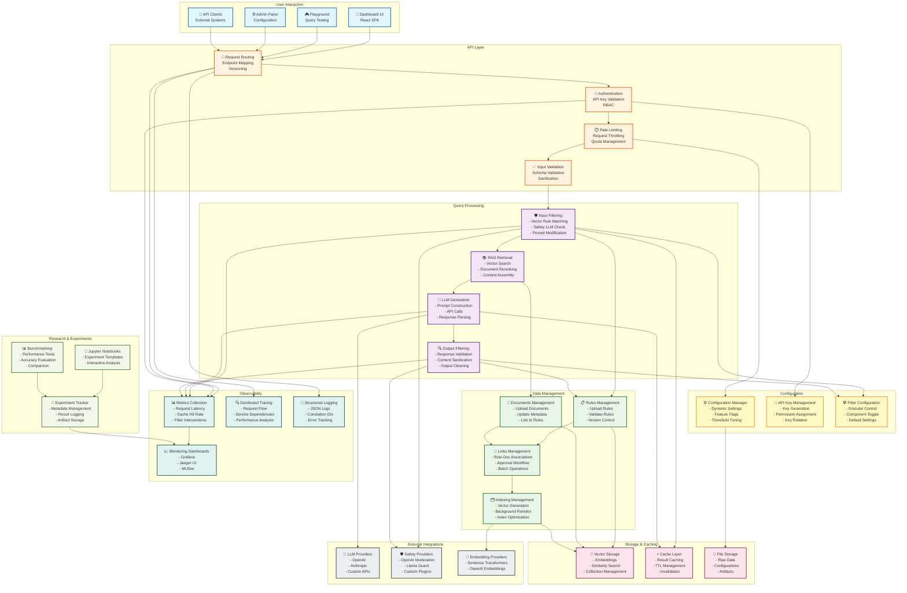

# Functional Blocks Diagram - AVI System

> Функциональная схема системы AVI с блоками ответственности

**Версия**: 2.0
**Дата**: 2025-11-13
**Цель**: Показать функциональные блоки и их взаимодействие

---

## 🎯 Функциональные блоки системы



---

## 📋 Детальное описание блоков

### 🎯 User Interaction Layer

#### Dashboard UI
- **Ответственность**: Административный интерфейс
- **Функции**:
  - Dashboard overview (metrics, health)
  - Query playground (testing)
  - Filters management (rules, documents)
  - Monitoring (embedded Grafana, Jaeger)
  - Experiments (notebook management)
  - Settings (configuration)
- **Технологии**: React 18, TypeScript, Ant Design

#### API Clients
- **Ответственность**: Внешние системы интеграции
- **Функции**:
  - REST API calls
  - Authentication via API keys
  - Programmatic access
- **Примеры**: Python SDK, JavaScript client, CLI tool

---

### 🔐 API Layer

#### Authentication
- **Ответственность**: Проверка подлинности
- **Функции**:
  - API key validation (SHA-256)
  - Role-based access control (RBAC)
  - Permission checks
  - Key expiration management
- **Файл**: `src/api/auth.py`

#### Rate Limiting
- **Ответственность**: Защита от перегрузки
- **Функции**:
  - Request throttling
  - Per-endpoint limits
  - API key quotas
  - Distributed rate limiting (Redis)
- **Файл**: `src/api/rate_limit.py`

#### Request Routing
- **Ответственность**: Маршрутизация запросов
- **Функции**:
  - Endpoint mapping
  - API versioning
  - CORS handling
  - Request correlation
- **Файл**: `src/api/routes.py`

#### Input Validation
- **Ответственность**: Валидация входных данных
- **Функции**:
  - Schema validation (Pydantic)
  - Type checking
  - Input sanitization
  - Error handling
- **Технология**: Pydantic models

---

### 🔄 Query Processing Layer

#### Input Filtering
- **Ответственность**: Фильтрация входных запросов
- **Функции**:
  - Vector-based rule matching
  - Safety LLM integration (optional)
  - Prompt modification
  - Category detection
- **Файл**: `src/core/content_filter.py`
- **Компоненты**:
  - `enable_vector_rules` - поиск похожих правил
  - `enable_safety_llm` - проверка через Safety API
  - `enable_prompt_modification` - модификация запроса

#### RAG Retrieval
- **Ответственность**: Контекстуальное обогащение
- **Функции**:
  - Vector similarity search
  - Document reranking (cross-encoder)
  - Relevance scoring
  - Context assembly
- **Файл**: `src/core/rag_system.py`

#### LLM Generation
- **Ответственность**: Генерация ответа
- **Функции**:
  - Prompt construction
  - API calls to LLM providers
  - Response parsing
  - Streaming support
  - Error handling
- **Файл**: `src/core/llm_service.py`

#### Output Filtering
- **Ответственность**: Фильтрация ответов LLM
- **Функции**:
  - Response validation
  - Content sanitization
  - PII detection
  - Output cleaning (system markers removal)
- **Файл**: `src/core/content_filter.py`
- **Компоненты**:
  - `enable_vector_rules` - проверка ответа
  - `enable_safety_llm` - Safety API проверка
  - `enable_output_cleaning` - очистка выхода

---

### 📊 Data Management Layer

#### Rules Management
- **Ответственность**: Управление правилами фильтрации
- **Функции**:
  - Upload rules (CSV)
  - Rule validation
  - Category management
  - Version control
- **Файл**: `src/services/filter_service.py`

#### Documents Management
- **Ответственность**: Управление knowledge base
- **Функции**:
  - Upload documents (CSV)
  - Metadata management
  - Document linking
  - Content updates
- **Файл**: `src/services/rag_service.py`

#### Links Management
- **Ответственность**: Rule-Document ассоциации
- **Функции**:
  - Create links
  - Approval workflow
  - Batch operations
  - Link validation
- **Файл**: `src/services/links_manager.py`

#### Indexing Management
- **Ответственность**: Векторное индексирование
- **Функции**:
  - Embedding generation
  - Background reindex tasks
  - Index optimization
  - Collection management
- **Файл**: `src/services/indexing_service.py`

---

### ⚙️ Configuration Layer

#### Configuration Manager
- **Ответственность**: Динамическая конфигурация
- **Функции**:
  - Settings management
  - Feature flags
  - Threshold tuning
  - Configuration persistence
- **Файл**: `src/services/config_manager.py`

#### API Key Management
- **Ответственность**: Управление API keys
- **Функции**:
  - Key generation
  - Role assignment
  - Key rotation
  - Usage tracking
- **Файл**: `src/api/auth.py` (APIKeyManager)

#### Filter Configuration
- **Ответственность**: Настройка фильтрации
- **Функции**:
  - Granular component control
  - Default settings
  - Per-request overrides
  - Configuration validation
- **Файл**: `src/services/config_manager.py`

---

### 💾 Storage & Caching Layer

#### Vector Storage
- **Ответственность**: Хранение embeddings
- **Функции**:
  - Vector indexing (HNSW)
  - Similarity search
  - Collection management
  - Persistence
- **Технология**: Qdrant
- **Файл**: `src/services/vector_db.py`

#### Cache Layer
- **Ответственность**: Кэширование результатов
- **Функции**:
  - Query result caching
  - TTL management
  - Cache invalidation
  - Distributed cache
- **Технология**: Redis
- **Файл**: `src/services/cache_service.py`

#### File Storage
- **Ответственность**: Файловое хранилище
- **Функции**:
  - Raw data storage
  - Configuration files
  - Experiment artifacts
  - API key storage
- **Директории**: `data/`, `artifacts/`

---

### 🔌 External Integrations Layer

#### LLM Providers
- **Ответственность**: Интеграция с LLM API
- **Поддерживаемые**:
  - OpenAI (GPT-4, GPT-3.5)
  - Anthropic (Claude)
  - Custom endpoints
- **Файл**: `src/services/llm_adapter.py`

#### Safety Providers
- **Ответственность**: Safety model интеграции
- **Поддерживаемые**:
  - OpenAI Moderation API
  - Llama Guard 2
  - Custom plugins
- **Файл**: `src/services/safety_client.py`, `src/services/safety_plugin.py`

#### Embedding Providers
- **Ответственность**: Генерация embeddings
- **Поддерживаемые**:
  - Sentence Transformers (local)
  - OpenAI Embeddings API
- **Файл**: `src/services/vector_db.py`

---

### 📈 Observability Layer

#### Metrics Collection
- **Ответственность**: Сбор метрик
- **Метрики**:
  - `avi_http_request_latency_seconds`
  - `avi_cache_hits_total` / `avi_cache_misses_total`
  - `avi_safety_interventions_total`
  - `avi_rerank_latency_seconds`
- **Технология**: Prometheus
- **Файл**: `src/monitoring/metrics.py`

#### Distributed Tracing
- **Ответственность**: Трассировка запросов
- **Функции**:
  - Request flow visualization
  - Service dependency mapping
  - Performance bottleneck identification
- **Технология**: OpenTelemetry, Tempo, Jaeger
- **Файл**: `src/monitoring/tracing.py`

#### Structured Logging
- **Ответственность**: Логирование
- **Функции**:
  - JSON formatted logs
  - Correlation IDs
  - Error tracking
  - Audit logs
- **Технология**: Loguru
- **Файл**: `src/utils/logger.py`

#### Monitoring Dashboards
- **Ответственность**: Визуализация
- **Компоненты**:
  - Grafana (metrics visualization)
  - Jaeger UI (trace visualization)
  - MLflow (experiment tracking)
- **Порты**: 3000, 16686, 5000

---

### 🧪 Research & Experiments Layer

#### Jupyter Notebooks
- **Ответственность**: Интерактивные эксперименты
- **Функции**:
  - Experiment templates
  - Interactive analysis
  - Data visualization
  - Result export
- **Директория**: `notebooks/`

#### Experiment Tracker
- **Ответственность**: Tracking экспериментов
- **Функции**:
  - Metadata management
  - Result logging
  - Artifact storage
  - MLflow integration
- **Файл**: `avi/experiments.py`

#### Benchmarking
- **Ответственность**: Performance тестирование
- **Функции**:
  - Accuracy evaluation
  - Latency benchmarking
  - Model comparison
  - Report generation
- **Интеграция**: Through notebooks

---

## 🔄 Взаимодействие между блоками

### Критические пути

**Path 1: Query Processing**
```
UI → Routing → Auth → Rate Limit → Input Filter
→ RAG Retrieval → LLM Generation → Output Filter → Cache → Response
```

**Path 2: Data Upload**
```
UI → Routing → Auth → Rules Management → Index Management
→ Vector Storage → Background Job → Completion
```

**Path 3: Configuration Update**
```
UI → Routing → Auth → Config Manager → File Storage
→ Dynamic Reload → Apply Changes
```

---

## 📊 Ответственность по категориям

| Категория | Блоки | Основная функция |
|-----------|-------|------------------|
| **Security** | Auth, Rate Limiting, Input/Output Filtering | Безопасность и защита |
| **Processing** | Query Processing Layer | Обработка запросов |
| **Storage** | Vector Store, Cache, File Storage | Хранение данных |
| **Integration** | LLM/Safety/Embedding Providers | Внешние интеграции |
| **Management** | Rules/Docs/Links/Index Management | Управление данными |
| **Configuration** | Config Manager, API Keys, Filter Config | Настройка системы |
| **Observability** | Metrics, Tracing, Logging, Monitoring | Мониторинг и диагностика |
| **Research** | Notebooks, Experiment Tracker, Benchmark | Исследования и оптимизация |

---

**Версия**: 2.0
**Дата**: 2025-11-13
**Статус**: ✅ Complete
**Связанные диаграммы**: [HLD](./01_HLD_ARCHITECTURE.md), [Component](./10_COMPONENTS.md)
