# Deployment Diagram - AVI System

> Диаграмма развертывания системы AVI в production

**Версия**: 2.0
**Дата**: 2025-11-13
**Environment**: Production (Docker Compose + Kubernetes ready)

---

## 🚀 Production Deployment Architecture

```mermaid
graph TB
    subgraph "External"
        Internet[🌐 Internet]
        DNS[📡 DNS]
    end

    subgraph "Load Balancing"
        LoadBalancer[⚖️ Load Balancer<br/>Nginx/Traefik<br/>Port 80/443]
    end

    subgraph "Application Tier"
        subgraph "Web Servers"
            Frontend1[🖥️ Dashboard #1<br/>React SPA<br/>Node:18-alpine]
            Frontend2[🖥️ Dashboard #2<br/>React SPA<br/>Node:18-alpine]
        end

        subgraph "API Servers"
            API1[⚙️ FastAPI #1<br/>Python 3.11<br/>Uvicorn Workers]
            API2[⚙️ FastAPI #2<br/>Python 3.11<br/>Uvicorn Workers]
            API3[⚙️ FastAPI #3<br/>Python 3.11<br/>Uvicorn Workers]
        end

        subgraph "Background Workers"
            Worker1[👷 Worker #1<br/>Celery<br/>Indexing Tasks]
            Worker2[👷 Worker #2<br/>Celery<br/>Reindex Tasks]
        end
    end

    subgraph "Data Tier"
        subgraph "Vector Database Cluster"
            Qdrant1[(🗄️ Qdrant Node #1<br/>Primary<br/>6GB RAM)]
            Qdrant2[(🗄️ Qdrant Node #2<br/>Replica<br/>6GB RAM)]
        end

        subgraph "Cache Cluster"
            Redis1[(⚡ Redis Master<br/>Port 6379<br/>AOF Enabled)]
            Redis2[(⚡ Redis Replica<br/>Port 6380<br/>Read-only)]
        end

        subgraph "Persistent Storage"
            Volume1[💾 Volume: data/<br/>Rules, Documents<br/>NFS/EBS]
            Volume2[💾 Volume: artifacts/<br/>Experiments<br/>S3/EBS]
            Volume3[💾 Volume: logs/<br/>Application Logs<br/>EBS]
        end
    end

    subgraph "Monitoring & Observability"
        Prometheus[📊 Prometheus<br/>Port 9090<br/>Metrics Storage]
        Grafana[📈 Grafana<br/>Port 3000<br/>Dashboards]
        Tempo[🔍 Tempo<br/>Port 3200<br/>Trace Storage]
        Jaeger[🔎 Jaeger UI<br/>Port 16686<br/>Trace Visualization]
        MLflow[🧪 MLflow<br/>Port 5000<br/>Experiment Tracking]
    end

    subgraph "External Services"
        OpenAI[🤖 OpenAI API<br/>api.openai.com]
        Anthropic[🤖 Anthropic API<br/>api.anthropic.com]
        SafetyAPI[🛡️ Safety APIs<br/>Optional]
    end

    %% User connections
    Internet --> DNS
    DNS --> LoadBalancer

    %% Load balancer routing
    LoadBalancer -->|/| Frontend1
    LoadBalancer -->|/| Frontend2
    LoadBalancer -->|/api| API1
    LoadBalancer -->|/api| API2
    LoadBalancer -->|/api| API3
    LoadBalancer -->|/grafana| Grafana
    LoadBalancer -->|/jaeger| Jaeger
    LoadBalancer -->|/mlflow| MLflow

    %% Frontend to API
    Frontend1 -.->|REST/WebSocket| API1
    Frontend1 -.->|REST/WebSocket| API2
    Frontend2 -.->|REST/WebSocket| API2
    Frontend2 -.->|REST/WebSocket| API3

    %% API to data tier
    API1 --> Redis1
    API1 --> Qdrant1
    API2 --> Redis1
    API2 --> Qdrant1
    API3 --> Redis1
    API3 --> Qdrant2

    %% Workers to data tier
    Worker1 --> Qdrant1
    Worker1 --> Redis1
    Worker2 --> Qdrant2
    Worker2 --> Redis1

    %% Redis replication
    Redis1 -.->|Replication| Redis2
    API1 -.->|Read| Redis2
    API2 -.->|Read| Redis2

    %% Qdrant replication
    Qdrant1 -.->|Replication| Qdrant2

    %% Persistent volumes
    API1 --> Volume1
    API2 --> Volume1
    API3 --> Volume1
    Worker1 --> Volume1
    Worker2 --> Volume1
    API1 --> Volume2
    Worker1 --> Volume2
    API1 --> Volume3
    API2 --> Volume3
    API3 --> Volume3

    %% Monitoring connections
    API1 -->|Metrics| Prometheus
    API2 -->|Metrics| Prometheus
    API3 -->|Metrics| Prometheus
    API1 -->|Traces| Tempo
    API2 -->|Traces| Tempo
    API3 -->|Traces| Tempo
    Prometheus --> Grafana
    Tempo --> Jaeger
    Worker1 -->|Logs| MLflow

    %% External services
    API1 -.->|HTTPS| OpenAI
    API2 -.->|HTTPS| Anthropic
    API3 -.->|HTTPS| SafetyAPI

    %% Styling
    classDef external fill:#eceff1,stroke:#263238,stroke-width:2px
    classDef lb fill:#fff3e0,stroke:#e65100,stroke-width:2px
    classDef app fill:#e1f5ff,stroke:#01579b,stroke-width:2px
    classDef data fill:#e8f5e9,stroke:#1b5e20,stroke-width:2px
    classDef monitor fill:#fff9c4,stroke:#f57f17,stroke-width:2px
    classDef storage fill:#fce4ec,stroke:#880e4f,stroke-width:2px

    class Internet,DNS,OpenAI,Anthropic,SafetyAPI external
    class LoadBalancer lb
    class Frontend1,Frontend2,API1,API2,API3,Worker1,Worker2 app
    class Redis1,Redis2,Qdrant1,Qdrant2 data
    class Prometheus,Grafana,Tempo,Jaeger,MLflow monitor
    class Volume1,Volume2,Volume3 storage
```



---

## 📦 Container Specifications

### Frontend (React Dashboard)

**Image**: `avi-dashboard:latest`
**Base**: `node:18-alpine` (build) → `nginx:alpine` (runtime)
**Resources**:
- CPU: 0.5 cores
- Memory: 512 MB
- Replicas: 2 (HA)

**Ports**:
- 80 (HTTP)

**Configuration**:
```yaml
environment:
  VITE_API_URL: http://api:8000
  VITE_GRAFANA_URL: http://grafana:3000
  VITE_MLFLOW_URL: http://mlflow:5000
  VITE_JAEGER_URL: http://jaeger:16686
```

---

### API (FastAPI Backend)

**Image**: `avi-api:cpu` или `avi-api:gpu`
**Base**: `python:3.11-slim` (CPU) or `nvidia/cuda:11.8-runtime` (GPU)
**Resources**:
- CPU: 2 cores (CPU) or 4 cores + 1 GPU (GPU)
- Memory: 4 GB (CPU) or 8 GB (GPU)
- Replicas: 3 (HA)

**Ports**:
- 8000 (HTTP)

**Configuration**:
```yaml
environment:
  APP_ENV: production
  ENVIRONMENT: production
  DEVICE: cpu  # or cuda
  QDRANT_HOST: qdrant
  QDRANT_PORT: 6333
  REDIS_URL: redis://redis:6379/0
  PROMETHEUS_ENABLED: "true"
  OTEL_ENABLED: "true"
```

---

### Background Workers

**Image**: `avi-worker:latest`
**Base**: Same as API
**Resources**:
- CPU: 2 cores
- Memory: 4 GB
- Replicas: 2

**Configuration**:
```yaml
command: ["celery", "-A", "avi.worker", "worker"]
```

---

### Qdrant (Vector Database)

**Image**: `qdrant/qdrant:v1.7.3`
**Resources**:
- CPU: 2 cores
- Memory: 6 GB (holds vectors in RAM)
- Replicas: 2 (primary + replica)

**Ports**:
- 6333 (REST API)
- 6334 (gRPC)

**Volumes**:
- `/qdrant/storage` → `./data/indexes/qdrant`

**Configuration**:
```yaml
environment:
  QDRANT__CLUSTER__ENABLED: "true"
  QDRANT__CLUSTER__P2P__PORT: "6335"
```

---

### Redis (Cache & State)

**Image**: `redis:7-alpine`
**Resources**:
- CPU: 1 core
- Memory: 2 GB
- Replicas: 2 (master + replica)

**Ports**:
- 6379 (Redis Protocol)

**Volumes**:
- `/data` → `./data/redis`

**Configuration**:
```yaml
command: ["redis-server", "--appendonly", "yes"]
```

---

### Prometheus (Metrics)

**Image**: `prom/prometheus:latest`
**Resources**:
- CPU: 1 core
- Memory: 2 GB

**Ports**:
- 9090 (HTTP)

**Volumes**:
- `/prometheus` → `./monitoring/prometheus-data`
- `/etc/prometheus/prometheus.yml` → `./monitoring/prometheus.yml`

---

### Grafana (Dashboards)

**Image**: `grafana/grafana:latest`
**Resources**:
- CPU: 0.5 cores
- Memory: 1 GB

**Ports**:
- 3000 (HTTP)

**Volumes**:
- `/var/lib/grafana` → `./monitoring/grafana-data`
- `/etc/grafana/provisioning` → `./monitoring/grafana/provisioning`

---

### Tempo (Tracing)

**Image**: `grafana/tempo:latest`
**Resources**:
- CPU: 1 core
- Memory: 2 GB

**Ports**:
- 3200 (HTTP)
- 4318 (OTLP gRPC)

**Volumes**:
- `/var/tempo` → `./monitoring/tempo-data`

---

### Jaeger UI

**Image**: `jaegertracing/all-in-one:latest`
**Resources**:
- CPU: 0.5 cores
- Memory: 1 GB

**Ports**:
- 16686 (HTTP UI)
- 6831 (UDP Jaeger compact thrift)

---

### MLflow

**Image**: `python:3.11-slim` + MLflow
**Resources**:
- CPU: 1 core
- Memory: 2 GB

**Ports**:
- 5000 (HTTP)

**Volumes**:
- `/mlflow` → `./data/mlruns`

**Command**:
```bash
mlflow server --host 0.0.0.0 --port 5000 --backend-store-uri file:///mlflow
```

---

## 🔧 Docker Compose Configuration

### Production docker-compose.yml

```yaml
version: "3.9"

services:
  # Load Balancer
  nginx:
    image: nginx:alpine
    ports:
      - "80:80"
      - "443:443"
    volumes:
      - ./nginx.conf:/etc/nginx/nginx.conf
      - ./certs:/etc/nginx/certs
    depends_on:
      - dashboard
      - api

  # Frontend
  dashboard:
    image: avi-dashboard:latest
    build:
      context: ./frontend
      dockerfile: Dockerfile
    deploy:
      replicas: 2
    environment:
      VITE_API_URL: http://api:8000

  # API
  api:
    image: avi-api:cpu
    build:
      context: .
      dockerfile: Dockerfile
      target: cpu
    deploy:
      replicas: 3
    depends_on:
      - qdrant
      - redis
      - mlflow
    environment:
      APP_ENV: production
      QDRANT_HOST: qdrant
      REDIS_URL: redis://redis:6379/0
    volumes:
      - ./data:/app/data
      - ./logs:/app/logs

  # Background Workers
  worker:
    image: avi-worker:latest
    build:
      context: .
      dockerfile: Dockerfile
      target: cpu
    deploy:
      replicas: 2
    command: ["celery", "-A", "avi.worker", "worker"]
    depends_on:
      - redis
      - qdrant
    volumes:
      - ./data:/app/data

  # Qdrant (Vector DB)
  qdrant:
    image: qdrant/qdrant:v1.7.3
    ports:
      - "6333:6333"
      - "6334:6334"
    volumes:
      - ./data/indexes/qdrant:/qdrant/storage
    environment:
      QDRANT__SERVICE__GRPC_PORT: "6334"

  # Redis (Cache)
  redis:
    image: redis:7-alpine
    ports:
      - "6379:6379"
    volumes:
      - ./data/redis:/data
    command: ["redis-server", "--appendonly", "yes"]
    healthcheck:
      test: ["CMD", "redis-cli", "ping"]
      interval: 5s
      timeout: 3s
      retries: 5

  # Prometheus
  prometheus:
    image: prom/prometheus:latest
    ports:
      - "9090:9090"
    volumes:
      - ./monitoring/prometheus.yml:/etc/prometheus/prometheus.yml
      - prometheus-data:/prometheus
    command:
      - '--config.file=/etc/prometheus/prometheus.yml'

  # Grafana
  grafana:
    image: grafana/grafana:latest
    ports:
      - "3000:3000"
    volumes:
      - ./monitoring/grafana/provisioning:/etc/grafana/provisioning
      - grafana-data:/var/lib/grafana
    environment:
      GF_SECURITY_ADMIN_PASSWORD: ${GRAFANA_PASSWORD}
      GF_SERVER_ROOT_URL: http://localhost:3000

  # Tempo
  tempo:
    image: grafana/tempo:latest
    ports:
      - "3200:3200"
      - "4318:4318"
    volumes:
      - tempo-data:/var/tempo

  # Jaeger
  jaeger:
    image: jaegertracing/all-in-one:latest
    ports:
      - "16686:16686"
      - "6831:6831/udp"

  # MLflow
  mlflow:
    image: python:3.11-slim
    ports:
      - "5000:5000"
    volumes:
      - ./data/mlruns:/mlflow
    command: >
      bash -c "pip install mlflow &&
               mlflow server
                 --host 0.0.0.0
                 --port 5000
                 --backend-store-uri file:///mlflow"

volumes:
  prometheus-data:
  grafana-data:
  tempo-data:
```

---

## ☸️ Kubernetes Deployment (Optional)

### Namespace

```yaml
apiVersion: v1
kind: Namespace
metadata:
  name: avi-production
```

### API Deployment

```yaml
apiVersion: apps/v1
kind: Deployment
metadata:
  name: avi-api
  namespace: avi-production
spec:
  replicas: 3
  selector:
    matchLabels:
      app: avi-api
  template:
    metadata:
      labels:
        app: avi-api
    spec:
      containers:
      - name: api
        image: avi-api:cpu
        ports:
        - containerPort: 8000
        env:
        - name: ENVIRONMENT
          value: "production"
        - name: QDRANT_HOST
          value: "qdrant-service"
        - name: REDIS_URL
          value: "redis://redis-service:6379/0"
        resources:
          requests:
            cpu: "2"
            memory: "4Gi"
          limits:
            cpu: "4"
            memory: "8Gi"
        livenessProbe:
          httpGet:
            path: /health
            port: 8000
          initialDelaySeconds: 30
          periodSeconds: 10
        readinessProbe:
          httpGet:
            path: /health
            port: 8000
          initialDelaySeconds: 5
          periodSeconds: 5
```

### Service

```yaml
apiVersion: v1
kind: Service
metadata:
  name: avi-api-service
  namespace: avi-production
spec:
  selector:
    app: avi-api
  ports:
  - protocol: TCP
    port: 8000
    targetPort: 8000
  type: LoadBalancer
```

### Ingress

```yaml
apiVersion: networking.k8s.io/v1
kind: Ingress
metadata:
  name: avi-ingress
  namespace: avi-production
  annotations:
    kubernetes.io/ingress.class: nginx
    cert-manager.io/cluster-issuer: letsencrypt-prod
spec:
  tls:
  - hosts:
    - avi.example.com
    secretName: avi-tls
  rules:
  - host: avi.example.com
    http:
      paths:
      - path: /api
        pathType: Prefix
        backend:
          service:
            name: avi-api-service
            port:
              number: 8000
      - path: /
        pathType: Prefix
        backend:
          service:
            name: avi-dashboard-service
            port:
              number: 80
```

---

## 📊 Resource Requirements

### Minimum (Development/Test)
- **CPUs**: 6 cores
- **RAM**: 16 GB
- **Storage**: 50 GB

### Recommended (Production)
- **CPUs**: 16 cores
- **RAM**: 48 GB
- **Storage**: 200 GB SSD

### Scaling Guidelines

| Component | Scale by | Metric |
|-----------|----------|--------|
| API | Horizontal | CPU > 70%, Latency > 1s |
| Workers | Horizontal | Queue depth > 100 |
| Qdrant | Vertical (RAM) | Memory usage > 80% |
| Redis | Vertical (RAM) | Memory usage > 80% |

---

## 🔒 Security Configuration

### Network Policies

```yaml
apiVersion: networking.k8s.io/v1
kind: NetworkPolicy
metadata:
  name: api-network-policy
  namespace: avi-production
spec:
  podSelector:
    matchLabels:
      app: avi-api
  ingress:
  - from:
    - podSelector:
        matchLabels:
          app: avi-dashboard
    - podSelector:
        matchLabels:
          app: nginx-ingress
    ports:
    - protocol: TCP
      port: 8000
  egress:
  - to:
    - podSelector:
        matchLabels:
          app: qdrant
    - podSelector:
        matchLabels:
          app: redis
    ports:
    - protocol: TCP
      port: 6333
    - protocol: TCP
      port: 6379
  - to:
    - namespaceSelector: {}
    ports:
    - protocol: TCP
      port: 443  # External APIs
```

---

**Версия**: 2.0
**Дата**: 2025-11-13
**Статус**: ✅ Production Ready
**Платформы**: Docker Compose, Kubernetes
