# Component Diagram - AVI System

> Детальная структура компонентов системы AVI с зависимостями

**Версия**: 2.0
**Дата**: 2025-11-13
**Цель**: Показать внутреннюю структуру кодовой базы

---

## 🏗️ Component Structure

```mermaid
graph TB
    subgraph "src/api"
        Routes[routes.py<br/>Main API Endpoints]
        AdminRoutes[admin_routes.py<br/>Admin API Endpoints]
        SettingsRoutes[settings_routes.py<br/>Settings API]
        Auth[auth.py<br/>API Key Auth + RBAC]
        RateLimit[rate_limit.py<br/>SlowAPI Integration]
        Middleware[middleware.py<br/>CORS, Metrics, Logging]
        Prometheus[prometheus.py<br/>Metrics Endpoint]
    end

    subgraph "src/core"
        ContentFilter[content_filter.py<br/>Content Filtering Logic]
        RAGSystem[rag_system.py<br/>RAG Implementation]
        LLMService[llm_service.py<br/>LLM Integration]
        CacheSystem[cache_system.py<br/>Caching Logic]
        StreamingGuard[streaming_guard.py<br/>Streaming Filtering]
    end

    subgraph "src/services"
        VectorDB[vector_db.py<br/>Qdrant Client Wrapper]
        FilterService[filter_service.py<br/>Rule Management]
        RAGService[rag_service.py<br/>Document Management]
        LLMAdapter[llm_adapter.py<br/>Multi-provider LLM]
        Reranker[reranker.py<br/>Cross-encoder Reranking]
        SafetyClient[safety_client.py<br/>Safety API Client]
        SafetyPlugin[safety_plugin.py<br/>Plugin System]
        CacheService[cache_service.py<br/>Redis Client]
        ConfigManager[config_manager.py<br/>Dynamic Config]
        LinksManager[links_manager.py<br/>Rule-Doc Links]
        IndexingService[indexing_service.py<br/>Embedding & Index]
        CSVProcessor[csv_processor.py<br/>CSV Validation]
    end

    subgraph "src/models"
        Schemas[schemas.py<br/>Pydantic Models]
        FilterModels[FilteredContent<br/>FilterResult]
        QueryModels[QueryRequest<br/>QueryResponse]
        UploadModels[CSVUploadRequest<br/>CSVUploadResponse]
        AuthModels[APIKey<br/>RoleLinkRequest]
    end

    subgraph "src/monitoring"
        Metrics[metrics.py<br/>Prometheus Metrics]
        Tracing[tracing.py<br/>OpenTelemetry Setup]
        Observability[observability.py<br/>Helper Functions]
    end

    subgraph "src/utils"
        Logger[logger.py<br/>Loguru Setup]
        Health[health.py<br/>Health Checks]
        ProdValidators[production_validators.py<br/>Production Validation]
    end

    subgraph "config"
        Settings[settings.py<br/>Pydantic Settings]
        BenchmarkConfig[benchmark_config.json<br/>Benchmark Definitions]
    end

    subgraph "avi (CLI & Experiments)"
        CLI[cli.py<br/>CLI Commands]
        Experiments[experiments.py<br/>ExperimentTracker]
    end

    subgraph "main Application"
        MainApp[main.py<br/>FastAPI App Creation]
    end

    %% API Layer Dependencies
    Routes --> Auth
    Routes --> ContentFilter
    Routes --> RAGSystem
    Routes --> FilterService
    Routes --> LinksManager
    Routes --> Schemas
    AdminRoutes --> Auth
    AdminRoutes --> ConfigManager
    SettingsRoutes --> Auth
    SettingsRoutes --> ConfigManager
    Auth --> CacheService
    RateLimit --> CacheService
    Middleware --> Metrics
    Middleware --> Tracing
    Middleware --> Logger

    %% Core Dependencies
    ContentFilter --> VectorDB
    ContentFilter --> SafetyClient
    ContentFilter --> FilterService
    ContentFilter --> Schemas
    RAGSystem --> VectorDB
    RAGSystem --> RAGService
    RAGSystem --> Reranker
    RAGSystem --> CacheService
    LLMService --> LLMAdapter
    LLMService --> CacheService
    CacheSystem --> CacheService
    StreamingGuard --> ContentFilter

    %% Service Dependencies
    FilterService --> VectorDB
    FilterService --> Schemas
    RAGService --> VectorDB
    RAGService --> Schemas
    LLMAdapter --> Schemas
    SafetyClient --> SafetyPlugin
    ConfigManager --> Settings
    LinksManager --> VectorDB
    IndexingService --> VectorDB

    %% Monitoring Dependencies
    Metrics --> Prometheus
    Tracing --> Observability

    %% Main App Dependencies
    MainApp --> Routes
    MainApp --> AdminRoutes
    MainApp --> SettingsRoutes
    MainApp --> Middleware
    MainApp --> Auth
    MainApp --> RateLimit
    MainApp --> Settings
    MainApp --> Logger
    MainApp --> Health
    MainApp --> ProdValidators

    %% CLI Dependencies
    CLI --> Experiments
    CLI --> Settings
    Experiments --> Schemas

    %% Styling
    classDef api fill:#fff3e0,stroke:#e65100,stroke-width:2px
    classDef core fill:#f3e5f5,stroke:#4a148c,stroke-width:2px
    classDef service fill:#e8f5e9,stroke:#1b5e20,stroke-width:2px
    classDef model fill:#e1f5ff,stroke:#01579b,stroke-width:2px
    classDef monitor fill:#fff9c4,stroke:#f57f17,stroke-width:2px
    classDef util fill:#fce4ec,stroke:#880e4f,stroke-width:2px
    classDef ui fill:#eceff1,stroke:#263238,stroke-width:2px
    classDef config fill:#f1f8e9,stroke:#33691e,stroke-width:2px
    classDef main fill:#ede7f6,stroke:#311b92,stroke-width:2px

    class Routes,AdminRoutes,SettingsRoutes,Auth,RateLimit,Middleware,Prometheus api
    class ContentFilter,RAGSystem,LLMService,CacheSystem,StreamingGuard core
    class VectorDB,FilterService,RAGService,LLMAdapter,Reranker,SafetyClient,SafetyPlugin,CacheService,ConfigManager,LinksManager,IndexingService,CSVProcessor service
    class Schemas,FilterModels,QueryModels,UploadModels,AuthModels model
    class Metrics,Tracing,Observability monitor
    class Logger,Health,ProdValidators util
    class Settings,BenchmarkConfig config
    class CLI,Experiments config
    class MainApp main
```



---

## 📦 Component Inventory

### API Layer (`src/api/`)

| File | Lines | Purpose | Dependencies |
|------|-------|---------|--------------|
| `routes.py` | ~1200 | Main API endpoints | Auth, ContentFilter, RAGSystem, Services |
| `admin_routes.py` | ~250 | Admin operations | Auth, ConfigManager |
| `settings_routes.py` | ~850 | Settings management | Auth, ConfigManager |
| `auth.py` | ~500 | API Key + RBAC | CacheService, Schemas |
| `rate_limit.py` | ~150 | Rate limiting | SlowAPI, CacheService |
| `middleware.py` | ~100 | Middleware stack | Metrics, Tracing, Logger |
| `prometheus.py` | ~50 | Metrics endpoint | prometheus_client |

**Total**: ~3100 lines

---

### Core Layer (`src/core/`)

| File | Lines | Purpose | Dependencies |
|------|-------|---------|--------------|
| `content_filter.py` | ~600 | Main filtering logic | VectorDB, SafetyClient, FilterService |
| `rag_system.py` | ~550 | RAG implementation | VectorDB, RAGService, Reranker, Cache |
| `llm_service.py` | ~500 | LLM integration | LLMAdapter, Cache |
| `cache_system.py` | ~300 | Caching abstraction | CacheService |
| `streaming_guard.py` | ~250 | Streaming filter | ContentFilter |

**Total**: ~2200 lines

---

### Services Layer (`src/services/`)

| File | Lines | Purpose | Dependencies |
|------|-------|---------|--------------|
| `vector_db.py` | ~1500 | Qdrant client wrapper | qdrant-client |
| `filter_service.py` | ~350 | Rule management | VectorDB, Schemas |
| `rag_service.py` | ~200 | Document management | VectorDB, Schemas |
| `llm_adapter.py` | ~700 | Multi-provider LLM | OpenAI, Anthropic APIs |
| `reranker.py` | ~150 | Cross-encoder reranking | sentence-transformers |
| `safety_client.py` | ~250 | Safety API client | SafetyPlugin |
| `safety_plugin.py` | ~300 | Plugin system | ABC, External APIs |
| `cache_service.py` | ~200 | Redis client | redis-py |
| `config_manager.py` | ~900 | Dynamic configuration | Settings, FileSystem |
| `links_manager.py` | ~150 | Rule-doc associations | VectorDB |
| `indexing_service.py` | ~200 | Indexing operations | VectorDB |
| `csv_processor.py` | ~250 | CSV validation | pandas |

**Total**: ~5150 lines

---

### Models (`src/models/`)

| File | Lines | Purpose |
|------|-------|---------|
| `schemas.py` | ~800 | Pydantic models for all DTOs |

**Total**: ~800 lines

---

### Monitoring (`src/monitoring/`)

| File | Lines | Purpose | Dependencies |
|------|-------|---------|--------------|
| `metrics.py` | ~300 | Prometheus metrics | prometheus_client |
| `tracing.py` | ~200 | OpenTelemetry setup | opentelemetry-* |
| `observability.py` | ~100 | Helper functions | - |

**Total**: ~600 lines

---

### Utils (`src/utils/`)

| File | Lines | Purpose |
|------|-------|---------|
| `logger.py` | ~100 | Loguru configuration |
| `health.py` | ~150 | Health check logic |
| `production_validators.py` | ~200 | Production validation |

**Total**: ~450 lines

---

### Configuration (`config/`)

| File | Lines | Purpose |
|------|-------|---------|
| `settings.py` | ~400 | Pydantic Settings with validation |
| `benchmark_config.json` | ~150 | Benchmark definitions |

**Total**: ~550 lines

---

### CLI & Experiments (`avi/`)

| File | Lines | Purpose |
|------|-------|---------|
| `cli.py` | ~150 | CLI commands |
| `experiments.py` | ~0 | Experiment tracker (to be created) |

**Total**: ~150 lines (+ experiments to be added)

---

### Main Application

| File | Lines | Purpose |
|------|-------|---------|
| `main.py` | ~190 | FastAPI app creation |

**Total**: ~190 lines

---

---

## 📊 Codebase Statistics

| Layer | Files | Lines | % of Total |
|-------|-------|-------|------------|
| API Layer | 7 | ~3100 | 23% |
| Core Layer | 5 | ~2200 | 17% |
| Services Layer | 12 | ~5150 | 39% |
| Models | 1 | ~800 | 6% |
| Monitoring | 3 | ~600 | 5% |
| Utils | 3 | ~450 | 3% |
| Config | 2 | ~550 | 4% |
| CLI | 2 | ~150 | 1% |
| Main | 1 | ~190 | 1% |
| **Total** | **36** | **~13190** | **100%** |

---

## 🔗 Key Dependencies

### Internal Dependencies

**Most Depended On (by other components):**
1. `VectorDB` (vector_db.py) - 10+ components
2. `Schemas` (schemas.py) - 10+ components
3. `CacheService` (cache_service.py) - 8 components
4. `Auth` (auth.py) - 8 components
5. `Settings` (settings.py) - All components

**Most Dependencies (depends on others):**
1. `Routes` (routes.py) - 8+ components
2. `ContentFilter` (content_filter.py) - 6 components
3. `RAGSystem` (rag_system.py) - 6 components
4. `MainApp` (main.py) - 10+ components

### External Dependencies (Key Libraries)

**Core:**
- `fastapi` - Web framework
- `pydantic` - Data validation
- `qdrant-client` - Vector database
- `redis` - Caching

**ML:**
- `sentence-transformers` - Embeddings
- `transformers` - Transformers (optional)
- `torch` - PyTorch backend

**LLM:**
- `openai` - OpenAI API
- `anthropic` - Anthropic API (via httpx)

**Monitoring:**
- `prometheus-client` - Metrics
- `opentelemetry-*` - Tracing
- `loguru` - Logging

---

## 🎯 Component Responsibilities

### Single Responsibility

Each component has a clear single purpose:
- ✅ `auth.py` - только authentication & authorization
- ✅ `rate_limit.py` - только rate limiting
- ✅ `content_filter.py` - только filtering logic
- ✅ `vector_db.py` - только Qdrant interactions

### Separation of Concerns

**API Layer**: HTTP handling, validation, routing
**Core Layer**: Business logic
**Services Layer**: External integrations, data access
**Models**: Data structures
**Utils**: Cross-cutting concerns

---

## 🔄 Dependency Injection

Key components support DI for testability:

```python
# Example: ContentFilterService
class ContentFilterService:
    def __init__(
        self,
        vector_db: VectorDBClient | None = None,  # Injectable
        safety_llm: LLMAdapter | None = None,     # Injectable
        mode: SafetyMode | None = None            # Configurable
    ):
        self.vector_db = vector_db or VectorDBService()
        self.safety_llm = safety_llm
        # ...
```

**Benefits:**
- Easy unit testing (mock dependencies)
- Flexible configuration
- Swappable implementations

---

## 📈 Future Components (After Modernization)

### New React UI (`frontend/`)

```
frontend/
├── src/
│   ├── App.tsx                # Main app
│   ├── router/                # React Router
│   ├── pages/                 # Page components
│   ├── components/            # Reusable components
│   ├── services/              # API clients
│   ├── stores/                # Zustand stores
│   └── hooks/                 # Custom hooks
└── package.json
```

**Estimated**: ~5000 lines TypeScript/React

### Experiment Tracker (`avi/experiments.py`)

```python
# New component
class ExperimentTracker:
    def __init__(self, name: str, ...):
        pass

    def log_result(self, result: Dict):
        pass

    def save_results(self, path: str):
        pass

    def push_to_mlflow(self):
        pass
```

**Estimated**: ~300 lines

---

## 🧪 Testing Structure

```
tests/
├── test_api_integration.py    # API endpoint tests
├── test_services_unit.py       # Service unit tests
├── test_core_logic.py          # Core business logic
├── test_auth.py                # Authentication tests
├── test_filter_service.py      # Filter validation tests
├── test_links_manager.py       # Links management tests
└── test_production_validators.py  # Production checks
```

**Coverage Target**: > 80%

---

**Версия**: 2.0
**Дата**: 2025-11-13
**Статус**: ✅ Complete
**Total Lines**: ~15915 (Python) + ~5000 (React, planned)
