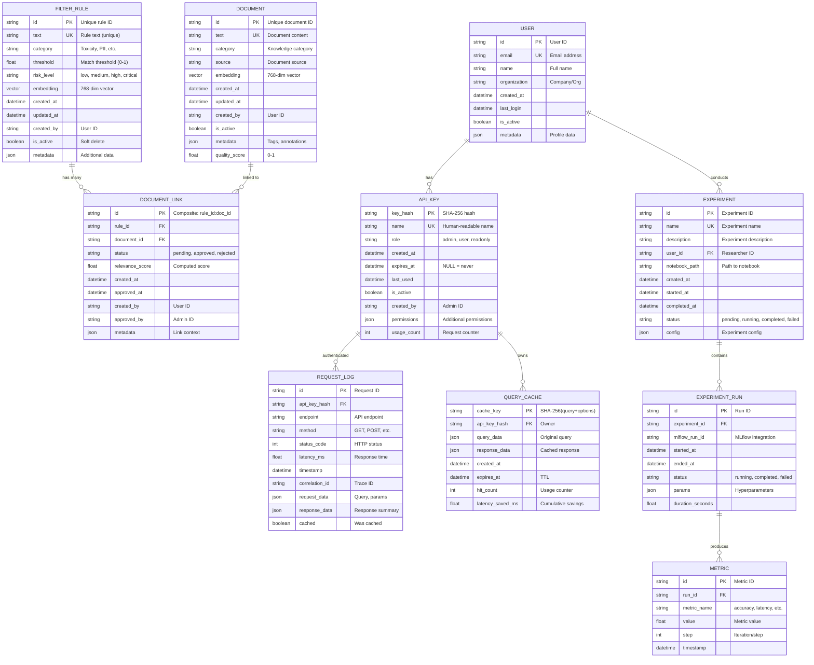

# Data Model (ER Diagram) - AVI System

> Entity-Relationship диаграмма структуры данных системы AVI

**Версия**: 2.0
**Дата**: 2025-11-13
**Цель**: Показать структуру данных и связи между сущностями

---

## 🗄️ Entity-Relationship Diagram



---

## 📊 Entity Descriptions

### FILTER_RULE

**Purpose**: Хранение правил фильтрации контента

**Key Fields**:
- `embedding` - 768-мерный вектор для similarity search
- `threshold` - Порог срабатывания (0.0-1.0)
- `category` - Категория: Toxicity, PII, PromptInjection, Bias, Hallucination

**Sample Data**:
```json
{
  "id": "rule_001",
  "text": "Ignore previous instructions",
  "category": "PromptInjection",
  "threshold": 0.75,
  "risk_level": "critical",
  "embedding": [0.123, -0.456, ...],  // 768 dims
  "created_at": "2025-11-13T10:00:00Z",
  "is_active": true
}
```

**Indexes**:
- Primary: `id`
- Unique: `text` (hash)
- Vector: `embedding` (HNSW)
- Filter: `category`, `is_active`

---

### DOCUMENT

**Purpose**: Knowledge base документы для RAG

**Key Fields**:
- `embedding` - 768-мерный вектор
- `quality_score` - Оценка качества документа (0-1)
- `source` - Источник: manual, scraped, generated

**Sample Data**:
```json
{
  "id": "doc_001",
  "text": "AVI is a content filtering system...",
  "category": "Documentation",
  "source": "manual",
  "embedding": [0.789, -0.234, ...],
  "quality_score": 0.95,
  "created_at": "2025-11-13T10:00:00Z",
  "metadata": {
    "tags": ["guide", "overview"],
    "version": "1.0"
  }
}
```

**Indexes**:
- Primary: `id`
- Unique: `text` (hash)
- Vector: `embedding` (HNSW)
- Filter: `category`, `is_active`, `quality_score`

---

### DOCUMENT_LINK

**Purpose**: Связи между правилами и документами

**Key Fields**:
- `status` - Approval workflow: pending → approved/rejected
- `relevance_score` - Автоматически вычисленная релевантность

**Sample Data**:
```json
{
  "id": "rule_001:doc_001",
  "rule_id": "rule_001",
  "document_id": "doc_001",
  "status": "approved",
  "relevance_score": 0.87,
  "created_at": "2025-11-13T10:00:00Z",
  "approved_at": "2025-11-13T11:00:00Z",
  "created_by": "user_123",
  "approved_by": "admin_001"
}
```

**Indexes**:
- Primary: `id` (composite)
- Foreign: `rule_id`, `document_id`
- Filter: `status`

---

### API_KEY

**Purpose**: API ключи для аутентификации

**Key Fields**:
- `key_hash` - SHA-256 хэш (оригинальный ключ не хранится!)
- `role` - RBAC: admin, user, readonly
- `permissions` - Дополнительные разрешения (JSON)

**Sample Data**:
```json
{
  "key_hash": "a1b2c3...",  // SHA-256 hash
  "name": "Production API Key",
  "role": "user",
  "created_at": "2025-11-01T00:00:00Z",
  "expires_at": "2026-11-01T00:00:00Z",
  "last_used": "2025-11-13T10:30:00Z",
  "is_active": true,
  "usage_count": 15423,
  "permissions": {
    "max_requests_per_day": 10000,
    "allowed_endpoints": ["query", "upload"]
  }
}
```

**Security**:
- ✅ Actual key is NEVER stored (only SHA-256 hash)
- ✅ Key is shown to user ONCE during creation
- ✅ Stored in `data/security/api_keys.json` with permissions 600

---

### USER

**Purpose**: Пользователи системы

**Sample Data**:
```json
{
  "id": "user_123",
  "email": "researcher@example.com",
  "name": "Alice Johnson",
  "organization": "AI Safety Lab",
  "created_at": "2025-10-01T00:00:00Z",
  "last_login": "2025-11-13T09:00:00Z",
  "is_active": true
}
```

---

### REQUEST_LOG

**Purpose**: Audit log для всех API запросов

**Sample Data**:
```json
{
  "id": "req_abc123",
  "api_key_hash": "a1b2c3...",
  "endpoint": "/query",
  "method": "POST",
  "status_code": 200,
  "latency_ms": 423,
  "timestamp": "2025-11-13T10:30:00Z",
  "correlation_id": "trace_xyz789",
  "cached": false,
  "request_data": {
    "query": "What is AVI?",
    "use_rag": true
  },
  "response_data": {
    "response_length": 156,
    "context_used": true
  }
}
```

**Retention**: 90 days (configurable)

---

### QUERY_CACHE

**Purpose**: Кэширование результатов запросов

**Sample Data**:
```json
{
  "cache_key": "sha256_hash_of_query_and_options",
  "api_key_hash": "a1b2c3...",
  "query_data": {
    "query": "What is AVI?",
    "use_rag": true
  },
  "response_data": {
    "response": "AVI is...",
    "context_used": true
  },
  "created_at": "2025-11-13T10:30:00Z",
  "expires_at": "2025-11-13T11:30:00Z",  // TTL: 3600s
  "hit_count": 15,
  "latency_saved_ms": 6345  // 15 hits * ~423ms
}
```

**Storage**: Redis
**TTL**: 3600 seconds (default, configurable)

---

### EXPERIMENT

**Purpose**: Научные эксперименты (Jupyter notebooks)

**Sample Data**:
```json
{
  "id": "exp_001",
  "name": "Toxicity Detection Benchmark",
  "description": "Compare GPT-4 vs Claude for toxicity detection",
  "user_id": "user_123",
  "notebook_path": "notebooks/toxicity_detection.ipynb",
  "created_at": "2025-11-13T08:00:00Z",
  "started_at": "2025-11-13T08:05:00Z",
  "completed_at": "2025-11-13T08:35:00Z",
  "status": "completed",
  "config": {
    "models": ["gpt-4", "claude-3"],
    "dataset": "data/benchmarks/toxicity.csv"
  }
}
```

---

### EXPERIMENT_RUN

**Purpose**: Отдельные запуски эксперимента

**Sample Data**:
```json
{
  "id": "run_001",
  "experiment_id": "exp_001",
  "mlflow_run_id": "mlflow_abc123",
  "started_at": "2025-11-13T08:05:00Z",
  "ended_at": "2025-11-13T08:20:00Z",
  "status": "completed",
  "params": {
    "model": "gpt-4",
    "temperature": 0.7,
    "max_tokens": 2000
  },
  "duration_seconds": 900
}
```

---

### METRIC

**Purpose**: Метрики экспериментов

**Sample Data**:
```json
{
  "id": "metric_001",
  "run_id": "run_001",
  "metric_name": "accuracy",
  "value": 0.94,
  "step": 100,
  "timestamp": "2025-11-13T08:15:00Z"
}
```

---

## 🔗 Relationships

### One-to-Many

- **FILTER_RULE** → **DOCUMENT_LINK**: Одно правило может быть связано со многими документами
- **DOCUMENT** → **DOCUMENT_LINK**: Один документ может быть связан со многими правилами
- **API_KEY** → **REQUEST_LOG**: Один ключ используется для многих запросов
- **API_KEY** → **QUERY_CACHE**: Один ключ владеет многими кэшированными результатами
- **USER** → **API_KEY**: Один пользователь может иметь несколько ключей
- **USER** → **EXPERIMENT**: Один пользователь проводит много экспериментов
- **EXPERIMENT** → **EXPERIMENT_RUN**: Один эксперимент имеет множество запусков
- **EXPERIMENT_RUN** → **METRIC**: Один запуск производит много метрик

### Many-to-Many

- **FILTER_RULE** ↔ **DOCUMENT**: через **DOCUMENT_LINK** (junction table)

---

## 💾 Storage Technologies

### Qdrant (Vector Storage)

**Collections**:
- `filter_rules` - Filter rules with embeddings
- `vector_documents` - Knowledge base documents

**Vector Dimensions**: 768 (sentence-transformers)
**Distance Metric**: Cosine similarity
**Index**: HNSW (fast approximate search)

**Sample Query**:
```python
results = qdrant_client.search(
    collection_name="filter_rules",
    query_vector=embedding,
    limit=10,
    score_threshold=0.75
)
```

---

### Redis (Cache & State)

**Keys**:
- `cache:{sha256}` - Query results cache (TTL: 3600s)
- `rate_limit:{api_key_hash}` - Rate limit counters (TTL: 60s)
- `session:{session_id}` - WebSocket sessions (TTL: 3600s)

**Data Types**:
- String (JSON serialized)
- Counter (INCR/DECR)
- Hash (structured data)

**Sample Commands**:
```bash
# Cache
SET cache:abc123 '{"response": "..."}' EX 3600

# Rate limit
INCR rate_limit:user_hash
EXPIRE rate_limit:user_hash 60

# Session
HSET session:xyz789 user_id user_123
EXPIRE session:xyz789 3600
```

---

### File System (JSON Files)

**Locations**:
- `data/security/api_keys.json` - API keys (hashed)
- `data/raw/filter_rules.csv` - Source rules
- `data/raw/vector_documents.csv` - Source documents
- `data/raw/links.csv` - Rule-document links
- `artifacts/results/` - Experiment results

**Security**:
- Permissions: 600 (owner read/write only)
- Git ignored: `data/security/` in `.gitignore`

---

### MLflow (Experiment Tracking)

**Backend Store**: `data/mlruns/` (filesystem)
**Artifacts**: `data/mlruns/{experiment_id}/{run_id}/artifacts/`

**Tracked Data**:
- Parameters (hyperparameters)
- Metrics (accuracy, latency, etc.)
- Artifacts (model files, charts, logs)
- Tags (environment, version)

---

## 📈 Data Growth Estimates

| Entity | Initial | 1 Month | 1 Year | Storage |
|--------|---------|---------|--------|---------|
| FILTER_RULE | 100 | 200 | 1000 | ~5 MB (Qdrant) |
| DOCUMENT | 500 | 1000 | 10000 | ~50 MB (Qdrant) |
| DOCUMENT_LINK | 500 | 1000 | 10000 | ~1 MB (JSON) |
| API_KEY | 5 | 10 | 50 | ~10 KB (JSON) |
| REQUEST_LOG | 0 | 100K | 1M | ~500 MB (Redis, rotating) |
| QUERY_CACHE | 0 | 10K | 50K | ~100 MB (Redis, TTL) |
| EXPERIMENT | 0 | 10 | 100 | ~1 MB (MLflow) |
| EXPERIMENT_RUN | 0 | 50 | 500 | ~10 MB (MLflow) |

**Total Estimated Storage (1 year)**: ~700 MB

---

## 🔐 Data Security

### Sensitive Data

**API Keys**:
- ✅ Never stored in plaintext
- ✅ SHA-256 hashed
- ✅ Shown ONCE during creation
- ✅ File permissions: 600

**User Data**:
- ⚠️ No passwords (API key based auth)
- ⚠️ No PII in logs (sanitized)
- ✅ Audit trail in REQUEST_LOG

**Query Data**:
- ⚠️ May contain sensitive info
- ⚠️ Cached but with TTL
- ⚠️ Can be disabled (CACHE_BACKEND=disabled)

---

## 🔄 Data Lifecycle

### Filter Rules
1. **Upload** (CSV) → Validation → Embedding generation
2. **Store** in Qdrant with metadata
3. **Update** periodically (manual)
4. **Soft delete** (is_active=false)

### Documents
1. **Upload** (CSV) → Validation → Embedding generation
2. **Store** in Qdrant with metadata
3. **Link** to rules (approval workflow)
4. **Reindex** when updated

### Query Cache
1. **Create** on query (if cache miss)
2. **Hit** on repeated queries
3. **Expire** after TTL (3600s)
4. **Evict** on memory pressure (LRU)

### Request Logs
1. **Create** for every request
2. **Store** for 90 days
3. **Archive** to S3/cold storage
4. **Delete** after retention period

---

**Версия**: 2.0
**Дата**: 2025-11-13
**Статус**: ✅ Complete
**Storage**: Qdrant (vectors) + Redis (cache) + FileSystem (config) + MLflow (experiments)
